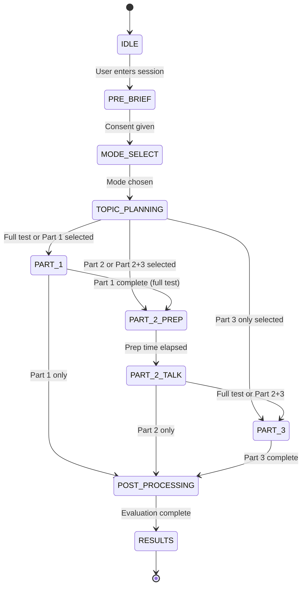

# Cramer Speaking Session Foundations (Draft v0.4)

This document extends the initial notes into a clearer, test-aligned plan for a simulated IELTS Speaking session inside Cramer.

## 0. Scope, goals, and assumptions
- **Scope:** IELTS Speaking-style simulations (Academic/General share the same Speaking format).
- **Goal:** Create a session flow that mirrors the IELTS Speaking test structure while enabling detailed, explainable feedback.
- **Assumptions:** The platform can record audio, run ASR (speech-to-text), and store per-question metadata.
- **Non-goals (for now):** Examiner training, live human moderation, and high-stakes scoring certification.

## 1. IELTS-aligned test structure (baseline)
The real IELTS Speaking test is 11-14 minutes and has three parts. Use this structure as the default template.

| Test section | Official duration | Focus | Interaction pattern | Notes |
| --- | --- | --- | --- | --- |
| Admin / Intro | ~30-60 sec (local policy) | ID check + recording notice | Scripted | Not scored; keep short |
| Part 1 | 4-5 minutes | Personal / familiar topics | Q-A (ping-pong) | "Introduction and interview" |
| Part 2 | 3-4 minutes | Long turn (monologue) | 1 min prep + 1-2 min talk | Follow-up question(s) allowed |
| Part 3 | 4-5 minutes | Abstract / analytical | 2-way discussion | Linked to Part 2 topic |
| Total | 11-14 minutes | Global proficiency | Varied | Target timing band |

### 1.1 User selection modes
- **Full test:** Admin + Part 1 + Part 2 + Part 3
- **Single part:** Part 1 OR Part 2 OR Part 3
- **Paired:** Part 2 + Part 3 (Part 3 must inherit Part 2 topic/context)

### 1.2 If Part 3 is taken without Part 2
Offer one of:
1) **Auto-brief** (system-generated Part 2 topic summary), or
2) **User-prompted topic** (user selects a topic area)

## 2. Session flow (agentic, multi-phase)
This flow separates real-time speaking from heavier analysis so the user experience feels smooth while the system still produces deep, explainable evaluation. The design is intentionally "agentic": each phase has a clear owner, fixed input/output, and explicit constraints that keep the session reliable and on-time.

### 2.1 Business intent (why this flow exists)
- **Consistency:** The live conversation must follow IELTS timing and part structure with minimal drift.
- **Reliability:** The session should not stall even if one model or provider is slow or unavailable.
- **Explainability:** Scoring is not just a number; it must be backed by evidence the user can understand.
- **Scalability:** The system should support many concurrent sessions without large quality swings.

### 2.2 Phase breakdown (what happens, in order)
1) **Entry (Courses UI)**
   - The user enters the Speaking simulation from Courses.
2) **Pre-brief + consent**
   - Friendly greeting + explain recording + structure.
   - Example (localized): "Cramer chao ban! Ban sap buoc vao buoi thi Speaking mo phong..."
3) **Mode selection**
   - Full test, single part, or Part 2+3.
4) **Topic and question planning (deterministic)**
   - System selects a topic (or user picks).
   - Retrieve a pre-defined bank for the topic and part.
   - Build a session blueprint: number of questions, time budget, and allowed follow-ups.
5) **Live test execution (low-latency path)**
   - Real-time, spoken interaction with controlled turn-taking.
   - Shared timer + per-part timers.
   - Voice-only or voice+text UI.
   - Warnings at 15s / 5s remaining per part.
6) **Post-turn processing (near-real-time)**
   - Transcription alignment and QA checks.
   - First-pass scoring signals and error tagging.
7) **Post-session synthesis (batch path)**
   - Full evaluation across all criteria.
   - Sample answers per question.
8) **Results delivery**
   - Transcript per part.
   - Detailed rubric-based evaluation.
   - Sample answers (per question).

### 2.3 Agent roles (business view)
Treat the system as a small team of agents, each with a purpose and budget.

- **Session Orchestrator**
  - Owns the session state, timers, and rule enforcement.
  - Enforces which questions are allowed and how many can be asked.
- **Live Examiner**
  - Speaks to the user in real time, asks questions, and handles barge-in.
  - Does not invent new questions outside the approved bank.
- **Post-turn Analyst**
  - Refines transcripts, tags errors, and captures phonetic signals.
- **Reasoning Synthesizer**
  - Converts raw signals into a business-readable evaluation with evidence.
- **Safety and QA Gate**
  - Validates the outputs, red-flags unsafe or inconsistent results, and triggers fallbacks.

### 2.4 Provider policy and routing (business rules)
The orchestration layer should be provider-agnostic, but **routing is constrained by purpose** to protect quality and cost. This also allows future upgrades without rewriting the flow.

**Current constraints (as of now)**
- **Session playing (live audio, turn-taking):** Gemini Live API.
- **Speech evaluation and analysis:** Vertex AI (Gemini models).
- **Text evaluation and admin test generation:** OpenRouter and DeepSeek.
  - **Admin side:** OpenRouter is the **main provider** for test and question generation.
  - **User side (Writing):** DeepSeek is currently used for writing evaluation.
  - **Future plan:** migrate admin generation fully to OpenRouter while retaining a multi-provider fallback.

**Provider flexibility rules**
- The provider is flexible **only within the allowed purpose**. For example, speech evaluation should not be routed to non-Vertex providers unless explicitly approved.
- Admins should be able to select providers **per task**, not just through OpenRouter (future update).
  - This allows direct selection of Vertex or DeepSeek for specific jobs when needed.

### 2.5 Model mapping (validated as of January 2026)

| Purpose | Model ID | Status | Notes |
|---------|----------|--------|-------|
| Live turn-taking | `gemini-live-2.5-flash-native-audio` | GA (Dec 12, 2025) | EOL: Dec 13, 2026. Low-latency voice agents. |
| Live turn-taking (preview) | `gemini-2.5-flash-native-audio-preview-12-2025` | Preview | Enhanced "thinking" for complex queries. |
| Post-turn ASR/transcript | `gemini-2.5-flash-lite` | GA (July 22, 2025) | Cost-efficient, multimodal (audio input). |
| Post-turn ASR refinement | `gemini-2.5-flash` / `gemini-2.5-pro` | GA (June 17, 2025) | Multimodal input, strong reasoning. |
| Pronunciation analysis | `gemini-3-pro` | Preview (Dec 17, 2025) | Recommended for prompt-based pronunciation feedback. |
| Reasoning and synthesis | `deepseek-reasoner` | Production | DeepSeek-V3.2 "thinking" mode. |
| Routing and fallback | OpenRouter | N/A | Provider routing, failover, zero data retention. |

**Key capabilities of Gemini Live API native audio:**
- Native audio input/output (no separate TTS/STT pipeline)
- Barge-in and turn detection
- Affective dialog (emotional tone detection)
- Multilingual support (24+ languages)
- Proactive audio (distinguishes speaker from background)

**Important:** Model IDs change frequently. Check the [Gemini API changelog](https://ai.google.dev/gemini-api/docs/changelog) before every release.

### 2.6 Reliability controls and constraints (pre-based logic)
This is where the system becomes "reliable by design," not just by luck.

- **Deterministic session blueprint**
  - The live model can only choose from the pre-approved question bank for a given topic and part.
  - This prevents drift and enforces the correct number of questions.
- **Time guards**
  - Per-part budgets and hard stops that match the IELTS format.
  - The live model can be flexible in phrasing but not in duration.
- **Output QA**
  - If post-turn analysis is low-confidence, label results accordingly or request a re-record.
  - Pronunciation scores should downweight if audio quality is poor.
- **Fallback rules**
  - If live audio fails, fall back to text mode for the rest of the session.
  - If one provider is degraded, route to the next allowed provider.

### 2.7 Latency tiers and data flow
- **Live path (sub-second to low seconds):** turn-taking, immediate follow-ups, time warnings.
- **Near-real-time path:** transcript cleanup, phonetic tagging, basic fluency metrics.
- **Batch path:** deep evaluation across all criteria, sample answers, and recommendations.

### 2.8 Service Level Objectives (SLOs)

| Path | Target | Measurement | Fallback |
|------|--------|-------------|----------|
| Live turn | < 500ms | User speech end → examiner response start | > 1s: log warning; > 3s: fall back to text mode |
| Transcript ready | < 5s | Turn end → refined transcript available | > 10s: use raw ASR with low-confidence flag |
| Full evaluation | < 30s | Session end → complete report generated | > 60s: deliver partial report, queue remainder |

### 2.9 Session state machine

## 3. Question design and bank
- **Part 1:** authored bank of 30 prompts per test; runtime session selects 8-12 short questions across 2-3 topics.
- **Part 2:** Cue card with 3-4 bullets (who/what/when/why/how).
- **Part 3:** authored bank of 15 prompts per test; runtime session selects 3-6 follow-up questions, ideally using Part 2 topic and answer context when available.

### 3.1 Proposed question bank schema

Current Cramer runtime uses the shared `tests -> sections -> questions` hierarchy for Speaking authored content. The schema below is historical design context only, not the active source of truth.

| Column | Type | Required | Description |
|--------|------|----------|-------------|
| `id` | bigint | Yes | Primary key |
| `topic_id` | bigint | Yes | FK to topics/hashtags table |
| `part` | integer | Yes | 1, 2, or 3 |
| `question_text` | text | Yes | The question prompt |
| `cue_card_bullets` | jsonb | Part 2 only | Array of bullet points for cue card |
| `difficulty` | varchar | Yes | CEFR level: A1, A2, B1, B2, C1, C2 |
| `register` | varchar | Yes | formal, semi-formal, informal |
| `expected_length_seconds` | integer | No | Expected response duration |
| `follow_up_allowed` | boolean | No | Whether follow-ups are permitted |
| `follow_up_question_ids` | bigint[] | No | Array of related question IDs |
| `version` | integer | No | For versioning/refresh cycles |
| `created_at` | timestamptz | Yes | Creation timestamp |

### 3.2 Question bank requirements
- Tag each question with: `topic`, `difficulty`, `register`, `expected_length`, `follow_up`.
- Versioning: allow periodic refresh, keep a stable "core" set for calibration.
- Deterministic selection: the live model can only select from the pre-approved bank for the chosen topic and part.
- Example: select 8-12 questions out of a 30-question Part 1 topic bank, while respecting time and coverage rules.
  - Coverage rule: avoid repeating the same sub-topic more than twice unless the user requests clarification.
  - Time rule: stop asking once the part time budget is reached, even if there are unasked questions.
  - Flow rule: allow 1-2 natural follow-ups, but do not turn Part 1 into Part 3.

## 4. Timer + turn management
- **Global timer:** 11-14 minutes for full test.
- **Part timers:** enforce hard stops; soft warning with a bell tone.
- **Turn control:** interrupt politely if the user exceeds limits (especially Part 2).
- **Part 2 talk time:** fixed at 2 minutes by default, unless the user ends early.
- **End-of-turn modes:** auto-detect end-of-speech (faster, less reliable) or user-confirmed finish (button/space).
  - Business intent: give users control while still preserving timing integrity.
  - UX note: provide a visible timer for Part 2 preparation and talk phases.

## 5. Data capture and storage
- **Audio:** per-answer audio clips with timestamps.
- **Transcript:** per-answer text + confidence scores (word-level if available).
- **Metadata:** question id, topic id, part id, time start/stop, language hints.
- **Privacy:** explicit recording consent in pre-brief.
  - Retention policy: define how long raw audio and transcripts are stored.
  - Audit trail: store model versions and prompts used for scoring.

## 6. Evaluation (business-readable, structured)
This section is the core "evaluation contract" between the system and the learner. It keeps your original intent but is slightly refined for clarity and format.

Detailed evaluation (with 9-band scoring) based on IELTS' band descriptors:

| Criterion | What to analyze (refined wording) | What the system must report (evidence) |
| --- | --- | --- |
| **Fluency and coherence** | **Hesitation:** number of pauses (max 20 per part) and where they occur. **Repetition:** ideas repeated in similar form, showing lack of expansion. **Self-correction:** frequency and type of repairs. **Topic development:** coherence, appropriateness, relevance. | **Hesitation:** list 1-10 common pause locations (e.g., mid-sentence, new idea start, end of idea) + questions where pausing clusters. **Repetition:** list repeated ideas with repetition counts, quote or paraphrase weakly stated ideas. **Self-correction:** indicate dominant correction category (verb tense, pronunciation, grammar). **Topic development:** short rationale for coherence, appropriateness, relevance. |
| **Lexical resources** | **Flexibility:** range and variety of vocabulary across topics. **Precision:** correct word choice, collocations, and spelling. **Idiomatic language:** use of natural, accurate expressions. | **Strengths:** list well-used vocabulary items. **Weaknesses:** list weak or overused words with better alternatives. **Inaccuracy:** list misused words/phrases with corrections. **Idioms:** list idioms used + suggest equal or stronger alternatives. |
| **Grammatical range and accuracy** | Structure variety (simple/compound/complex) and correctness. | List inaccurate structures and improved versions. Provide problematic sentences that show grammar, spelling, or systemic errors. |
| **Pronunciation** | **Phonological features:** stress, intonation, and segmental pronunciation. **Connected speech:** linking, rhythm, reductions. **Intelligibility:** impact of accent on understanding. | Identify inaccurate stress, intonation, or pronunciations (regardless of accent). Note connected speech issues. State whether accent affects intelligibility and how. |

## 7. Scoring and calibration (implementation guidance)
- Use the official band descriptors as the rubric source of truth.
- Produce a **provisional band** per criterion and a **final overall band**.
- Add confidence indicators (low/medium/high) based on ASR quality and audio signal.

## 8. Output report structure (aligned to results preview UI)
This should mirror the user-facing results preview so the document maps cleanly to the product.

1) **Session overview**
   - Parts taken, total time, topics covered
2) **Overall score**
   - Band score + confidence indicator
3) **Diem manh (Strengths)**
   - Clear, specific strengths tied to evidence
4) **Diem yeu (Weaknesses)**
   - Most important weaknesses to address first
5) **Goi y huong di (Direction suggestions)**
   - Concrete, short-term learning directions
6) **Detailed evaluation**
   - Per-criterion findings + evidence + improvements
7) **Transcript**
   - Per-question transcript with timestamps
8) **Sample answers**
   - One model answer per question (length aligned to real test)
9) **Next-step practice plan**
   - 3-5 targeted practice actions

## 9. Edge cases and fallbacks
- **ASR failures:** fall back to manual text input.
- **Low audio quality:** prompt re-record or downweight pronunciation scores.
- **User silence:** allow re-ask once; then skip and note in report.
- **Time overrun:** truncate and log as a fluency/coherence issue.

## 10. Open questions (decision tracker)

| # | Question | Options | Choice | Status |
|---|----------|---------|--------|--------|
| 1 | ASR engine for production? | A) Gemini Live API only B) Azure Speech + Gemini C) Gemini 2.5 Flash Lite | C | Decided |
| 2 | Examiner interruption style? | A) Patient (never interrupt) B) IELTS-realistic (interrupt at limits) C) Configurable | B | Decided |
| 3 | Part 2 prep notes format? | A) Text-only B) Voice-only C) Voice + text card + notes box | C | Decided |
| 4 | Acceptable latency for scoring? | A) Real-time (< 5s) B) Near-real-time (< 30s) C) Batch (< 5min) | C | Decided |
| 5 | Phonetic scoring approach? | A) Gemini 3 Pro prompt-based B) External pronunciation engine C) Skip for MVP | A | Decided |

### Part 2 prep UX (Decision #3 detail)

During the 1-minute Part 2 preparation phase, the screen displays:
- **Topic card** (text) — The cue card with 3-4 bullet points
- **Voice prompt** — Examiner reads the topic aloud
- **Notes text box** — User can type notes during prep time
- **Timer** — Visible countdown (60 seconds)

## 11. Phonetic feasibility assessment

**Finding:** Gemini models excel at native audio dialog (barge-in, turn detection, emotional tone) but do not provide phoneme-level pronunciation scoring (IPA alignment, formant analysis).

**Adopted approach:** Use Gemini 3 Pro with prompt-based pronunciation feedback. Based on internal testing:
- Gemini 3 Flash: Decent accuracy with some inaccuracies.
- Gemini 3 Pro: Good accuracy for describing pronunciation issues in natural language.

**Limitation:** This is less precise than dedicated pronunciation engines (e.g., ELSA's proprietary ASR, Azure Speech SDK) but acceptable for MVP. Scores should be labeled with a confidence indicator.

## 12. Competitor analysis

| Platform | Approach | Key Technology |
|----------|----------|----------------|
| **ELSA Speak** | Proprietary ASR trained on world's largest accented English dataset (95%+ accuracy). Real-time feedback on pronunciation, intonation, rhythm, fluency. Focuses on American accent. | Deep learning on non-native voice data |
| **Duolingo English Test** | Adaptive difficulty using Rasch model. ASR + NLP for automated scoring. Human review for speaking/writing. Generative AI for interactive conversation tasks. | Hybrid AI + human grading |

## 13. References (for internal verification)
- https://www.ielts.org/for-organisations/ielts-for-organisations/test-types/ielts-general-training-test/ielts-general-training-test-format-in-detail
- https://ai.google.dev/api/multimodal-live
- https://cloud.google.com/vertex-ai/docs/generative-ai/learn/models
- https://ai.google.dev/gemini-api/docs/changelog
- https://api-docs.deepseek.com/
- https://openrouter.ai/docs/features/provider-routing
- https://elsaspeak.com/
- https://englishtest.duolingo.com/
