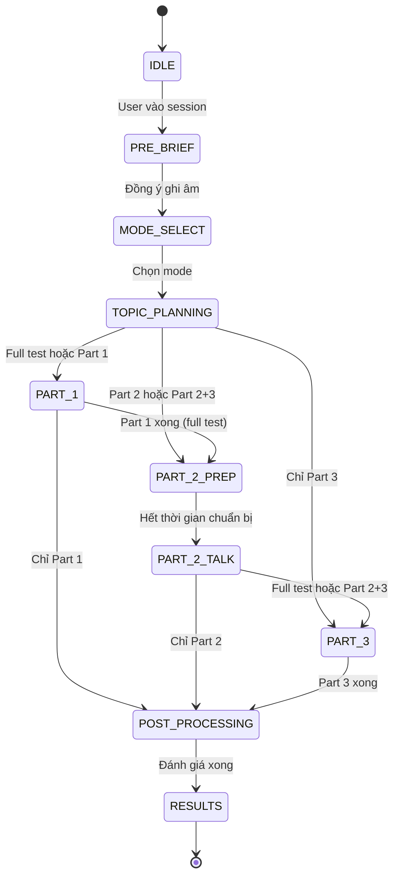

# Nền tảng Speaking Session cho Cramer (Bản nháp v0.4 - Tiếng Việt)

Tài liệu này là phiên bản mở rộng từ những ghi chú ban đầu, nhằm làm rõ cấu trúc và định hướng cho buổi thi Speaking mô phỏng trong Cramer.

## 0. Phạm vi, mục tiêu, và giả định
- **Phạm vi:** Speaking theo IELTS (Academic/General có cùng định dạng Speaking).
- **Mục tiêu:** Tạo một buổi thi mô phỏng giống thi thật, đồng thời có thể đánh giá chi tiết và giải thích rõ ràng.
- **Giả định:** Nền tảng có thể ghi âm, chạy ASR (speech-to-text), và lưu metadata theo câu hỏi.
- **Ngoài phạm vi (tạm thời):** đào tạo giám khảo, live moderation, hay chứng nhận chấm điểm cấp cao.

## 1. Cấu trúc bài thi theo IELTS (cơ sở)
Bài thi Speaking IELTS có tổng thời gian 11-14 phút và gồm 3 phần.

| Phần thi | Thời lượng | Trọng tâm | Kiểu tương tác | Ghi chú |
| --- | --- | --- | --- | --- |
| Admin / Intro | ~30-60 giây | Xác minh + thông báo ghi âm | Scripted | Không chấm điểm |
| Part 1 | 4-5 phút | Cá nhân / gần gũi | Hỏi - đáp | Giới thiệu và phỏng vấn |
| Part 2 | 3-4 phút | Độc thoại | 1 phút chuẩn bị + 1-2 phút nói | Có thể hỏi thêm |
| Part 3 | 4-5 phút | Trừu tượng / phân tích | Thảo luận | Liên kết Part 2 |
| Tổng | 11-14 phút | Năng lực tổng thể | Đa dạng | Đúng khung thời gian |

### 1.1 Các chế độ lựa chọn
- **Full test:** Admin + Part 1 + Part 2 + Part 3
- **Một phần:** Part 1 hoặc Part 2 hoặc Part 3
- **Hai phần liên tục:** Part 2 + Part 3 (Part 3 kế thừa chủ đề Part 2)

### 1.2 Nếu chỉ làm Part 3
Hệ thống đưa 1 trong 2 lựa chọn:
1) **Auto-brief** (tự động tóm tắt chủ đề Part 2), hoặc
2) **User-prompted topic** (người dùng chọn chủ đề)

## 2. Luồng session (agentic, nhiều giai đoạn)
Luồng này tách phần nói trực tuyến (real-time) và phần đánh giá sau (post-turn) để UX mượt và đánh giá sâu sắc.

### 2.1 Mục tiêu kinh doanh (tại sao cần flow này)
- **Ổn định:** Hội thoại real-time phải bám đúng thời gian IELTS.
- **Tin cậy:** Hệ thống không bị dừng khi một provider chậm hoặc lỗi.
- **Giải thích rõ:** Điểm số phải có bằng chứng để người học hiểu.
- **Mở rộng:** Có thể chạy nhiều session mà không giảm chất lượng.

### 2.2 Các giai đoạn (theo thứ tự)
1) **Entry (Courses UI)**
2) **Pre-brief + consent**
   - Chào hỏi + thông báo ghi âm + giới thiệu cấu trúc.
   - Ví dụ: "Cramer chào bạn! Bạn sắp bước vào buổi thi Speaking mô phỏng..."
3) **Mode selection**
   - Full test, 1 phần, hoặc Part 2+3.
4) **Topic & question planning (deterministic)**
   - Hệ thống chọn chủ đề (hoặc user chọn).
   - Lấy ngân hàng câu hỏi theo chủ đề và part.
   - Tạo blueprint: số câu hỏi, ngân sách thời gian, follow-up được phép.
5) **Live test execution (low-latency)**
   - Tương tác nói real-time, có kiểm soát turn-taking.
   - Timer tổng + timer từng part.
   - Voice-only hoặc voice+text.
   - Cảnh báo 15s / 5s trước khi kết thúc mỗi part.
6) **Post-turn processing**
   - Căn chỉnh transcript + QA.
   - Tạo tín hiệu chấm điểm ban đầu.
7) **Post-session synthesis**
   - Đánh giá đầy đủ theo tiêu chí.
   - Sample answers theo câu hỏi.
8) **Results delivery**
   - Transcript từng part.
   - Đánh giá chi tiết.
   - Sample answers.

### 2.3 Vai trò agents (góc nhìn kinh doanh)
- **Session Orchestrator**
  - Quản lý trạng thái session, timer, quy tắc.
  - Đảm bảo chỉ hỏi câu hỏi nằm trong bank được phép.
- **Live Examiner**
  - Nói real-time, hỏi đáp, xử lý barge-in.
  - Không được tự tạo câu hỏi ngoài bank.
- **Post-turn Analyst**
  - Làm sạch transcript, tag lỗi, bắt tín hiệu phonetic.
- **Reasoning Synthesizer**
  - Tổng hợp tín hiệu thành đánh giá dễ đọc.
- **Safety & QA Gate**
  - Kiểm tra tính hợp lý, gọi fallback nếu cần.

### 2.4 Chính sách provider và routing (quy tắc kinh doanh)
Hệ thống provider-agnostic nhưng **routing bị giới hạn theo mục đích**.

**Hiện tại**
- **Session playing (live audio):** Gemini Live API.
- **Speech evaluation & analysis:** Vertex AI (Gemini).
- **Text evaluation & admin test generation:** OpenRouter và DeepSeek.
  - **Admin side:** OpenRouter là provider chính cho test và question generation.
  - **User side (Writing):** DeepSeek hiện đang chấm bài.
  - **Kế hoạch:** chuyển admin generation về OpenRouter đầy đủ, giữ fallback đa provider.

**Quy tắc linh hoạt**
- Chỉ linh hoạt trong phạm vi mục đích được phép.
- Admin có thể chọn provider theo từng task, không chỉ thông qua OpenRouter (future update).

### 2.5 Mapping model (đã xác thực - Tháng 1/2026)

| Mục đích | Model ID | Trạng thái | Ghi chú |
|----------|----------|------------|--------|
| Live turn-taking | `gemini-live-2.5-flash-native-audio` | GA (12/12/2025) | EOL: 13/12/2026. Voice agents latency thấp. |
| Live turn-taking (preview) | `gemini-2.5-flash-native-audio-preview-12-2025` | Preview | "Thinking" cho queries phức tạp. |
| Post-turn ASR/transcript | `gemini-2.5-flash-lite` | GA (22/07/2025) | Chi phí thấp, multimodal (audio input). |
| Post-turn ASR refinement | `gemini-2.5-flash` / `gemini-2.5-pro` | GA (17/06/2025) | Multimodal input, reasoning mạnh. |
| Pronunciation analysis | `gemini-3-pro` | Preview (17/12/2025) | Khuyến nghị cho pronunciation prompt-based. |
| Reasoning và synthesis | `deepseek-reasoner` | Production | DeepSeek-V3.2 "thinking" mode. |
| Routing và fallback | OpenRouter | N/A | Provider routing, failover, zero data retention. |

**Khả năng chính của Gemini Live API native audio:**
- Native audio input/output (không cần pipeline TTS/STT riêng)
- Barge-in và turn detection
- Affective dialog (nhận diện cảm xúc)
- Hỗ trợ đa ngôn ngữ (24+ ngôn ngữ)
- Proactive audio (phân biệt người nói và background)

**Quan trọng:** Model IDs thay đổi thường xuyên. Kiểm tra [Gemini API changelog](https://ai.google.dev/gemini-api/docs/changelog) trước mỗi release.

### 2.6 Kiểm soát độ tin cậy (pre-based logic)
- **Blueprint cố định**
  - Live model chỉ được chọn câu hỏi từ bank đã duyệt.
- **Time guards**
  - Có hard stop đúng định dạng IELTS.
- **Output QA**
  - Nếu tín hiệu thấp, giảm độ tin cậy hoặc yêu cầu ghi âm lại.
- **Fallback rules**
  - Nếu live audio lỗi, chuyển sang text cho phần còn lại.

### 2.7 Latency tiers
- **Live path:** turn-taking, follow-up, cảnh báo thời gian.
- **Near-real-time:** làm sạch transcript, phonetic tagging.
- **Batch:** chấm điểm đầy đủ, sample answers, recommendations.

### 2.8 Service Level Objectives (SLOs)

| Path | Mục tiêu | Đo lường | Fallback |
|------|----------|----------|----------|
| Live turn | < 500ms | Kết thúc nói → bắt đầu phản hồi | > 1s: log warning; > 3s: chuyển text mode |
| Transcript sẵn sàng | < 5s | Kết thúc turn → transcript refined | > 10s: dùng raw ASR với low-confidence flag |
| Đánh giá đầy đủ | < 5 phút | Kết thúc session → report hoàn chỉnh | > 10 phút: gửi partial report, queue phần còn lại |

### 2.9 Sơ đồ trạng thái session

## 3. Thiết kế câu hỏi
- **Part 1:** bank authored 30 câu cho mỗi test; runtime session chọn ra 8-12 câu trên 2-3 chủ đề.
- **Part 2:** cue card 3-4 gợi ý.
- **Part 3:** bank authored 15 câu cho mỗi test; runtime session chọn ra 3-6 câu follow-up, ưu tiên dùng ngữ cảnh từ chủ đề và câu trả lời Part 2 khi có.

### 3.1 Schema ngân hàng câu hỏi (đề xuất)

Runtime Speaking hiện tại của Cramer dùng shared hierarchy `tests -> sections -> questions` cho authored content. Bảng phía dưới chỉ còn giá trị tham khảo lịch sử, không phải source of truth đang hoạt động.

| Cột | Kiểu | Bắt buộc | Mô tả |
|-----|------|----------|-------|
| `id` | bigint | Có | Primary key |
| `topic_id` | bigint | Có | FK đến bảng topics/hashtags |
| `part` | integer | Có | 1, 2, hoặc 3 |
| `question_text` | text | Có | Nội dung câu hỏi |
| `cue_card_bullets` | jsonb | Chỉ Part 2 | Mảng các bullet points cho cue card |
| `difficulty` | varchar | Có | CEFR: A1, A2, B1, B2, C1, C2 |
| `register` | varchar | Có | formal, semi-formal, informal |
| `expected_length_seconds` | integer | Không | Thời gian trả lời dự kiến |
| `follow_up_allowed` | boolean | Không | Cho phép follow-up không |
| `follow_up_question_ids` | bigint[] | Không | Mảng ID câu hỏi liên quan |
| `version` | integer | Không | Cho versioning/refresh cycles |
| `created_at` | timestamptz | Có | Thời gian tạo |

### 3.2 Yêu cầu ngân hàng câu hỏi
- Tag: `topic`, `difficulty`, `register`, `expected_length`, `follow_up`.
- Có versioning, giữ core set để calibration.
- **Deterministic selection:** live model chỉ chọn từ bank theo chủ đề và part.
- Ví dụ: chọn 8-12 câu từ bank 30 câu Part 1, có quy tắc về thời gian và độ phủ.
  - Tránh lặp lại cùng sub-topic quá 2 lần.
  - Dừng khi hết thời gian part, dù chưa hỏi hết.
  - Cho 1-2 follow-up tự nhiên, nhưng không biến Part 1 thành Part 3.

## 4. Timer + turn management
- **Global timer:** 11-14 phút cho full test.
- **Part timers:** hard stop + cảnh báo.
- **Turn control:** cắt lời lịch sự nếu vượt giới hạn (đặc biệt Part 2).
- **Part 2 talk time:** cố định 2 phút nếu người dùng không kết thúc sớm.
- **End-of-turn modes:** tự động phát hiện kết thúc hoặc user bấm nút/space.

## 5. Data capture & storage
- **Audio:** lưu từng answer với timestamp.
- **Transcript:** từng answer + confidence.
- **Metadata:** question id, topic id, part id, start/stop time.
- **Privacy:** xin phép ghi âm trong pre-brief.
  - Retention policy: quy định thời gian lưu audio/transcript.
  - Audit trail: lưu model versions và prompts.

## 6. Đánh giá (business-readable, đã được cấu trúc)
Đây là "evaluation contract" giữa hệ thống và người học.

| Tiêu chí | Cần phân tích | Bắt buộc báo cáo |
| --- | --- | --- |
| **Fluency and coherence** | **Hesitation:** số lần ngừng (max 20/part) và vị trí. **Repetition:** ý tưởng lặp lại. **Self-correction:** tần suất tự sửa. **Topic development:** coherence, appropriateness, relevance. | **Hesitation:** liệt kê 1-10 vị trí hay ngừng + câu hỏi có nhiều pause. **Repetition:** ý tưởng lặp + số lần. **Self-correction:** phân loại (verb tense, pronunciation, grammar). **Topic development:** lý giải ngắn cho coherence/appropriateness/relevance. |
| **Lexical resources** | **Flexibility:** độ phong phú từ vựng. **Precision:** dùng từ, collocation, spelling. **Idiomatic:** dùng thành ngữ đúng. | **Strengths:** từ vựng dùng tốt. **Weaknesses:** từ vựng yếu + gợi ý thay thế. **Inaccuracy:** từ dùng sai + sửa lại. **Idioms:** thành ngữ dùng + thay thế tốt hơn. |
| **Grammatical range and accuracy** | Đa dạng cấu trúc và độ chính xác. | Liệt kê câu sai + phiên bản sửa + các lỗi hệ thống. |
| **Pronunciation** | Stress, intonation, pronunciation, connected speech, intelligibility. | Chỉ ra lỗi stress/intonation/pronunciation. Nhận xét connected speech và tác động accent. |

## 7. Scoring và calibration
- Sử dụng band descriptors làm nguồn chuẩn.
- Tạo điểm từng tiêu chí và điểm tổng.
- Có confidence (low/medium/high) dựa trên chất lượng âm thanh và ASR.

## 8. Cấu trúc report (phù hợp UI kết quả)
1) **Session overview** (phần thi, thời gian, chủ đề)
2) **Overall score** (band + confidence)
3) **Điểm mạnh**
4) **Điểm yếu**
5) **Gợi ý hướng đi**
6) **Đánh giá chi tiết** (theo từng tiêu chí)
7) **Transcript**
8) **Sample answers**
9) **Kế hoạch luyện tập tiếp theo**

## 9. Edge cases và fallbacks
- **ASR lỗi:** chuyển sang text input.
- **Audio kém:** yêu cầu ghi âm lại hoặc giảm độ tin cậy pronunciation.
- **Im lặng:** hỏi lại 1 lần, sau đó bỏ qua và ghi chú.
- **Quá giờ:** cắt và tính vào fluency/coherence.

## 10. Câu hỏi mở (theo dõi quyết định)

| # | Câu hỏi | Lựa chọn | Quyết định | Trạng thái |
|---|---------|----------|------------|------------|
| 1 | ASR engine cho production? | A) Gemini Live API only B) Azure Speech + Gemini C) Gemini 2.5 Flash Lite | C | Đã quyết định |
| 2 | Phong cách giám khảo? | A) Kiên nhẫn (không ngắt) B) Giống IELTS thật (ngắt khi hết giờ) C) Tùy chỉnh | B | Đã quyết định |
| 3 | Format chuẩn bị Part 2? | A) Chỉ text B) Chỉ voice C) Voice + topic card + ô ghi chú | C | Đã quyết định |
| 4 | Latency chấp nhận cho scoring? | A) Real-time (< 5s) B) Near-real-time (< 30s) C) Batch (< 5 phút) | C | Đã quyết định |
| 5 | Phương pháp chấm pronunciation? | A) Gemini 3 Pro prompt-based B) Engine pronunciation riêng C) Bỏ qua cho MVP | A | Đã quyết định |

### UX chuẩn bị Part 2 (Chi tiết quyết định #3)

Trong giai đoạn chuẩn bị 1 phút của Part 2, màn hình hiển thị:
- **Topic card** (text) — Cue card với 3-4 bullet points
- **Voice prompt** — Giám khảo đọc chủ đề
- **Ô ghi chú** — User có thể gõ notes trong thời gian chuẩn bị
- **Timer** — Đếm ngược (60 giây)

## 11. Đánh giá tính khả thi của phonetic

**Phát hiện:** Gemini models xuất sắc ở native audio dialog (barge-in, turn detection, cảm xúc) nhưng không cung cấp phoneme-level pronunciation scoring (IPA alignment, formant analysis).

**Phương pháp áp dụng:** Sử dụng Gemini 3 Pro với prompt-based pronunciation feedback. Dựa trên testing nội bộ:
- Gemini 3 Flash: Độ chính xác khá, có một số sai sót.
- Gemini 3 Pro: Độ chính xác tốt khi mô tả vấn đề pronunciation bằng ngôn ngữ tự nhiên.

**Hạn chế:** Ít chính xác hơn pronunciation engines chuyên dụng (ELSA, Azure Speech SDK) nhưng chấp nhận được cho MVP. Điểm nên kèm confidence indicator.

## 12. Phân tích đối thủ

| Nền tảng | Phương pháp | Công nghệ chính |
|----------|-------------|----------------|
| **ELSA Speak** | ASR độc quyền được train trên dataset tiếng Anh có accent lớn nhất thế giới (95%+ accuracy). Feedback real-time về pronunciation, intonation, rhythm, fluency. Tập trung American accent. | Deep learning trên dữ liệu giọng non-native |
| **Duolingo English Test** | Độ khó adaptive dùng Rasch model. ASR + NLP cho automated scoring. Human review cho speaking/writing. Generative AI cho interactive conversation tasks. | Hybrid AI + human grading |

## 13. References (để xác minh nội bộ)
- https://www.ielts.org/for-organisations/ielts-for-organisations/test-types/ielts-general-training-test/ielts-general-training-test-format-in-detail
- https://ai.google.dev/api/multimodal-live
- https://cloud.google.com/vertex-ai/docs/generative-ai/learn/models
- https://ai.google.dev/gemini-api/docs/changelog
- https://api-docs.deepseek.com/
- https://openrouter.ai/docs/features/provider-routing
- https://elsaspeak.com/
- https://englishtest.duolingo.com/
