# Cramer Backend - JPA Entity Documentation

> **Last Updated:** March 11, 2026  
> **Spring Boot Version:** 3.x  
> **Database:** PostgreSQL (Supabase)

This document provides a comprehensive reference for all JPA entities in the Cramer IELTS learning platform backend.

---

## Table of Contents

1. [Entity Overview](#entity-overview)
2. [Test Content Domain](#test-content-domain)
3. [User & Profile Domain](#user--profile-domain)
4. [Test Attempt & Answers Domain](#test-attempt--answers-domain)
5. [Subscription & Monetization Domain](#subscription--monetization-domain)
6. [Quota & Billing Domain](#quota--billing-domain)
7. [AI & Chat Domain](#ai--chat-domain)
8. [Vocabulary Domain](#vocabulary-domain)
9. [Activity & Audit Domain](#activity--audit-domain)
10. [Entity Relationship Diagram](#entity-relationship-diagram)

---

## Entity Overview

| # | Entity | Table Name | Domain | Description |
|---|--------|-----------|--------|-------------|
| 1 | `TestSet` | `test_sets` | Test Content | Collection/folder of tests (e.g., Cambridge 17) |
| 2 | `IeltsTest` | `tests` | Test Content | Individual IELTS test within a set |
| 3 | `Section` | `sections` | Test Content | Exam sections (Reading passages, Listening parts) |
| 4 | `Question` | `questions` | Test Content | Individual questions within sections |
| 5 | `Hashtag` | `hashtags` | Test Content | Tags for categorizing tests |
| 6 | `Profile` | `profiles` | User | User profile linked to Supabase auth |
| 7 | `Target` | `target` | User | User's IELTS target scores and exam date |
| 8 | `TestAttempt` | `test_attempts` | Attempt | User's test attempt session |
| 9 | `UserAnswer` | `user_answers` | Attempt | Individual answers for questions |
| 10 | `WritingSubmission` | `writing_submissions` | Attempt | Writing essays with AI grading results |
| 10a | `SpeakingSession` *(planned mapping)* | `speaking_sessions` | Attempt | Speaking runtime session lifecycle and grading state |
| 10b | `SpeakingTranscript` *(planned mapping)* | `speaking_transcripts` | Attempt | Turn-level Speaking runtime truth |
| 13 | `SubscriptionTier` | `subscription_tiers` | Subscription | Tier definitions (Cramerie, Cramerich) |
| 14 | `UserSubscription` | `user_subscriptions` | Subscription | User's active subscription |
| 15 | `UserCredit` | `user_credits` | Subscription | User's Lua (credit) balance |
| 16 | `CreditTransaction` | `credit_transactions` | Subscription | Credit movement history |
| 17 | `PaymentOrder` | `payment_orders` | Subscription | PayOS payment order tracking |
| 18 | `LuaPack` | `lua_packs` | Subscription | Purchasable Lua packages |
| 19 | `UserQuota` | `user_quotas` | Quota | Global monthly quota usage |
| 20 | `SkillQuota` | `skill_quotas` | Quota | Per-skill monthly quota usage |
| 21 | `TranslationUsage` | `translation_usage` | Quota | Monthly translation usage |
| 22 | `ChatMessage` | `chat_messages` | AI/Chat | Chat conversation messages |
| 23 | `ChatbotUsage` | `chatbot_usage` | AI/Chat | Daily chatbot usage tracking |
| 24 | `Vocabulary` | `vocabulary` | Vocabulary | User's saved vocabulary entries |
| 25 | `UserActivity` | `user_activities` | Activity | User activity timeline |
| 26 | `AdminAuditLog` | `admin_audit_log` | Audit | Admin action audit trail |

**Total implemented entities: 24**

**Additional planned mappings documented: 2**

**Note:** `SpeakingSession` and `SpeakingTranscript` are documented here as planned JPA mappings because the live Supabase schema is already active, while backend entity classes may be implemented in subsequent Speaking backend tasks.

---

## Test Content Domain

### 1. TestSet

Collection/folder of IELTS tests.

| Field | Column | Type | Constraints | Description |
|-------|--------|------|-------------|-------------|
| `id` | `id` | `Long` | PK, auto-increment | Primary key |
| `code` | `code` | `String(50)` | NOT NULL, UNIQUE | Unique code (e.g., "cam17") |
| `name` | `name` | `String(255)` | NOT NULL | Display name |
| `description` | `description` | `TEXT` | | Description |
| `coverImageUrl` | `cover_image_url` | `String(500)` | | Cover image URL |
| `sourceType` | `source_type` | `String(50)` | Default: "custom" | 'cambridge', 'custom', 'ai_generated' |
| `isPublished` | `is_published` | `Boolean` | Default: false | Publication status |
| `displayOrder` | `display_order` | `Integer` | Default: 0 | Sort order |
| `createdBy` | `created_by` | `UUID` | | Creator user ID |
| `createdAt` | `created_at` | `OffsetDateTime` | NOT NULL | Auto-timestamped |
| `updatedAt` | `updated_at` | `OffsetDateTime` | | Auto-updated |

**Relationships:**
- `@OneToMany` → `IeltsTest` (tests)

---

### 2. IeltsTest

Individual IELTS test within a set.

| Field | Column | Type | Constraints | Description |
|-------|--------|------|-------------|-------------|
| `id` | `id` | `Long` | PK, auto-increment | Primary key |
| `testSet` | `set_id` | FK → TestSet | NOT NULL | Parent test set |
| `testNumber` | `test_number` | `Integer` | NOT NULL | Test number within set |
| `name` | `name` | `String(255)` | | Test name |
| `description` | `description` | `TEXT` | | Description |
| `difficulty` | `difficulty` | `String(30)` | Default: "INTERMEDIATE" | BEGINNER, INTERMEDIATE, ADVANCED |
| `estimatedTimeMinutes` | `estimated_time_minutes` | `Integer` | Default: 170 | Full test duration |
| `isPublished` | `is_published` | `Boolean` | Default: false | Publication status |
| `isAiGenerated` | `is_ai_generated` | `Boolean` | Default: false | AI generation flag |
| `generationMetadata` | `generation_metadata` | `JSONB` | | AI generation parameters |
| `createdBy` | `created_by` | `UUID` | | Creator user ID |
| `createdAt` | `created_at` | `OffsetDateTime` | NOT NULL | Auto-timestamped |
| `updatedAt` | `updated_at` | `OffsetDateTime` | | Auto-updated |

**Relationships:**
- `@ManyToOne` → `TestSet` (testSet)
- `@OneToMany` → `Section` (sections)
- `@ManyToMany` → `Hashtag` (hashtags) via `test_hashtags`

**Unique Constraint:** `(set_id, test_number)`

---

### 3. Section

Exam sections (Reading passages, Listening/Speaking parts, Writing tasks).

| Field | Column | Type | Constraints | Description |
|-------|--------|------|-------------|-------------|
| `id` | `id` | `Long` | PK, auto-increment | Primary key |
| `ieltsTest` | `test_id` | FK → IeltsTest | | Parent test |
| `examSource` | `exam_source` | `String` | | Source code (backward compat) |
| `testNumber` | `test_number` | `Integer` | | Test number (backward compat) |
| `skill` | `skill` | `String` | | "reading", "listening", "writing", "speaking" |
| `partNumber` | `part_number` | `Integer` | | Part number (1, 2, 3, 4); Speaking uses 1-3 |
| `displayContentUrl` | `display_content_url` | `String` | | Image/PDF URL |
| `sectionLayout` | `section_layout` | `JSONB` | | Flexible block-based layouts |
| `passageText` | `passage_text` | `TEXT` | | Full text for Reading passages |
| `audioUrl` | `audio_url` | `String` | | Audio file URL for Listening |
| `imageDescription` | `image_description` | `TEXT` | | Text description for Task 1 images |
| `status` | `status` | `String(20)` | Default: "PUBLISHED" | PUBLISHED, DRAFT, ARCHIVED |

**Relationships:**
- `@ManyToOne` → `IeltsTest` (ieltsTest)

**Speaking Notes:**
- Speaking content reuses the shared hierarchy: `test_sets` -> `tests` -> `sections` -> `questions`
- Speaking sections use `skill = 'speaking'`
- Speaking content tables from the legacy model were archived to `_legacy` tables in the database migration

---

### 4. Question

Individual questions within sections, including Speaking authored prompts.

| Field | Column | Type | Constraints | Description |
|-------|--------|------|-------------|-------------|
| `id` | `id` | `Long` | PK, auto-increment | Primary key |
| `sectionId` | `section_id` | `Long` | FK → Section | Parent section |
| `questionNumber` | `question_number` | `Integer` | | Sequential number |
| `questionUid` | `question_uid` | `String` | UNIQUE | Unique ID (e.g., "cam17-t1-r-q1") |
| `questionType` | `question_type` | `String` | | FILL_IN_BLANK, TRUE_FALSE_NOT_GIVEN, PART_1, PART_2, PART_3, etc. |
| `questionContent` | `question_content` | `JSONB` | | Question text/options or Speaking prompt payload |
| `correctAnswer` | `correct_answer` | `JSONB` | | Correct answer(s) as JSON array; may be null for Speaking |
| `explanation` | `explanation` | `JSONB` | | Structured explanation |
| `wordLimit` | `word_limit` | `String` | | Word limit constraint |
| `imageUrl` | `image_url` | `String` | | Question-specific image |

**Explanation JSONB Format:**
```json
{
  "detail": "Detailed explanation in Vietnamese",
  "quote": "Direct quote from passage/transcript",
  "strategy": "Strategy tip for this question type"
}
```

**Relationships:**
- `@ManyToOne` → `Section` (section)

**Speaking Notes:**
- Speaking uses `question_type = PART_1 | PART_2 | PART_3`
- Speaking `question_content` uses JSONB with base fields such as `schemaVersion`, `partType`, and `promptText`
- Part 2 prompts can additionally include `cueCardBullets`, `prepTimeSeconds`, and `talkTimeSeconds`

---

### 5. Hashtag

Tags for categorizing tests by topic, theme, or difficulty.

| Field | Column | Type | Constraints | Description |
|-------|--------|------|-------------|-------------|
| `id` | `id` | `Long` | PK, auto-increment | Primary key |
| `code` | `code` | `String(50)` | NOT NULL, UNIQUE | Unique code |
| `name` | `name` | `String(100)` | NOT NULL | Display name |
| `category` | `category` | `String(50)` | NOT NULL | 'topic', 'theme', 'difficulty' |
| `icon` | `icon` | `String(10)` | | Emoji or icon code |
| `color` | `color` | `String(20)` | | Hex color for UI |
| `useCount` | `use_count` | `Integer` | Default: 0 | Usage count |
| `isActive` | `is_active` | `Boolean` | Default: true | Active status |
| `createdAt` | `created_at` | `OffsetDateTime` | NOT NULL | Auto-timestamped |

**Relationships:**
- `@ManyToMany` → `IeltsTest` (tests) via `test_hashtags`

---

## User & Profile Domain

### 6. Profile

User profile linked to Supabase auth.users.

| Field | Column | Type | Constraints | Description |
|-------|--------|------|-------------|-------------|
| `id` | `id` | `UUID` | PK | Mirrors auth.users.id |
| `username` | `username` | `String` | NOT NULL, UNIQUE | Unique username |
| `fullName` | `full_name` | `String` | | User's full name |
| `phoneNumber` | `phone_number` | `String` | | Phone number |
| `address` | `address` | `String` | | Address |
| `avatarUrl` | `avatar_url` | `String` | | Profile picture URL |
| `heroBackgroundUrl` | `hero_background_url` | `String` | | Hero section background |
| `pageBackgroundUrl` | `page_background_url` | `String` | | Page background |
| `llmApiKey` | `llm_api_key` | `String` | | User's DeepSeek API key |
| `llmModel` | `llm_model` | `String` | | Preferred LLM model |
| `llmProvider` | `llm_provider` | `String` | Default: "deepseek" | LLM provider |
| `isAdmin` | `is_admin` | `Boolean` | Default: false | Admin flag |
| `createdAt` | `created_at` | `OffsetDateTime` | NOT NULL | Auto-timestamped |

---

### 7. Target

User's IELTS target scores and exam date.

| Field | Column | Type | Constraints | Description |
|-------|--------|------|-------------|-------------|
| `id` | `id` | `UUID` | PK | Primary key |
| `userId` | `user_id` | `UUID` | NOT NULL, UNIQUE | User reference |
| `examName` | `exam_name` | `String` | | Exam name |
| `examDate` | `exam_date` | `LocalDate` | | Target exam date |
| `listening` | `listening` | `Double` | | Target listening score |
| `reading` | `reading` | `Double` | | Target reading score |
| `writing` | `writing` | `Double` | | Target writing score |
| `speaking` | `speaking` | `Double` | | Target speaking score |
| `createdAt` | `created_at` | `OffsetDateTime` | NOT NULL | Auto-timestamped |
| `updatedAt` | `updated_at` | `OffsetDateTime` | NOT NULL | Auto-updated |

---

## Test Attempt & Answers Domain

### 8. TestAttempt

User's test attempt session.

| Field | Column | Type | Constraints | Description |
|-------|--------|------|-------------|-------------|
| `id` | `id` | `Long` | PK, auto-increment | Primary key |
| `userId` | `user_id` | `UUID` | NOT NULL | User reference |
| `examSource` | `exam_source` | `String` | NOT NULL | Source (e.g., "cam17") |
| `testNumber` | `test_number` | `String` | NOT NULL | Test number |
| `skill` | `skill` | `String` | NOT NULL | Skill type |
| `status` | `status` | `String` | NOT NULL | IN_PROGRESS, COMPLETED, CANCELLED |
| `score` | `score` | `Integer` | | Raw score |
| `startedAt` | `started_at` | `OffsetDateTime` | NOT NULL | Start time |
| `completedAt` | `completed_at` | `OffsetDateTime` | | Completion time |
| `timeLeft` | `time_left` | `Integer` | | Remaining seconds |
| `currentPart` | `current_part` | `Integer` | | Current part number |

**RLS Enabled:** Yes (service_role policies for backend operations)

---

### 9. UserAnswer

Individual answers for questions.

| Field | Column | Type | Constraints | Description |
|-------|--------|------|-------------|-------------|
| `id` | `id` | `Long` | PK, auto-increment | Primary key |
| `userId` | `user_id` | `UUID` | NOT NULL | User reference |
| `attempt` | `attempt_id` | FK → TestAttempt | NOT NULL | Parent attempt |
| `question` | `question_id` | FK → Question | NOT NULL | Question reference |
| `answerContent` | `answer_content` | `JSONB` | NOT NULL | Submitted answer |
| `userAnswer` | `user_answer` | `String` | | Simplified answer string |
| `isCorrect` | `is_correct` | `Boolean` | | Correctness flag |
| `submittedAt` | `submitted_at` | `OffsetDateTime` | NOT NULL | Submission time |
| `createdAt` | `created_at` | `OffsetDateTime` | NOT NULL | Auto-timestamped |

**Relationships:**
- `@ManyToOne` → `TestAttempt` (attempt)
- `@ManyToOne` → `Question` (question)

**RLS Enabled:** Yes

---

### 10. WritingSubmission

Writing essays with AI grading results.

| Field | Column | Type | Constraints | Description |
|-------|--------|------|-------------|-------------|
| `id` | `id` | `Long` | PK, auto-increment | Primary key |
| `attemptId` | `attempt_id` | `Long` | NOT NULL | Parent attempt |
| `userId` | `user_id` | `UUID` | NOT NULL | User reference |
| `taskNumber` | `task_number` | `Integer` | NOT NULL | Task 1 or Task 2 |
| `essayText` | `essay_text` | `TEXT` | NOT NULL | Essay content |
| `wordCount` | `word_count` | `Integer` | NOT NULL | Word count |
| `gradingStatus` | `grading_status` | `String` | NOT NULL | PENDING, GRADING, COMPLETED, ERROR |
| `overallBand` | `overall_band` | `BigDecimal(2,1)` | | Overall band score |
| `bandScores` | `band_scores` | `JSONB` | | Detailed band scores |
| `aiFeedback` | `ai_feedback` | `JSONB` | | AI feedback and corrections |
| `submittedAt` | `submitted_at` | `OffsetDateTime` | NOT NULL | Submission time |
| `gradedAt` | `graded_at` | `OffsetDateTime` | | Grading completion time |
| `createdAt` | `created_at` | `OffsetDateTime` | NOT NULL | Auto-timestamped |

---

### Speaking runtime (planned post-migration mappings)

These tables are already active in the live Supabase schema and should be treated as the source of truth for future backend entity implementation.

### 10a. SpeakingSession *(planned mapping)*

Runtime session record for IELTS Speaking.

| Field | Column | Type | Constraints | Description |
|-------|--------|------|-------------|-------------|
| `id` | `id` | `Long` | PK, auto-increment | Primary key |
| `userId` | `user_id` | `UUID` | FK -> Profile, NOT NULL | Session owner |
| `testId` | `test_id` | `Long` | FK -> IeltsTest, NOT NULL | Shared-hierarchy Speaking test |
| `sessionMode` | `session_mode` | `String(20)` | NOT NULL | FULL, PART_1, PART_2, PART_3 |
| `status` | `status` | `String(30)` | NOT NULL | in_progress, completed, grading, graded, grading_failed, abandoned, expired |
| `accent` | `accent` | `String(20)` | NOT NULL | british, american, australian, neutral |
| `speed` | `speed` | `BigDecimal` | NOT NULL | Examiner speed multiplier |
| `sessionBlueprint` | `session_blueprint` | `JSONB` | NOT NULL | Runtime truth for planned turns |
| `isFinalized` | `is_finalized` | `Boolean` | NOT NULL | Blocks further transcript writes |
| `totalDurationSeconds` | `total_duration_seconds` | `Integer` | | Session duration |
| `overallBand` | `overall_band` | `BigDecimal` | | Overall band |
| `fluencyBand` | `fluency_band` | `BigDecimal` | | Fluency and coherence |
| `lexicalBand` | `lexical_band` | `BigDecimal` | | Lexical resource |
| `grammarBand` | `grammar_band` | `BigDecimal` | | Grammar range and accuracy |
| `pronunciationBand` | `pronunciation_band` | `BigDecimal` | | Pronunciation |
| `gradingResult` | `grading_result` | `JSONB` | | Detailed grading payload |
| `luaCost` | `lua_cost` | `Integer` | NOT NULL | Session credit cost |
| `luaDeducted` | `lua_deducted` | `Boolean` | NOT NULL | Credit deduction state |
| `startedAt` | `started_at` | `OffsetDateTime` | NOT NULL | Session start |
| `completedAt` | `completed_at` | `OffsetDateTime` | | Submission/finalization time |
| `gradedAt` | `graded_at` | `OffsetDateTime` | | Grading completion time |
| `createdAt` | `created_at` | `OffsetDateTime` | NOT NULL | Auto-timestamped |
| `updatedAt` | `updated_at` | `OffsetDateTime` | NOT NULL | Auto-timestamped |

**Relationships:**
- Planned `@ManyToOne` -> `Profile` via `user_id`
- Planned `@ManyToOne` -> `IeltsTest` via `test_id`

**Runtime Truth Notes:**
- `sessionBlueprint` is the frozen runtime plan for a session
- This table stores grading lifecycle, history metadata, and cleanup-related state

---

### 10b. SpeakingTranscript *(planned mapping)*

Turn-level runtime record for IELTS Speaking.

| Field | Column | Type | Constraints | Description |
|-------|--------|------|-------------|-------------|
| `id` | `id` | `Long` | PK, auto-increment | Primary key |
| `sessionId` | `session_id` | `Long` | FK -> SpeakingSession, NOT NULL | Parent session |
| `sourceQuestionId` | `source_question_id` | `Long` | FK -> Question | Optional authored source question |
| `partNumber` | `part_number` | `Integer` | NOT NULL | Speaking part 1-3 |
| `turnIndex` | `turn_index` | `Integer` | NOT NULL, UNIQUE per session | Session turn order |
| `questionSnapshot` | `question_snapshot` | `JSONB` | NOT NULL | Runtime truth for the exact prompt used |
| `audioStoragePath` | `audio_storage_path` | `TEXT` | | Object key in storage bucket |
| `audioDurationSeconds` | `audio_duration_seconds` | `Integer` | | Audio duration |
| `transcriptText` | `transcript_text` | `TEXT` | | STT/manual transcript |
| `transcriptConfidence` | `transcript_confidence` | `BigDecimal` | | Value from 0 to 1 |
| `questionEvaluation` | `question_evaluation` | `JSONB` | | Optional turn-level evaluation |
| `recordedAt` | `recorded_at` | `OffsetDateTime` | NOT NULL | Recording time |
| `createdAt` | `created_at` | `OffsetDateTime` | NOT NULL | Auto-timestamped |
| `updatedAt` | `updated_at` | `OffsetDateTime` | NOT NULL | Auto-timestamped |

**Relationships:**
- Planned `@ManyToOne` -> `SpeakingSession` via `session_id`
- Planned optional `@ManyToOne` -> `Question` via `source_question_id`

**Runtime Truth Notes:**
- `questionSnapshot` is the persisted runtime truth for each turn
- `(session_id, turn_index)` is the stable upsert key expected by the Speaking API flow

---

## Subscription & Monetization Domain

### 11. SubscriptionTier

Tier definitions (pricing, limits, features).

| Field | Column | Type | Constraints | Description |
|-------|--------|------|-------------|-------------|
| `id` | `id` | `Long` | PK, auto-increment | Primary key |
| `code` | `code` | `String(50)` | NOT NULL, UNIQUE | Tier code (cramerie, cramerich) |
| `name` | `name` | `String(100)` | NOT NULL | Display name |
| `priceVnd` | `price_vnd` | `Integer` | NOT NULL | Monthly price in VND |
| `monthlyAttemptLimit` | `monthly_attempt_limit` | `Integer` | NOT NULL, Default: 0 | Global attempt limit |
| `monthlyAttemptAiLimit` | `monthly_attempt_ai_limit` | `Integer` | NOT NULL, Default: 0 | AI grading attempt limit |
| `perSkillAttemptLimit` | `per_skill_attempt_limit` | `Integer` | NOT NULL, Default: 0 | Per-skill limit |
| `perSkillAttemptAiLimit` | `per_skill_attempt_ai_limit` | `Integer` | NOT NULL, Default: 0 | Per-skill AI limit |
| `attemptOverageCost` | `attempt_overage_cost` | `Integer` | NOT NULL, Default: 10 | Lúa cost per overage |
| `attemptAiOverageCost` | `attempt_ai_overage_cost` | `Integer` | NOT NULL, Default: 20 | AI overage Lúa cost |
| `includedAiGradings` | `included_ai_gradings` | `Integer` | NOT NULL, Default: 0 | Legacy AI gradings |
| `dailyChatLimit` | `daily_chat_limit` | `Integer` | NOT NULL, Default: 20 | Daily chat messages |
| `chatbotMonthlyLimit` | `chatbot_monthly_limit` | `Integer` | NOT NULL, Default: 0 | Monthly chatbot messages |
| `monthlyTranslationLimit` | `monthly_translation_limit` | `Integer` | NOT NULL, Default: 0 | Monthly translations |
| `chatbotOverageCost` | `chatbot_overage_cost` | `Integer` | NOT NULL, Default: 2 | Chat overage cost |
| `translationOverageCost` | `translation_overage_cost` | `Integer` | NOT NULL, Default: 1 | Translation overage cost |
| `vocabAiDailyLimit` | `vocab_ai_daily_limit` | `Integer` | NOT NULL, Default: 0 | Vocab AI daily limit |
| `maxVocabularyEntries` | `max_vocabulary_entries` | `Integer` | NOT NULL, Default: 0 | Max vocab entries |
| `monthlyLuaBonus` | `monthly_lua_bonus` | `Integer` | NOT NULL, Default: 0 | Monthly Lúa bonus |
| `initialLua` | `initial_lua` | `Integer` | NOT NULL, Default: 0 | Initial Lúa on signup |

**Tiers:**
- 🌾 **Cramerie** (Free): Limited access, no AI grading
- 🌻 **Cramerich** (69,000đ/month): Full access with ATTEMPT/ATTEMPT_AI system

---

### 12. UserSubscription

User's active subscription.

| Field | Column | Type | Constraints | Description |
|-------|--------|------|-------------|-------------|
| `id` | `id` | `Long` | PK, auto-increment | Primary key |
| `userId` | `user_id` | `UUID` | NOT NULL | User reference |
| `tier` | `tier_id` | FK → SubscriptionTier | NOT NULL | Current tier |
| `startedAt` | `started_at` | `OffsetDateTime` | NOT NULL | Subscription start |
| `expiresAt` | `expires_at` | `OffsetDateTime` | | Expiration date |
| `status` | `status` | `Enum` | NOT NULL, Default: ACTIVE | ACTIVE, EXPIRED, CANCELLED, PENDING |
| `attemptsUsed` | `attempts_used` | `Integer` | NOT NULL, Default: 0 | Monthly attempts used |
| `attemptAisUsed` | `attempt_ais_used` | `Integer` | NOT NULL, Default: 0 | AI attempts used |
| `chatbotUsed` | `chatbot_used` | `Integer` | NOT NULL, Default: 0 | Chatbot messages used |
| `paymentReference` | `payment_reference` | `String(255)` | | Payment order reference |
| `autoRenew` | `auto_renew` | `Boolean` | Default: false | Auto-renewal flag |
| `aiGradingEnabled` | `ai_grading_enabled` | `Boolean` | Default: true | AI grading toggle |

**Relationships:**
- `@ManyToOne` → `SubscriptionTier` (tier)

---

### 13. UserCredit

User's Lúa (credit) balance.

| Field | Column | Type | Constraints | Description |
|-------|--------|------|-------------|-------------|
| `id` | `id` | `Long` | PK, auto-increment | Primary key |
| `userId` | `user_id` | `UUID` | NOT NULL, UNIQUE | User reference |
| `balance` | `balance` | `Integer` | NOT NULL, Default: 0 | Current balance |
| `lifetimeEarned` | `lifetime_earned` | `Integer` | NOT NULL, Default: 0 | Total earned |
| `lifetimeSpent` | `lifetime_spent` | `Integer` | NOT NULL, Default: 0 | Total spent |
| `createdAt` | `created_at` | `OffsetDateTime` | NOT NULL | Auto-timestamped |
| `updatedAt` | `updated_at` | `OffsetDateTime` | | Auto-updated |

---

### 14. CreditTransaction

Credit movement history.

| Field | Column | Type | Constraints | Description |
|-------|--------|------|-------------|-------------|
| `id` | `id` | `Long` | PK, auto-increment | Primary key |
| `userId` | `user_id` | `UUID` | NOT NULL | User reference |
| `amount` | `amount` | `Integer` | NOT NULL | Amount (+/- for earn/spend) |
| `balanceAfter` | `balance_after` | `Integer` | NOT NULL | Balance after transaction |
| `type` | `type` | `Enum` | NOT NULL | EARN, SPEND, BONUS, PURCHASE, REFUND |
| `category` | `category` | `Enum` | NOT NULL | Transaction category |
| `description` | `description` | `String(500)` | | Description |
| `referenceId` | `reference_id` | `String(255)` | | External reference |
| `createdAt` | `created_at` | `OffsetDateTime` | NOT NULL | Auto-timestamped |

**Categories:**
- Earning: INITIAL_BONUS, TIER_BONUS, STREAK_BONUS, MILESTONE_REWARD, PURCHASE, REFERRAL, PROMOTION, signup
- Spending: AI_GRADING, VOCABULARY_TRANSLATION, PREMIUM_CONTENT, ESSAY_FEEDBACK, CHAT_EXTENSION, OTHER

---

### 15. PaymentOrder

PayOS payment order tracking.

| Field | Column | Type | Constraints | Description |
|-------|--------|------|-------------|-------------|
| `id` | `id` | `Long` | PK, auto-increment | Primary key |
| `userId` | `user_id` | `UUID` | NOT NULL | User reference |
| `orderCode` | `order_code` | `Long` | NOT NULL, UNIQUE | PayOS order code |
| `paymentLinkId` | `payment_link_id` | `String(255)` | | PayOS payment link ID |
| `checkoutUrl` | `checkout_url` | `String(500)` | | Checkout URL |
| `qrCode` | `qr_code` | `TEXT` | | QR code data |
| `type` | `type` | `Enum` | NOT NULL | SUBSCRIPTION, LUA_PACK |
| `tierId` | `tier_id` | `Long` | | Subscription tier ID |
| `tierCode` | `tier_code` | `String(50)` | | Tier code for display |
| `luaAmount` | `lua_amount` | `Integer` | | Lúa amount (for LUA_PACK) |
| `priceVnd` | `price_vnd` | `Integer` | NOT NULL | Price in VND |
| `status` | `status` | `Enum` | NOT NULL, Default: PENDING | PENDING, PAID, CANCELLED, EXPIRED, FAILED |
| `createdAt` | `created_at` | `OffsetDateTime` | NOT NULL | Auto-timestamped |
| `paidAt` | `paid_at` | `OffsetDateTime` | | Payment completion time |

**Indexes:**
- `idx_payment_orders_user_id` on (user_id)
- `idx_payment_orders_order_code` UNIQUE on (order_code)
- `idx_payment_orders_status` on (status)

---

### 16. LuaPack

Purchasable Lúa packages.

| Field | Column | Type | Constraints | Description |
|-------|--------|------|-------------|-------------|
| `id` | `id` | `Long` | PK, auto-increment | Primary key |
| `code` | `code` | `String(50)` | NOT NULL, UNIQUE | Pack code (lua_100, lua_500) |
| `name` | `name` | `String(100)` | NOT NULL | Display name |
| `emoji` | `emoji` | `String(10)` | Default: "🌾" | Pack emoji |
| `luaAmount` | `lua_amount` | `Integer` | NOT NULL | Base Lúa amount |
| `priceVnd` | `price_vnd` | `Integer` | NOT NULL | Price in VND |
| `discountPercent` | `discount_percent` | `Integer` | NOT NULL, Default: 0 | Discount percentage |
| `bonusLua` | `bonus_lua` | `Integer` | NOT NULL, Default: 0 | Bonus Lúa amount |
| `descriptionVi` | `description_vi` | `String` | | Vietnamese description |
| `descriptionEn` | `description_en` | `String` | | English description |
| `isActive` | `is_active` | `Boolean` | NOT NULL, Default: true | Active status |
| `displayOrder` | `display_order` | `Integer` | Default: 0 | Sort order |
| `createdAt` | `created_at` | `Instant` | | Creation time |
| `updatedAt` | `updated_at` | `Instant` | | Update time |

---

## Quota & Billing Domain

### 17. UserQuota

Global monthly quota usage (Cramerie/free tier users).

| Field | Column | Type | Constraints | Description |
|-------|--------|------|-------------|-------------|
| `id` | `id` | `Long` | PK, auto-increment | Primary key |
| `userId` | `user_id` | `UUID` | NOT NULL | User reference |
| `quotaMonth` | `quota_month` | `LocalDate` | NOT NULL | First day of month |
| `attemptCount` | `attempt_count` | `Integer` | NOT NULL, Default: 0 | Regular attempts used |
| `attemptAiCount` | `attempt_ai_count` | `Integer` | NOT NULL, Default: 0 | AI attempts used |
| `createdAt` | `created_at` | `OffsetDateTime` | NOT NULL | Auto-timestamped |
| `updatedAt` | `updated_at` | `OffsetDateTime` | | Auto-updated |

**Unique Constraint:** `(user_id, quota_month)`

**Quota Caps (Cramerie):**
- Global ATTEMPT: 60/month
- Global ATTEMPT_AI: 30/month

---

### 18. SkillQuota

Per-skill monthly quota usage.

| Field | Column | Type | Constraints | Description |
|-------|--------|------|-------------|-------------|
| `id` | `id` | `Long` | PK, auto-increment | Primary key |
| `userId` | `user_id` | `UUID` | NOT NULL | User reference |
| `skill` | `skill` | `Enum` | NOT NULL | READING, LISTENING, WRITING, SPEAKING |
| `quotaMonth` | `quota_month` | `LocalDate` | NOT NULL | First day of month |
| `attemptCount` | `attempt_count` | `Integer` | NOT NULL, Default: 0 | Attempts used |
| `attemptAiCount` | `attempt_ai_count` | `Integer` | NOT NULL, Default: 0 | AI attempts used |
| `createdAt` | `created_at` | `OffsetDateTime` | NOT NULL | Auto-timestamped |
| `updatedAt` | `updated_at` | `OffsetDateTime` | | Auto-updated |

**Unique Constraint:** `(user_id, skill, quota_month)`

**Quota Caps (Cramerie, per skill):**
- Local ATTEMPT: 20/month per skill
- Local ATTEMPT_AI: 3/month per skill

---

### 19. TranslationUsage

Monthly translation usage tracking.

| Field | Column | Type | Constraints | Description |
|-------|--------|------|-------------|-------------|
| `id` | `id` | `Long` | PK, auto-increment | Primary key |
| `userId` | `user_id` | `UUID` | NOT NULL | User reference |
| `usageMonth` | `usage_month` | `LocalDate` | NOT NULL | First day of month |
| `translationsUsed` | `translations_used` | `Integer` | NOT NULL, Default: 0 | Usage count |
| `createdAt` | `created_at` | `OffsetDateTime` | NOT NULL | Auto-timestamped |
| `updatedAt` | `updated_at` | `OffsetDateTime` | | Auto-updated |

**Unique Constraint:** `(user_id, usage_month)`

---

## AI & Chat Domain

### 20. ChatMessage

Chat conversation messages.

| Field | Column | Type | Constraints | Description |
|-------|--------|------|-------------|-------------|
| `id` | `id` | `Long` | PK, auto-increment | Primary key |
| `userId` | `user_id` | `UUID` | NOT NULL | User reference |
| `role` | `role` | `String(20)` | NOT NULL | "user", "assistant", "system" |
| `content` | `content` | `TEXT` | NOT NULL | Message content |
| `tokensUsed` | `tokens_used` | `Integer` | Default: 0 | API token usage |
| `createdAt` | `created_at` | `OffsetDateTime` | NOT NULL | Auto-timestamped |

---

### 21. ChatbotUsage

Daily chatbot usage tracking.

| Field | Column | Type | Constraints | Description |
|-------|--------|------|-------------|-------------|
| `id` | `id` | `Long` | PK, auto-increment | Primary key |
| `userId` | `user_id` | `UUID` | NOT NULL | User reference |
| `usageDate` | `usage_date` | `LocalDate` | NOT NULL | Usage date |
| `messagesUsed` | `messages_used` | `Integer` | NOT NULL, Default: 0 | Messages used today |

**Unique Constraint:** `(user_id, usage_date)`

---

## Vocabulary Domain

### 22. Vocabulary

User's saved vocabulary entries.

| Field | Column | Type | Constraints | Description |
|-------|--------|------|-------------|-------------|
| `id` | `id` | `Long` | PK, auto-increment | Primary key |
| `userId` | `user_id` | `UUID` | NOT NULL | User reference |
| `word` | `word` | `String(200)` | NOT NULL | The word |
| `translation` | `translation` | `TEXT` | | Vietnamese translation |
| `phonetic` | `phonetic` | `String(100)` | | Phonetic pronunciation |
| `partOfSpeech` | `part_of_speech` | `String(50)` | | noun, verb, adj, etc. |
| `definition` | `definition` | `TEXT` | | English definition |
| `exampleSentence` | `example_sentence` | `TEXT` | | Example usage |
| `sourceContext` | `source_context` | `TEXT` | | Context from test |
| `sourceTestId` | `source_test_id` | `Long` | | Source test ID |
| `sourceSectionId` | `source_section_id` | `Long` | | Source section ID |
| `notes` | `notes` | `TEXT` | | User notes |
| `isMastered` | `is_mastered` | `Boolean` | Default: false | Mastery status |
| `reviewCount` | `review_count` | `Integer` | Default: 0 | Review count |
| `lastReviewedAt` | `last_reviewed_at` | `OffsetDateTime` | | Last review time |
| `createdAt` | `created_at` | `OffsetDateTime` | NOT NULL | Auto-timestamped |
| `updatedAt` | `updated_at` | `OffsetDateTime` | | Auto-updated |

---

## Activity & Audit Domain

### 23. UserActivity

User activity timeline.

| Field | Column | Type | Constraints | Description |
|-------|--------|------|-------------|-------------|
| `id` | `id` | `Long` | PK, auto-increment | Primary key |
| `userId` | `user_id` | `UUID` | NOT NULL | User reference |
| `activityType` | `activity_type` | `String(50)` | NOT NULL | Activity type |
| `title` | `title` | `String` | NOT NULL | Activity title |
| `description` | `description` | `TEXT` | | Description |
| `metadata` | `metadata` | `JSONB` | | Additional data |
| `createdAt` | `created_at` | `OffsetDateTime` | NOT NULL | Auto-timestamped |

**Activity Types:**
- `TEST_COMPLETED` - User completed a test
- `VOCAB_SAVED` - User saved vocabulary
- `SUBSCRIPTION_CHANGED` - Subscription tier changed
- `LOGIN` - User logged in
- `ACHIEVEMENT_EARNED` - Badge earned
- `PROFILE_UPDATED` - Profile updated
- `CREDITS_CHANGED` - Lúa balance changed

---

### 24. AdminAuditLog

Admin action audit trail.

| Field | Column | Type | Constraints | Description |
|-------|--------|------|-------------|-------------|
| `id` | `id` | `Long` | PK, auto-increment | Primary key |
| `adminUserId` | `admin_user_id` | `UUID` | NOT NULL | Admin who performed action |
| `adminEmail` | `admin_email` | `String` | | Admin's email |
| `action` | `action` | `String(50)` | NOT NULL | Action type |
| `targetType` | `target_type` | `String(50)` | NOT NULL | Target entity type |
| `targetId` | `target_id` | `String` | NOT NULL | Target entity ID |
| `oldValue` | `old_value` | `JSONB` | | Previous value |
| `newValue` | `new_value` | `JSONB` | | New value |
| `description` | `description` | `TEXT` | | Action description |
| `ipAddress` | `ip_address` | `String(45)` | | Client IP address |
| `userAgent` | `user_agent` | `TEXT` | | Client user agent |
| `createdAt` | `created_at` | `OffsetDateTime` | NOT NULL | Auto-timestamped |

**Action Types:**
- `STATUS_CHANGE` - User status changed
- `CREDITS_ADD` / `CREDITS_SUBTRACT` - Credit modifications
- `SUBSCRIPTION_CHANGE` - Subscription tier changed
- `PROFILE_UPDATE` - Profile modifications
- `BAN` / `UNBAN` - User ban actions

**Target Types:**
- `USER` - User entity
- `SUBSCRIPTION` - Subscription entity
- `CREDITS` - Credit balance
- `CONTENT` - Test content

---

## Entity Relationship Diagram

```mermaid
erDiagram
    %% Test Content Domain
    TestSet ||--o{ IeltsTest : contains
    IeltsTest ||--o{ Section : has
    Section ||--o{ Question : contains
    IeltsTest }o--o{ Hashtag : tagged_with

    %% User Domain
    Profile ||--o| Target : has
    Profile ||--o{ UserSubscription : has
    Profile ||--o| UserCredit : has
    Profile ||--o{ CreditTransaction : owns
    Profile ||--o{ PaymentOrder : creates
    Profile ||--o{ UserActivity : logs
    Profile ||--o{ Vocabulary : saves
    Profile ||--o{ ChatMessage : sends
    Profile ||--o{ ChatbotUsage : tracks

    %% Attempt Domain
    Profile ||--o{ TestAttempt : creates
    TestAttempt ||--o{ UserAnswer : contains
    TestAttempt ||--o{ WritingSubmission : contains
    Question ||--o{ UserAnswer : answered_in

    %% Subscription Domain
    SubscriptionTier ||--o{ UserSubscription : defines

    %% Quota Domain
    Profile ||--o{ UserQuota : has
    Profile ||--o{ SkillQuota : has
    Profile ||--o{ TranslationUsage : tracks

    %% Admin Domain
    Profile ||--o{ AdminAuditLog : performs

    %% Entity Definitions
    TestSet {
        Long id PK
        String code UK
        String name
        String sourceType
        Boolean isPublished
    }

    IeltsTest {
        Long id PK
        Long setId FK
        Integer testNumber
        String difficulty
        Boolean isAiGenerated
    }

    Section {
        Long id PK
        Long testId FK
        String skill
        Integer partNumber
        String passageText
    }

    Question {
        Long id PK
        Long sectionId FK
        String questionUid UK
        String questionType
        JSONB questionContent
        JSONB correctAnswer
    }

    Hashtag {
        Long id PK
        String code UK
        String name
        String category
    }

    Profile {
        UUID id PK
        String username UK
        String fullName
        Boolean isAdmin
    }

    Target {
        UUID id PK
        UUID userId UK
        LocalDate examDate
        Double listening
        Double reading
        Double writing
        Double speaking
    }

    TestAttempt {
        Long id PK
        UUID userId FK
        String examSource
        String skill
        String status
        Integer score
    }

    UserAnswer {
        Long id PK
        UUID userId FK
        Long attemptId FK
        Long questionId FK
        Boolean isCorrect
    }

    WritingSubmission {
        Long id PK
        Long attemptId FK
        UUID userId FK
        Integer taskNumber
        TEXT essayText
        BigDecimal overallBand
        JSONB aiFeedback
    }

    SubscriptionTier {
        Long id PK
        String code UK
        String name
        Integer priceVnd
        Integer monthlyAttemptLimit
    }

    UserSubscription {
        Long id PK
        UUID userId FK
        Long tierId FK
        Status status
        Integer attemptsUsed
    }

    UserCredit {
        Long id PK
        UUID userId UK
        Integer balance
        Integer lifetimeEarned
    }

    CreditTransaction {
        Long id PK
        UUID userId FK
        Integer amount
        Type type
        Category category
    }

    PaymentOrder {
        Long id PK
        UUID userId FK
        Long orderCode UK
        Type type
        Status status
    }

    LuaPack {
        Long id PK
        String code UK
        Integer luaAmount
        Integer priceVnd
    }

    UserQuota {
        Long id PK
        UUID userId FK
        LocalDate quotaMonth
        Integer attemptCount
    }

    SkillQuota {
        Long id PK
        UUID userId FK
        Skill skill
        LocalDate quotaMonth
    }

    TranslationUsage {
        Long id PK
        UUID userId FK
        LocalDate usageMonth
        Integer translationsUsed
    }

    ChatMessage {
        Long id PK
        UUID userId FK
        String role
        TEXT content
    }

    ChatbotUsage {
        Long id PK
        UUID userId FK
        LocalDate usageDate
        Integer messagesUsed
    }

    Vocabulary {
        Long id PK
        UUID userId FK
        String word
        TEXT translation
        Boolean isMastered
    }

    UserActivity {
        Long id PK
        UUID userId FK
        String activityType
        String title
    }

    AdminAuditLog {
        Long id PK
        UUID adminUserId FK
        String action
        String targetType
    }
```



---

## Key Business Domains Identified

1. **Test Content Management** - TestSet, IeltsTest, Section, Question, Hashtag
2. **User & Profile** - Profile, Target
3. **Test Attempt & Grading** - TestAttempt, UserAnswer, WritingSubmission
4. **Subscription & Monetization** - SubscriptionTier, UserSubscription, UserCredit, CreditTransaction, PaymentOrder, LuaPack
5. **Quota & Billing** - UserQuota, SkillQuota, TranslationUsage
6. **AI & Chat** - ChatMessage, ChatbotUsage
7. **Vocabulary** - Vocabulary
8. **Activity & Audit** - UserActivity, AdminAuditLog

---

*Document generated automatically from entity analysis on January 6, 2026*
