# Cramer Backend - Service Layer Documentation

> **Last Updated:** January 6, 2026  
> **Spring Boot Version:** 3.x  
> **Architecture:** Interface + Implementation pattern

This document provides a comprehensive reference for all services in the Cramer IELTS learning platform backend.

---

## Table of Contents

1. [Service Overview](#service-overview)
2. [Test Content Services](#test-content-services)
3. [Test Attempt Services](#test-attempt-services)
4. [User & Profile Services](#user--profile-services)
5. [Subscription & Credit Services](#subscription--credit-services)
6. [Quota & Billing Services](#quota--billing-services)
7. [AI & Grading Services](#ai--grading-services)
8. [Vocabulary & Translation Services](#vocabulary--translation-services)
9. [Admin Services](#admin-services)
10. [Utility Services](#utility-services)
11. [Service Dependencies Diagram](#service-dependencies-diagram)

---

## Service Overview

| # | Service | Type | Package | Purpose |
|---|---------|------|---------|---------|
| 1 | `TestService` | Concrete | service | Fetch test data for test-taking |
| 2 | `TestSetService` | Concrete | service | CRUD for test sets (collections) |
| 3 | `TestManagementService` | Concrete | service | CRUD for individual tests |
| 4 | `SectionService` | Concrete | service | Section management |
| 5 | `QuestionService` | Concrete | service | Question management |
| 6 | `HashtagService` | Concrete | service | Hashtag/tag management |
| 7 | `TestAttemptService` | Concrete | service | Test attempt lifecycle |
| 8 | `WritingSubmissionService` | Concrete | service | Writing essay management |
| 9 | `ProfileService` | Interface | service | User profile operations |
| 10 | `SubscriptionService` | Interface | service | Subscription management |
| 11 | `CreditService` | Interface | service | Lúa credit operations |
| 12 | `LuaCreditService` | Interface | service | Lúa pack purchases |
| 13 | `PaymentService` | Interface | service | PayOS payment gateway |
| 14 | `QuotaService` | Interface | service | Quota tracking |
| 15 | `QuotaBillingService` | Interface | service | Attempt billing |
| 16 | `ChatBillingService` | Interface | service | Chat message billing |
| 17 | `TranslationBillingService` | Interface | service | Translation billing |
| 18 | `FeatureGatingService` | Concrete | service | Feature access control |
| 19 | `ChatService` | Interface | service | AI chatbot operations |
| 20 | `LLMGradingService` | Concrete | service | DeepSeek AI grading |
| 21 | `AsyncGradingService` | Concrete | service | Async grading executor |
| 22 | `GeminiGradingService` | Concrete | service | Legacy Gemini grading |
| 23 | `VocabularyService` | Interface | service | Vocabulary notebook |
| 24 | `DashboardService` | Concrete | service | Dashboard aggregation |
| 25 | `CourseService` | Concrete | service | Course listing |
| 26 | `UserActivityService` | Interface | service | Activity logging |
| 27 | `AdminUserService` | Interface | service | Admin user management |
| 28 | `AdminContentService` | Interface | service | Admin content management |
| 29 | `AdminAuditService` | Interface | service | Admin audit logging |
| 30 | `SupabaseAdminService` | Concrete | service | Supabase Admin API client |
| 31 | `SupabaseClient` | Concrete | service | Supabase REST client |

**Total Services: 31** (Interface: 15, Concrete: 16)

---

## Test Content Services

### 1. TestService

Fetches test data for test-taking UI. Provides both "full" (with answers) and "safe" (without answers) endpoints.

**Location:** `com.cramer.service.TestService`  
**Type:** Concrete `@Service`

**Dependencies:**
- `SectionRepository`
- `QuestionRepository`

**Key Methods:**

| Method | Return Type | Description |
|--------|-------------|-------------|
| `getFullTest(source, testNum, skill)` | `List<FullSectionDTO>` | Full test data WITH answers (admin only) |
| `getSafeTest(source, testNum, skill)` | `List<TestSectionDTO>` | Safe test data WITHOUT answers (test-taking) |

**Usage:**
```java
// For test-taking (no answers exposed)
List<TestSectionDTO> sections = testService.getSafeTest("cam17", 1, "reading");

// For admin/debugging (includes answers)
List<FullSectionDTO> fullSections = testService.getFullTest("cam17", 1, "reading");
```

---

### 2. TestSetService

CRUD operations for test sets (collections like "Cambridge 17").

**Location:** `com.cramer.service.TestSetService`  
**Type:** Concrete `@Service` with `@Transactional`

**Dependencies:**
- `TestSetRepository`
- `IeltsTestRepository`
- `SectionRepository`

**Key Methods:**

| Method | Return Type | Description |
|--------|-------------|-------------|
| `getAllTestSets()` | `List<TestSetDTO>` | Get all test sets with test counts |
| `getTestSetById(id)` | `TestSetDetailDTO` | Get test set with nested tests |
| `getTestSetByCode(code)` | `TestSetDetailDTO` | Get by code (e.g., "cam17") |
| `createTestSet(request, userId)` | `TestSetDTO` | Create new test set |
| `updateTestSet(id, request)` | `TestSetDTO` | Update existing set |
| `deleteTestSet(id)` | `void` | Delete test set (with validations) |

**Exceptions:**
- `ResourceNotFoundException` - Test set not found
- `ResourceAlreadyExistsException` - Duplicate code
- `OperationNotAllowedException` - Delete with existing tests

---

### 3. TestManagementService

CRUD operations for individual IELTS tests within sets.

**Location:** `com.cramer.service.TestManagementService`  
**Type:** Concrete `@Service` with `@Transactional`

**Dependencies:**
- `IeltsTestRepository`
- `TestSetRepository`
- `SectionRepository`
- `HashtagService`

**Key Methods:**

| Method | Return Type | Description |
|--------|-------------|-------------|
| `getTestsBySetId(setId)` | `List<TestSummaryDTO>` | List tests in a set |
| `getTestById(id)` | `TestDetailDTO` | Get test with sections & hashtags |
| `createTest(request, userId)` | `TestDetailDTO` | Create new test |
| `updateTest(id, request)` | `TestDetailDTO` | Update test metadata |
| `deleteTest(id)` | `void` | Delete test (cascades to sections) |
| `setHashtags(testId, hashtagIds)` | `TestDetailDTO` | Replace test hashtags |
| `addHashtag(testId, hashtagId)` | `TestDetailDTO` | Add single hashtag |
| `removeHashtag(testId, hashtagId)` | `TestDetailDTO` | Remove single hashtag |

---

### 4. SectionService

Section management (Reading passages, Listening parts).

**Location:** `com.cramer.service.SectionService`  
**Type:** Concrete `@Service` with `@Transactional`

**Dependencies:**
- `SectionRepository`
- `QuestionService`

**Key Methods:**

| Method | Return Type | Description |
|--------|-------------|-------------|
| `getFullSectionById(id)` | `FullSectionDTO` | Section with all questions |
| `getAllSections()` | `List<Section>` | All sections |
| `getSectionById(id)` | `Optional<Section>` | Single section |
| `getSectionsByTestId(testId)` | `List<Section>` | Sections for a test |
| `createSection(section)` | `Section` | Create new section |
| `updateSection(id, section)` | `Section` | Update section |
| `deleteSection(id)` | `void` | Delete section |

---

### 5. QuestionService

Question management with CRUD and bulk operations.

**Location:** `com.cramer.service.QuestionService`  
**Type:** Concrete `@Service` with `@Transactional`

**Dependencies:**
- `QuestionRepository`

**Key Methods:**

| Method | Return Type | Description |
|--------|-------------|-------------|
| `getAllQuestions()` | `List<Question>` | All questions |
| `getQuestionById(id)` | `Optional<Question>` | Single question |
| `getQuestionsBySectionId(sectionId)` | `List<Question>` | Questions in section |
| `getQuestionByUid(uid)` | `Optional<Question>` | By unique identifier |
| `getQuestionsByType(type)` | `List<Question>` | By question type |
| `createQuestion(question)` | `Question` | Create question |
| `updateQuestion(id, question)` | `Question` | Update question |
| `deleteQuestion(id)` | `void` | Delete question |

---

### 6. HashtagService

Hashtag/tag management for test categorization.

**Location:** `com.cramer.service.HashtagService`  
**Type:** Concrete `@Service` with `@Transactional`

**Dependencies:**
- `HashtagRepository`

**Key Methods:**

| Method | Return Type | Description |
|--------|-------------|-------------|
| `getAllHashtags()` | `List<HashtagDTO>` | All active hashtags |
| `getHashtagsByCategory(category)` | `List<HashtagDTO>` | By category (topic, theme) |
| `searchHashtags(query)` | `List<HashtagDTO>` | Search by name/code |
| `getPopularHashtags(limit)` | `List<HashtagDTO>` | Most used hashtags |
| `createHashtag(request)` | `HashtagDTO` | Create new hashtag |
| `updateHashtag(id, request)` | `HashtagDTO` | Update hashtag |
| `deleteHashtag(id)` | `void` | Soft delete (set inactive) |

---

## Test Attempt Services

### 7. TestAttemptService

Manages the complete test attempt lifecycle.

**Location:** `com.cramer.service.TestAttemptService`  
**Type:** Concrete `@Service` with `@Transactional`

**Dependencies:**
- `TestAttemptRepository`
- `UserAnswerRepository`
- `WritingSubmissionRepository`
- `QuestionRepository`
- `SectionRepository`
- `QuotaBillingService`
- `ObjectMapper`
- `EntityManager`

**Key Methods:**

| Method | Return Type | Description |
|--------|-------------|-------------|
| `startOrGetAttempt(source, testNum, skill, userId)` | `TestAttempt` | Start/resume attempt |
| `startOrGetAttempt(source, testNum, skill, userId, forceNew)` | `TestAttempt` | With force new option |
| `saveProgress(attemptId, progressDTO)` | `TestAttempt` | Save answers & timer |
| `submitAttempt(attemptId, userId)` | `TestResultDTO` | Submit & score |
| `cancelAttempt(attemptId, userId)` | `void` | Cancel & delete attempt |
| `getAttemptById(attemptId, userId)` | `TestAttempt` | Get with auth check |
| `getAttemptHistory(userId)` | `List<AttemptHistoryDTO>` | User's history |
| `getTestReview(attemptId, userId)` | `TestReviewDTO` | Detailed review data |

**Attempt Flow:**
1. `startOrGetAttempt()` - Creates IN_PROGRESS or returns existing
2. `saveProgress()` - Periodic saves during test
3. `submitAttempt()` - Scores and marks COMPLETED
4. `cancelAttempt()` - Deletes attempt and answers

**forceNew Parameter:**
- `forceNew=false` (default): Resume existing, show modal if COMPLETED
- `forceNew=true`: Cancel all IN_PROGRESS, create new

---

### 8. WritingSubmissionService

Writing essay management with AI grading.

**Location:** `com.cramer.service.WritingSubmissionService`  
**Type:** Concrete `@Service` with `@Transactional`

**Dependencies:**
- `WritingSubmissionRepository`
- `TestAttemptRepository`
- `SectionRepository`
- `LLMGradingService`
- `AsyncGradingService`
- `QuotaBillingService`

**Key Methods:**

| Method | Return Type | Description |
|--------|-------------|-------------|
| `saveDraft(attemptId, taskNumber, essayText, userId)` | `WritingSubmissionDTO` | Save essay draft |
| `submitEssays(attemptId, userId)` | `List<WritingSubmissionDTO>` | Submit for grading |
| `getSubmissionsByAttemptId(attemptId, userId)` | `List<WritingSubmissionDTO>` | Get submissions |
| `getWritingReview(attemptId, userId)` | `WritingReviewDTO` | Detailed review with AI feedback |
| `gradeSubmissionSync(submissionId)` | `WritingSubmission` | Synchronous grading |

**Grading Flow:**
1. `saveDraft()` - During test (auto-saves)
2. `submitEssays()` - On test submit, triggers async grading
3. `AsyncGradingService.gradeSubmissionsAsync()` - Background grading
4. `getWritingReview()` - Retrieve results

---

## User & Profile Services

### 9. ProfileService

User profile CRUD operations.

**Location:** `com.cramer.service.ProfileService` (Interface)  
**Implementation:** `com.cramer.service.implement.ProfileServiceImpl`

**Key Methods:**

| Method | Return Type | Description |
|--------|-------------|-------------|
| `getProfileById(id)` | `ProfileDTO` | Get user profile |
| `updateProfile(id, profileDto)` | `ProfileDTO` | Update profile fields |

**ProfileDTO Fields:**
- `username`, `fullName`, `phoneNumber`, `address`
- `avatarUrl`, `heroBackgroundUrl`, `pageBackgroundUrl`
- `llmApiKey`, `llmModel`, `llmProvider`
- `isAdmin`, `createdAt`

---

## Subscription & Credit Services

### 10. SubscriptionService

Subscription management and tier operations.

**Location:** `com.cramer.service.SubscriptionService` (Interface)  
**Implementation:** `com.cramer.service.implement.SubscriptionServiceImpl`

**Key Methods:**

| Method | Return Type | Description |
|--------|-------------|-------------|
| `getAllTiers()` | `List<SubscriptionTierDTO>` | List all tiers |
| `getTierByCode(code)` | `SubscriptionTierDTO` | Get tier by code |
| `getUserSubscription(userId)` | `UserSubscriptionDTO` | Get/create user subscription |
| `checkAIGradingAllowed(userId)` | `GradingStatusDTO` | Check AI grading eligibility |
| `incrementAIGradingUsage(userId)` | `UserSubscriptionDTO` | Increment usage counter |
| `getMonthlyGradingsRemaining(userId)` | `int` | Remaining AI gradings |
| `initializeNewUser(userId)` | `UserSubscriptionDTO` | Create free tier + initial credits |
| `getMonthlyChatLimit(userId)` | `int` | Monthly chat limit |
| `getRemainingChatMessages(userId)` | `int` | Remaining chat messages |
| `getSubscriptionStatus(userId)` | `SubscriptionStatusDTO` | Full status for UI |

**GradingStatusDTO:**
```java
record GradingStatusDTO(
    boolean allowed,
    String reason,
    int remaining,
    int luaCost,
    boolean canPayWithLua
) {}
```

---

### 11. CreditService

Lúa (credit) balance and transaction management.

**Location:** `com.cramer.service.CreditService` (Interface)  
**Implementation:** `com.cramer.service.implement.CreditServiceImpl`

**Key Methods:**

| Method | Return Type | Description |
|--------|-------------|-------------|
| `getBalance(userId)` | `UserCreditDTO` | Get balance & stats |
| `earnCredits(userId, amount, category, description)` | `CreditTransactionDTO` | Add credits |
| `earnCredits(userId, amount, category, description, referenceId)` | `CreditTransactionDTO` | With reference |
| `spendCredits(userId, amount, category, description)` | `CreditTransactionDTO` | Subtract credits |
| `spendCredits(userId, amount, category, description, referenceId)` | `CreditTransactionDTO` | With reference |
| `hasEnoughCredits(userId, amount)` | `boolean` | Balance check |
| `getTransactionHistory(userId, pageable)` | `Page<CreditTransactionDTO>` | Transaction history |
| `getFullStats(userId)` | `UserFullStatsDTO` | Aggregated user stats |

**Transaction Categories:**
- **Earning:** INITIAL_BONUS, TIER_BONUS, STREAK_BONUS, MILESTONE_REWARD, PURCHASE, REFERRAL, PROMOTION
- **Spending:** AI_GRADING, VOCABULARY_TRANSLATION, PREMIUM_CONTENT, ESSAY_FEEDBACK, CHAT_EXTENSION

---

### 12. LuaCreditService

Lúa pack purchase operations.

**Location:** `com.cramer.service.LuaCreditService` (Interface)  
**Implementation:** `com.cramer.service.implement.LuaCreditServiceImpl`

**Key Methods:**

| Method | Return Type | Description |
|--------|-------------|-------------|
| `getAvailablePackages()` | `List<LuaPackage>` | Available Lúa packs |
| `getPackageByCode(code)` | `LuaPackage` | Get specific pack |
| `initiatePurchase(userId, packageCode)` | `LuaPurchaseResponseDTO` | Create payment link |
| `completePurchase(orderCode, luaAmount)` | `void` | Credit after payment |
| `getCreditHistory(userId, pageable)` | `Page<CreditHistoryDTO>` | Purchase history |

**LuaPackage Record:**
```java
record LuaPackage(
    String code,      // lua_100, lua_500
    String name,
    int luaAmount,
    int priceVnd,
    int bonusPercent
) {}
```

---

### 13. PaymentService

PayOS payment gateway integration.

**Location:** `com.cramer.service.PaymentService` (Interface)  
**Implementation:** `com.cramer.service.implement.PaymentServiceImpl`

**Key Methods:**

| Method | Return Type | Description |
|--------|-------------|-------------|
| `createSubscriptionPayment(userId, tierId)` | `PaymentResponseDTO` | Subscription payment link |
| `createSubscriptionPaymentByCode(userId, tierCode)` | `PaymentResponseDTO` | By tier code |
| `createLuaPackPayment(userId, luaAmount, priceVnd)` | `PaymentResponseDTO` | Lúa pack payment link |
| `handleWebhook(webhook)` | `void` | Process PayOS webhook |
| `verifyWebhookSignature(webhook)` | `boolean` | HMAC-SHA256 verification |
| `generateSignature(data)` | `String` | Create signature |
| `getOrderByCode(orderCode)` | `PaymentOrderDTO` | Get order status |
| `getPaymentHistory(userId, pageable)` | `Page<PaymentOrderDTO>` | Payment history |
| `isPayOSConfigured()` | `boolean` | Check config status |

**Webhook Flow:**
1. PayOS sends webhook to `POST /api/payments/webhook`
2. `verifyWebhookSignature()` validates HMAC-SHA256
3. `handleWebhook()` updates order status
4. For PAID: grants subscription or credits

---

## Quota & Billing Services

### 14. QuotaService

Monthly quota tracking for free tier users.

**Location:** `com.cramer.service.QuotaService` (Interface)  
**Implementation:** `com.cramer.service.implement.QuotaServiceImpl`

**Key Methods:**

| Method | Return Type | Description |
|--------|-------------|-------------|
| `getQuotaStatus(userId)` | `QuotaStatusDTO` | Current quota usage |
| `incrementAttempt(userId, skill, isAI)` | `void` | Increment usage |
| `canAttempt(userId, skill, isAI)` | `boolean` | Check if within limits |
| `isGlobalCapHit(userId, isAI)` | `boolean` | Global cap check |
| `isLocalCapHit(userId, skill, isAI)` | `boolean` | Per-skill cap check |

**Quota Caps (Cramerie/Free):**
- Global: 60 attempts/month, 30 AI attempts/month
- Per-skill: 20 attempts/month, 3 AI attempts/month

---

### 15. QuotaBillingService

Attempt billing with quota and Lúa integration.

**Location:** `com.cramer.service.QuotaBillingService` (Interface)  
**Implementation:** `com.cramer.service.implement.QuotaBillingServiceImpl`

**Key Methods:**

| Method | Return Type | Description |
|--------|-------------|-------------|
| `processAttemptBilling(userId, skill, isAI)` | `BillingResultDTO` | Charge or allow |
| `preCheckAttempt(userId, skill, isAI)` | `BillingResultDTO` | Preview without charging |

**Billing Flow:**
1. Premium users → Always allowed
2. Within quota → Allowed, no charge
3. Over quota + has Lúa → Charge Lúa (10 for attempt, 20 for AI)
4. Over quota + no Lúa → Blocked

**BillingResultDTO:**
```java
record BillingResultDTO(
    boolean allowed,
    boolean charged,
    int luaCost,
    String reason
) {}
```

---

### 16. ChatBillingService

Chatbot message billing.

**Location:** `com.cramer.service.ChatBillingService` (Interface)  
**Implementation:** `com.cramer.service.implement.ChatBillingServiceImpl`

**Key Methods:**

| Method | Return Type | Description |
|--------|-------------|-------------|
| `processChatBilling(userId)` | `ChatBillingResult` | Check and charge |
| `getRemainingMessages(userId)` | `int` | Remaining messages |

**ChatBillingResult:**
```java
record ChatBillingResult(
    boolean allowed,
    boolean charged,
    int luaCost,      // 2 Lúa per overage message
    int remaining,
    String message
) {}
```

---

### 17. TranslationBillingService

Vocabulary translation billing.

**Location:** `com.cramer.service.TranslationBillingService` (Interface)  
**Implementation:** `com.cramer.service.implement.TranslationBillingServiceImpl`

**Key Methods:**

| Method | Return Type | Description |
|--------|-------------|-------------|
| `preCheckTranslation(userId)` | `TranslationBillingResult` | Preview billing |
| `processTranslationBilling(userId)` | `TranslationBillingResult` | Charge if needed |
| `getRemainingTranslations(userId)` | `int` | Remaining translations |

**Cost:** 1 Lúa per translation after monthly limit

---

### 18. FeatureGatingService

Feature access control based on subscription tier.

**Location:** `com.cramer.service.FeatureGatingService`  
**Type:** Concrete `@Service`

**Dependencies:**
- `UserSubscriptionRepository`
- `SubscriptionTierRepository`
- `ObjectMapper`

**Key Methods:**

| Method | Return Type | Description |
|--------|-------------|-------------|
| `canAccessFeature(userId, featureCode)` | `boolean` | Check feature access |
| `getAccessibleFeatures(userId)` | `Set<String>` | List accessible features |
| `getFeatureAccess(userId, featureCode)` | `FeatureAccessDTO` | Detailed access info |

**Feature Codes:**
- Content: `all_tests`, `all_topics`, `limited_tests`
- AI Grading: `ai_writing_grading`, `ai_reading_grading`, etc.
- AI Features: `vocab_ai`, `chatbot`
- Progress: `basic_progress`, `full_progress`, `analytics`
- Support: `email_support`, `priority_support`

---

## AI & Grading Services

### 19. ChatService

AI chatbot for IELTS assistance.

**Location:** `com.cramer.service.ChatService` (Interface)  
**Implementation:** `com.cramer.service.implement.ChatServiceImpl`

**Key Methods:**

| Method | Return Type | Description |
|--------|-------------|-------------|
| `sendMessage(userId, message)` | `ChatResponseDTO` | Send message, get AI response |
| `getHistory(userId, limit)` | `List<ChatMessageDTO>` | Chat history |
| `getRemainingQuestions(userId)` | `int` | Daily questions left |
| `clearHistory(userId)` | `int` | Delete chat history |

**ChatResponseDTO:**
```java
record ChatResponseDTO(
    String message,
    int remainingQuestions,
    int tokensUsed
) {}
```

---

### 20. LLMGradingService

DeepSeek AI essay grading (primary grading service).

**Location:** `com.cramer.service.LLMGradingService`  
**Type:** Concrete `@Service`

**Dependencies:**
- `LLMConfig` (for server-side API key)
- `RestTemplate`
- `ObjectMapper`

**Key Methods:**

| Method | Return Type | Description |
|--------|-------------|-------------|
| `gradeSubmission(submission, taskPrompt, imageUrl, imageDescription, userApiKey, model)` | `WritingSubmission` | Grade essay with AI |
| `resolveApiKey(userApiKey)` | `String` | Resolve API key (user or server) |

**Supported Models:**
- `deepseek-chat` - Fast, cost-effective
- `deepseek-reasoner` - More accurate, thinking mode

**API Key Resolution:**
1. User's personal API key (from profile)
2. Server-side `DEEPSEEK_API_KEY` env var
3. Error if neither available

**Grading Output:**
- Band scores (Task Achievement, Coherence, Lexical, Grammar)
- Overall band (0.5 increments)
- Detailed feedback with corrections
- Sample improved essay

---

### 21. AsyncGradingService

Asynchronous grading executor.

**Location:** `com.cramer.service.AsyncGradingService`  
**Type:** Concrete `@Service` with `@Async`

**Dependencies:**
- `WritingSubmissionRepository`
- `SectionRepository`
- `LLMGradingService`
- `SubscriptionService`
- `CreditService`

**Key Methods:**

| Method | Return Type | Description |
|--------|-------------|-------------|
| `gradeSubmissionsAsync(submissions, attempt, userId)` | `void` | Parallel async grading |

**Features:**
- Task 1 and Task 2 graded in parallel using `CompletableFuture`
- Uses server-side DeepSeek API key
- Handles billing (20 Lúa per AI grading if over limit)
- Updates `grading_status` to COMPLETED or ERROR

---

### 22. GeminiGradingService

Legacy Google Gemini grading (deprecated).

**Location:** `com.cramer.service.GeminiGradingService`  
**Type:** Concrete `@Service`

**Note:** Replaced by `LLMGradingService` as of 2025-12-12. Kept for reference.

---

## Vocabulary & Translation Services

### 23. VocabularyService

Vocabulary notebook operations.

**Location:** `com.cramer.service.VocabularyService` (Interface)  
**Implementation:** `com.cramer.service.implement.VocabularyServiceImpl`

**Key Methods:**

| Method | Return Type | Description |
|--------|-------------|-------------|
| `getAllByUserId(userId)` | `List<VocabularyDTO>` | All user vocab |
| `getByUserId(userId, pageable)` | `Page<VocabularyDTO>` | Paginated vocab |
| `getById(id, userId)` | `VocabularyDTO` | Single entry (IDOR protected) |
| `create(userId, createDTO)` | `VocabularyDTO` | Add word (with optional AI translation) |
| `update(id, userId, updateDTO)` | `VocabularyDTO` | Update entry |
| `delete(id, userId)` | `void` | Delete entry |
| `toggleMastered(id, userId)` | `VocabularyDTO` | Toggle mastery status |
| `incrementReview(id, userId)` | `VocabularyDTO` | Increment review count |
| `searchVocabulary(userId, query)` | `List<VocabularyDTO>` | Search by word/translation |
| `getStats(userId)` | `Map<String, Object>` | Vocab statistics |

---

## Admin Services

### 24. DashboardService

User dashboard data aggregation.

**Location:** `com.cramer.service.DashboardService`  
**Type:** Concrete `@Service`

**Dependencies:**
- `ProfileRepository`
- `TargetRepository`
- `TestAttemptRepository`
- `UserAnswerRepository`
- `QuestionRepository`
- `SectionRepository`
- `WritingSubmissionRepository`

**Key Methods:**

| Method | Return Type | Description |
|--------|-------------|-------------|
| `buildDashboardSummary(userId, page, size, search)` | `DashboardSummaryDTO` | Complete dashboard data |

**DashboardSummaryDTO includes:**
- Profile info
- Target scores
- Course progress (paginated)
- Skill summaries (Reading, Listening, Writing)
- User stats (total questions, correct %, time spent)
- Recent activities
- Goals from target

---

### 25. CourseService

Course listing and navigation.

**Location:** `com.cramer.service.CourseService`  
**Type:** Concrete `@Service`

**Dependencies:**
- `SectionRepository`

**Key Methods:**

| Method | Return Type | Description |
|--------|-------------|-------------|
| `getCourses(page, size, search)` | `PageDTO<String>` | Paginated course list |
| `getTestsForCourse(courseName)` | `List<Integer>` | Test numbers in course |

---

### 26. UserActivityService

Activity timeline logging.

**Location:** `com.cramer.service.UserActivityService` (Interface)  
**Implementation:** `com.cramer.service.implement.UserActivityServiceImpl`

**Key Methods:**

| Method | Return Type | Description |
|--------|-------------|-------------|
| `getUserActivities(userId, pageable)` | `Page<UserActivityDTO>` | Paginated activities |
| `getUserActivitiesByType(userId, type, pageable)` | `Page<UserActivityDTO>` | Filter by type |
| `getRecentActivities(userId, limit)` | `List<UserActivityDTO>` | Recent activities |
| `logActivity(userId, type, title, desc, metadata)` | `void` | Log custom activity |
| `logTestCompleted(userId, testName, skill, score, total)` | `void` | Test completion |
| `logVocabSaved(userId, count)` | `void` | Vocab saved |
| `logSubscriptionChanged(userId, oldTier, newTier)` | `void` | Tier change |
| `logLogin(userId)` | `void` | User login |
| `logAchievementEarned(userId, name)` | `void` | Achievement |
| `logCreditsChanged(userId, amount, reason)` | `void` | Credit change |

---

### 27. AdminUserService

Admin user management operations.

**Location:** `com.cramer.service.AdminUserService` (Interface)  
**Implementation:** `com.cramer.service.implement.AdminUserServiceImpl`

**Key Methods:**

| Method | Return Type | Description |
|--------|-------------|-------------|
| `getUsers(page, size, search, status, subscription, sortBy, sortOrder)` | `AdminUserListResponse` | Paginated user list |
| `getUserById(id)` | `AdminUserDTO` | User details |
| `getUserStats()` | `Map<String, Object>` | User statistics |
| `updateUserStatus(userId, newStatus, reason, adminId)` | `AdminUserDTO` | Change user status |
| `updateUserCredits(userId, amount, action, reason, adminId)` | `AdminUserDTO` | Modify Lúa balance |
| `updateUserSubscription(userId, tierCode, durationMonths, reason, adminId)` | `AdminUserDTO` | Change subscription |

---

### 28. AdminContentService

Admin content management operations.

**Location:** `com.cramer.service.AdminContentService` (Interface)  
**Implementation:** `com.cramer.service.implement.AdminContentServiceImpl`

**Key Methods:**

| Method | Return Type | Description |
|--------|-------------|-------------|
| `getTopicsWithTests(search, status)` | `List<Map>` | Topics with tests |
| `getContentOverview()` | `Map<String, Object>` | Content statistics |
| `getTestDetails(examSource, testNumber)` | `Map<String, Object>` | Test details |
| `getSections(examSource, testNumber, skill)` | `List<Map>` | Section list |
| `getQuestionsBySection(sectionId)` | `List<Map>` | Questions in section |
| `getRecentActivities(limit)` | `List<Map>` | Recent content activities |
| `createSection(data, adminUserId)` | `Map<String, Object>` | Create section |
| `updateSection(sectionId, data, adminUserId)` | `Map<String, Object>` | Update section |
| `getSectionById(sectionId)` | `Map<String, Object>` | Section details |
| `createQuestion(data, adminUserId)` | `Map<String, Object>` | Create question |
| `updateQuestion(questionId, data, adminUserId)` | `Map<String, Object>` | Update question |

---

### 29. AdminAuditService

Admin action audit logging.

**Location:** `com.cramer.service.AdminAuditService` (Interface)  
**Implementation:** `com.cramer.service.implement.AdminAuditServiceImpl`

**Key Methods:**

| Method | Return Type | Description |
|--------|-------------|-------------|
| `getAuditLogsForUser(userId, pageable)` | `Page<AdminAuditLogDTO>` | Logs for target user |
| `getAuditLogsByAdmin(adminUserId, pageable)` | `Page<AdminAuditLogDTO>` | Logs by admin |
| `getAllAuditLogs(pageable)` | `Page<AdminAuditLogDTO>` | All audit logs |
| `logAudit(adminUserId, adminEmail, action, targetType, targetId, oldValue, newValue, description, ipAddress, userAgent)` | `void` | Generic log |
| `logStatusChange(...)` | `void` | User status change |
| `logCreditsChange(...)` | `void` | Credit modification |
| `logSubscriptionChange(...)` | `void` | Subscription change |

---

## Utility Services

### 30. SupabaseAdminService

Supabase Admin API client for direct Supabase operations.

**Location:** `com.cramer.service.SupabaseAdminService`  
**Type:** Concrete `@Service`

**Configuration:**
- `supabase.url` - Supabase project URL
- `supabase.service-role-key` - Service role key (secret)

**Key Methods:**

| Method | Return Type | Description |
|--------|-------------|-------------|
| `getTable(table, queryString)` | `String` | GET request to table |
| `postTable(table, body)` | `String` | POST to table |
| `patchTable(table, queryString, body)` | `String` | PATCH update |
| `deleteTable(table, queryString)` | `String` | DELETE from table |
| `getAuthUser(userId)` | `JsonNode` | Get auth.users record |
| `updateAuthUser(userId, updates)` | `JsonNode` | Update auth.users |

**Note:** Supports insecure TLS mode via `SUPABASE_INSECURE_TLS=true` env var.

---

### 31. SupabaseClient

General Supabase REST client (for non-admin operations).

**Location:** `com.cramer.service.SupabaseClient`  
**Type:** Concrete `@Service`

---

## Service Dependencies Diagram

```mermaid
graph TB
    subgraph "Test Content"
        TestService --> SectionRepository
        TestService --> QuestionRepository
        TestSetService --> TestSetRepository
        TestSetService --> IeltsTestRepository
        TestManagementService --> IeltsTestRepository
        TestManagementService --> HashtagService
        SectionService --> SectionRepository
        SectionService --> QuestionService
        QuestionService --> QuestionRepository
        HashtagService --> HashtagRepository
    end

    subgraph "Test Attempt"
        TestAttemptService --> TestAttemptRepository
        TestAttemptService --> UserAnswerRepository
        TestAttemptService --> QuotaBillingService
        WritingSubmissionService --> WritingSubmissionRepository
        WritingSubmissionService --> LLMGradingService
        WritingSubmissionService --> AsyncGradingService
        WritingSubmissionService --> QuotaBillingService
    end

    subgraph "AI & Grading"
        AsyncGradingService --> LLMGradingService
        AsyncGradingService --> SubscriptionService
        AsyncGradingService --> CreditService
        LLMGradingService --> LLMConfig
        ChatService --> ChatBillingService
    end

    subgraph "Subscription & Credits"
        SubscriptionService --> SubscriptionTierRepository
        SubscriptionService --> UserSubscriptionRepository
        CreditService --> UserCreditRepository
        CreditService --> CreditTransactionRepository
        LuaCreditService --> PaymentService
        LuaCreditService --> CreditService
        PaymentService --> PaymentOrderRepository
    end

    subgraph "Quota & Billing"
        QuotaBillingService --> QuotaService
        QuotaBillingService --> CreditService
        QuotaBillingService --> SubscriptionService
        QuotaService --> UserQuotaRepository
        QuotaService --> SkillQuotaRepository
        ChatBillingService --> SubscriptionService
        ChatBillingService --> CreditService
        TranslationBillingService --> SubscriptionService
        TranslationBillingService --> CreditService
    end

    subgraph "User Services"
        ProfileService --> ProfileRepository
        DashboardService --> ProfileRepository
        DashboardService --> TestAttemptRepository
        VocabularyService --> VocabularyRepository
        VocabularyService --> TranslationBillingService
        UserActivityService --> UserActivityRepository
        FeatureGatingService --> UserSubscriptionRepository
    end

    subgraph "Admin Services"
        AdminUserService --> ProfileRepository
        AdminUserService --> SubscriptionService
        AdminUserService --> CreditService
        AdminUserService --> AdminAuditService
        AdminContentService --> SectionRepository
        AdminContentService --> QuestionRepository
        AdminAuditService --> AdminAuditLogRepository
    end

    subgraph "External"
        SupabaseAdminService --> Supabase[Supabase API]
        LLMGradingService --> DeepSeek[DeepSeek API]
        PaymentService --> PayOS[PayOS API]
    end
```



---

## Service Layer Best Practices

### 1. Transaction Management

```java
@Service
@Transactional  // Default for all methods
public class ExampleService {
    
    @Transactional(readOnly = true)  // Read-only for queries
    public List<Entity> getAll() { ... }
    
    @Transactional  // Write operations
    public Entity create(Entity entity) { ... }
}
```

### 2. Exception Handling

Use standard exceptions from `com.cramer.exception`:
- `ResourceNotFoundException` - Entity not found
- `ResourceAlreadyExistsException` - Duplicate entry
- `OperationNotAllowedException` - Business rule violation
- `QuotaExceededException` - Quota limits hit

### 3. Logging Pattern

```java
private static final Logger logger = LoggerFactory.getLogger(MyService.class);

public void doSomething() {
    logger.info("🎯 Starting operation: {}", param);
    // ... 
    logger.debug("   ✓ Step completed");
    // ...
    logger.error("❌ Error: {}", e.getMessage());
}
```

### 4. DTO Conversion

Use `EntityMapper` for entity-to-DTO conversions:
```java
ProfileDTO dto = EntityMapper.toDTO(profileEntity);
```

---

*Document generated automatically from service analysis on January 6, 2026*
