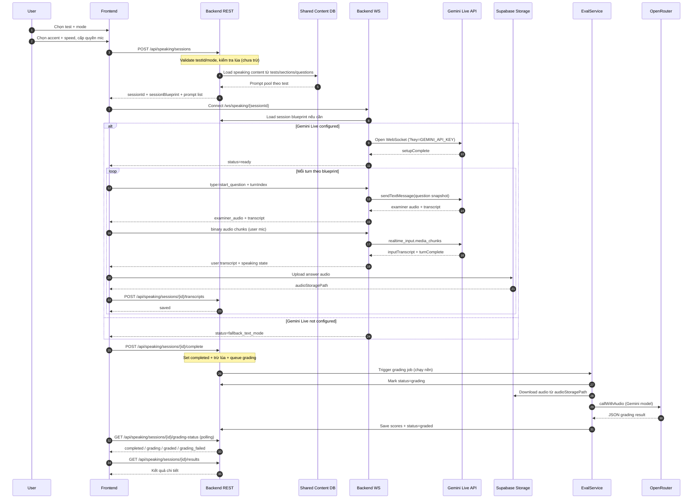

# Speaking Feature - GitHub Issue Draft

> File này chứa nội dung để copy-paste vào GitHub Issues.
> Mỗi section tương ứng với 1 issue trên GitHub.
> Xem hướng dẫn sử dụng GitHub Issues ở cuối file.

---

## PARENT ISSUE

> Copy phần **Title** và **Body** bên dưới vào issue chính trên GitHub.

### Title

```
Feature: Tính năng Speaking - AI IELTS Examiner
```

### Labels

```
speaking, feature, priority:high
```

### Body

---BEGIN COPY---

## Tổng quan

Tính năng này cho phép người dùng **luyện thi IELTS Speaking** với một giám khảo AI. Giám khảo sẽ hỏi câu hỏi bằng giọng nói, người dùng trả lời qua microphone, và hệ thống chấm điểm tự động sau khi buổi thi kết thúc. Toàn bộ phần tương tác giọng nói được xử lý qua Gemini Live API -- một dịch vụ hỗ trợ truyền audio hai chiều theo thời gian thực.

### Kiến trúc tổng thể

Hệ thống gồm 5 phần chính:

- **Cơ sở dữ liệu dùng chung**: Nội dung đề thi Speaking được lưu chung với các kỹ năng khác trong các bảng `test_sets`, `tests`, `sections`, `questions` -- không tạo bảng nội dung riêng cho Speaking.
- **Frontend**: Giao diện để người dùng làm bài -- bao gồm xin quyền microphone, hiển thị phụ đề trực tiếp, và phát lại giọng nói của giám khảo.
- **Backend REST**: Xử lý các thao tác theo kiểu yêu cầu - phản hồi thông thường: tạo buổi thi, lưu bản ghi từng lượt hỏi đáp, quản lý kết quả và lịch sử.
- **Backend WebSocket**: Duy trì kết nối liên tục hai chiều giữa trình duyệt và Gemini Live, cho phép truyền audio giám khảo về người dùng và ngược lại trong suốt buổi thi.
- **Storage**: Lưu file ghi âm của người dùng vào kho lưu trữ riêng để hệ thống chấm điểm có thể tải về phân tích, và để dọn dẹp sau khi không còn cần thiết.

### Mục tiêu

- Người dùng chọn bài Speaking và chế độ thi phù hợp (thi đủ 3 phần, hoặc chỉ thi riêng Part 1, Part 2, Part 3).
- Khi bắt đầu buổi thi, hệ thống tạo một **session blueprint** làm runtime truth. Mọi turn đã được chọn phải được "chốt" trước khi examiner model sử dụng; với Full Test, Part 3 có thể ở trạng thái `pending_after_part_2` cho đến khi transcript Part 2 có sẵn, sau đó mới được materialize và chốt.
- Người dùng làm bài với giám khảo AI theo luồng gần giống bài thi IELTS thật.
- Sau khi nộp bài, hệ thống chấm điểm chạy ngầm ở phía server -- người dùng không phải chờ đợi trong lúc chấm.
- Kết quả được trả về theo đúng 4 tiêu chí chấm điểm Speaking của IELTS: Fluency & Coherence, Lexical Resource, Grammatical Range & Accuracy, và Pronunciation.

### Tài liệu tham khảo

- Planning notes: `docs/short_term_plans/speaking_issue.md`
- Speaking foundations: `docs/ielts_specific/speaking_session_foundations_vi.md`
- [Gemini Live API docs](https://ai.google.dev/gemini-api/docs/live)

### Nguyên tắc quản lý dữ liệu

- **Nội dung đề thi** Speaking nằm chung trong hệ thống bảng dùng chung: `test_sets`, `tests`, `sections`, `questions`. Không tạo bảng nội dung riêng cho Speaking.
- **Các bảng `speaking_*`** chỉ lưu dữ liệu phát sinh trong quá trình làm bài -- ví dụ: thông tin buổi thi, bản ghi từng lượt hỏi đáp, kết quả chấm điểm. Đây là dữ liệu "runtime", không phải nội dung biên soạn.
- **File ghi âm** được lưu trong kho `speaking-audio`; cơ sở dữ liệu chỉ lưu đường dẫn tới file đó (trường `audioStoragePath`) chứ không lưu chính file audio.
- Trạng thái "đã chốt" (`is_finalized`) nằm trên **buổi thi**, không nằm trên từng lượt hỏi đáp riêng lẻ.
- Giọng nói giám khảo (`accent`) và tốc độ nói (`speed`) do người dùng chọn trước khi bắt đầu, sau đó được gửi kèm khi tạo buổi thi.
- Lúa (tín dụng) được **kiểm tra đủ** khi tạo buổi thi, nhưng chỉ thực sự **bị trừ** khi người dùng nộp bài hoàn thành. Chính sách này phải được cấu hình tập trung để dễ thay đổi sau này.

### Luồng chính từ góc nhìn người dùng

1. **Chọn bài thi**: Người dùng chọn một bài Speaking và chế độ thi muốn làm (Full Test, hoặc riêng Part 1 / Part 2 / Part 3).
2. **Chuẩn bị trước khi vào phòng thi**: Hệ thống xin quyền sử dụng microphone, cho người dùng chọn giọng giám khảo và tốc độ nói, rồi mới bắt đầu tạo buổi thi.
3. **Tạo buổi thi**: Frontend gửi yêu cầu `POST /api/speaking/sessions` kèm `testId`, `mode`, `accent`, `speed`. Backend đọc nội dung đề từ hệ thống bảng chung và tạo bản kế hoạch câu hỏi (`sessionBlueprint`) cho toàn bộ buổi thi.
4. **Thi trực tiếp với giám khảo AI**: Frontend mở kết nối WebSocket để nhận giọng nói giám khảo và gửi giọng nói người dùng theo thời gian thực.
5. **Lưu từng lượt hỏi đáp**: Sau mỗi lượt (giám khảo hỏi xong, người dùng trả lời xong), frontend tải file ghi âm lên kho lưu trữ rồi gọi REST API để lưu bản ghi lượt đó -- bao gồm nội dung câu hỏi đúng tại thời điểm đã hỏi (`questionSnapshot`).
6. **Nộp bài**: Người dùng bấm nộp bài. Backend chốt buổi thi, trừ lúa, rồi đưa việc chấm điểm vào hàng đợi xử lý ngầm.
7. **Xem kết quả**: Frontend gọi lại API theo chu kỳ vài giây một lần để kiểm tra tiến độ chấm điểm. Khi có kết quả, trang kết quả hiển thị điểm chi tiết theo từng tiêu chí.

### Cơ chế tín dụng (Lúa)

| Thời điểm | Hành động |
|------------|-----------|
| Tạo buổi thi (`POST /api/speaking/sessions`) | **Kiểm tra** số dư lúa đủ hay không -- nếu không đủ thì từ chối ngay. Chưa trừ ở bước này. |
| Nộp bài hoàn thành (`POST /api/speaking/sessions/{id}/complete`) | **Trừ lúa** -- chỉ trừ nếu chưa từng trừ cho buổi thi này (`lua_deducted = false`). |
| Bỏ dở giữa chừng (`POST /api/speaking/sessions/{id}/abandon`) | **Không trừ** lúa. Người dùng mất mạng hoặc thoát sớm sẽ không bị mất tín dụng. |

### Quy tắc ngân hàng câu hỏi và selection

- **Part 1 bank:** mỗi test Speaking chính thức có **30 prompts** authored trong shared `questions`; backend random số turn mục tiêu trong khoảng **8-12**, rồi gọi selection service để chọn ra một subset coherent. Examiner model chỉ đọc các turn đã được chọn.
- **Part 2 bank:** mỗi test Speaking chính thức có **1 cue card**; backend chọn đúng cue card này cho session.
- **Part 3 bank:** mỗi test Speaking chính thức có **15 prompts** authored trong shared `questions`.
- **Part 3 standalone:** nếu user thi riêng Part 3, backend random số turn mục tiêu trong khoảng **3-6**, rồi dùng selection service để chọn subset coherent từ bank 15 câu.
- **Part 3 sau Part 2 trong Full Test:** backend chưa để examiner model tự chọn câu hỏi. Thay vào đó, sau khi transcript Part 2 được lưu, backend dùng selection service để materialize subset **3-6** câu từ bank Part 3 dựa trên cue card + transcript/context của Part 2; sau khi materialize, các turn này được chốt trong `session_blueprint` và examiner model chỉ tiêu thụ blueprint đã chốt.
- **Validation bắt buộc khi create session:** nếu bank thực tế không đạt tối thiểu `PART_1 >= 30`, `PART_2 >= 1`, `PART_3 >= 15` cho mode cần dùng thì API phải reject với lỗi rõ ràng.

### Sub-issues

- [ ] #__ -- [Prep] Thiết lập baseline sạch cho Speaking MVP
- [ ] #__ -- [DB] Thiết kế schema & migration cho Speaking
- [ ] #__ -- [BE] REST API - Quản lý session Speaking
- [ ] #__ -- [DB] Speaking legacy cleanup + official content bank backfill
- [ ] #__ -- [BE] Optional LLM-based question selection planner
- [ ] #__ -- [BE] WebSocket + Gemini Live API integration
- [ ] #__ -- [BE] Hệ thống chấm điểm (Grading & Evaluation)
- [ ] #__ -- [FE] Core flow - Pages, routing, state management
- [ ] #__ -- [FE] Real-time session - Audio & WebSocket
- [ ] #__ -- [Infra] Storage bucket, access rules & audio paths
- [ ] #__ -- [Infra] Cleanup, fallback policy & kiểm thử

> Thay `#__` bằng số issue thật sau khi tạo từng sub-issue trên GitHub.
> **Sub-issue [Prep] phải hoàn thành TRƯỚC tất cả sub-issues khác.**

### Thứ tự phụ thuộc giữa các sub-issue

- `[DB]` chốt quy ước dữ liệu chính thức cho toàn bộ tính năng -- các issue khác đều dựa vào đây.
- `[BE] REST` xây API dựa trên quy ước từ `[DB]`.
- `[DB] Speaking legacy cleanup + backfill` làm sạch dữ liệu live và đưa shared content hierarchy về đúng contract chính thức mà REST API đang enforce.
- `[BE] Planner` bổ sung tầng chọn câu hỏi provider-neutral phía backend; nên hoàn tất trước khi chốt flow real-time để blueprint behavior ổn định.
- `[FE] Core` xây giao diện dựa trên API từ `[BE] REST`.
- `[Infra] Storage bucket` phải sẵn sàng trước khi `[BE] Grading` có thể tải audio về chấm điểm, và trước khi `[FE] Real-time` có thể tải audio lên.
- `[BE] WebSocket` và `[FE] Core` phải xong trước khi `[FE] Real-time` bắt đầu -- vì phần real-time cần cả WebSocket lẫn khung giao diện đã ổn.
- `[Infra] Cleanup, fallback & kiểm thử` nằm cuối cùng vì nó kiểm tra và dọn dẹp toàn bộ hệ thống sau khi các luồng chính đã hoạt động.

### Sequence Diagram



### Chính sách dự phòng tối thiểu

| Tình huống | Cách xử lý |
|------------|----------|
| Gemini Live không kết nối được | Trả `status=fallback_text_mode`. Frontend vẫn hiển thị câu hỏi dạng văn bản để người dùng tiếp tục làm bài -- chỉ mất phần giọng nói giám khảo, không mất cả buổi thi. |
| Phụ đề trực tiếp yếu hoặc trống | Buổi thi vẫn tiếp tục bình thường. Ưu tiên giữ nguyên file ghi âm đầy đủ vì đó là dữ liệu chính để chấm điểm. Phụ đề chỉ là hỗ trợ hiển thị, không ảnh hưởng đến kết quả. |
| Tải file ghi âm lên bị lỗi ở một lượt | Frontend phải báo lỗi rõ ràng và cho phép thử tải lại. Không được để lỗi một lượt làm hỏng cả buổi thi. |
| Chấm điểm chưa xong | Trang kết quả tiếp tục gọi lại API vài giây một lần cho tới khi trạng thái chuyển thành `graded` hoặc `grading_failed`. |

---END COPY---

---

## SUB-ISSUE 0: [Prep] Thiết lập baseline sạch cho Speaking MVP

### Title

```
[Prep] Thiết lập baseline sạch cho Speaking MVP
```

### Labels

```
speaking, priority:high
```

### Body

---BEGIN COPY---

## Mô tả

Issue này chuẩn bị một **điểm bắt đầu sạch** cho cả team trước khi triển khai Speaking MVP.

Hiện tại trong repo vẫn còn phiên bản Speaking cũ (code thử nghiệm từ giai đoạn trước) lẫn lộn với code mới. Ngoài ra, nhánh `feature/homepage` chứa phần giao diện trang chủ cần thiết cho luồng mới nhưng chưa được đưa vào `main`. Issue này giải quyết cả hai vấn đề đó:

- Đưa nhánh `feature/homepage` vào `main` để các issue sau có sẵn giao diện trang chủ làm nền.
- Gỡ bỏ toàn bộ code Speaking cũ -- phần code này không còn phải là hướng triển khai chính và nếu để lại sẽ gây nhầm lẫn.
- Đảm bảo `main` build thành công cả backend lẫn frontend, để mọi người bắt đầu các issue tiếp theo từ cùng một nền tảng.

**Parent issue**: #__
**Issue này PHẢI hoàn thành TRƯỚC tất cả các sub-issue khác.**

## Vì sao issue này quan trọng

Nếu không dọn dẹp trước, các issue sau sẽ rất dễ gặp rắc rối:

- **Bám nhầm code cũ**: Người làm backend hoặc frontend có thể vô tình import hoặc tham chiếu tới các route, service, hay store của phiên bản Speaking cũ -- những thứ sắp bị thay thế hoàn toàn.
- **Build hỏng ngay từ đầu**: Khi bắt đầu tạo entity, service, hay page mới cho Speaking, các import liên quan tới code cũ có thể gây lỗi biên dịch hoặc build.
- **Team nhìn thấy các "phiên bản" khác nhau**: Nếu code cũ còn lẫn lộn, mỗi người đọc repo sẽ thấy một bức tranh khác nhau về Speaking đang ở trạng thái gì, dễ dẫn tới hiểu sai kiến trúc.

## Kết quả cần đạt sau issue này

- Nhánh `main` đã chứa phần giao diện trang chủ cần thiết làm nền cho luồng Speaking mới.
- Code Speaking cũ đã được gỡ bỏ -- không còn file nào gây hiểu nhầm rằng phiên bản cũ vẫn là hướng triển khai chính.
- Hệ thống bảng dùng chung (`test_sets`, `tests`, `sections`, `questions`) vẫn nguyên vẹn, không bị ảnh hưởng bởi việc dọn dẹp.
- Backend biên dịch thành công và frontend build thành công.
- Cả team có thể checkout `main`, pull về, và bắt đầu các sub-issue tiếp theo mà không cần lo chuyện code cũ hay nhánh lệch.

## Phạm vi

Issue này chỉ làm 4 việc:

- Merge nhánh `feature/homepage` vào `main`.
- Gỡ bỏ code Speaking cũ ở cả backend và frontend.
- Dọn lại các dòng import, route, và cấu hình bị hỏng sau khi xóa code cũ.
- Chạy build kiểm tra để đảm bảo cả hai phía đều không lỗi.

## Không nằm trong phạm vi

Issue này **không** làm bất cứ gì liên quan tới kiến trúc Speaking mới:

- Không thiết kế schema cơ sở dữ liệu mới cho Speaking.
- Không tạo REST API mới.
- Không xây luồng WebSocket mới.
- Không xây hệ thống chấm điểm mới.
- Không tạo hay xóa bảng cơ sở dữ liệu cho Speaking mới (phần đó thuộc sub-issue [DB]).

## Người thực hiện

Jacob -- người sở hữu nhánh `feature/homepage` và hiểu rõ nhất phần nào cần giữ lại, phần nào cần gỡ.

## Hướng triển khai

### Bước 1: Đưa nhánh homepage vào `main`

```bash
git checkout main
git pull origin main
git merge feature/homepage
# Giải quyết conflict nếu có
git push origin main
```

### Bước 2: Tạo nhánh riêng cho việc dọn dẹp

```bash
git checkout -b chore/remove-old-speaking-code
```

### Bước 3: Gỡ code Speaking cũ ở backend

Cần gỡ toàn bộ các nhóm code thuộc phiên bản Speaking cũ. Dưới đây là các nhóm chính và ví dụ file đại diện:

- **Controller** -- điểm tiếp nhận request từ frontend
- **Service** -- logic nghiệp vụ xử lý buổi thi Speaking
- **WebSocket handler và client** -- kết nối thời gian thực với Gemini (phiên bản cũ)
- **Entity, repository, DTO** -- các lớp dữ liệu và truy vấn cơ sở dữ liệu
- **Config** -- cấu hình riêng cho Speaking cũ

Ví dụ các file đại diện cần được gỡ:

```bash
rm backend/src/main/java/com/cramer/controller/SpeakingController.java
rm backend/src/main/java/com/cramer/service/SpeakingSessionService.java
rm backend/src/main/java/com/cramer/websocket/SpeakingWebSocketHandler.java
rm backend/src/main/java/com/cramer/websocket/GeminiLiveWebSocketClient.java
rm backend/src/main/java/com/cramer/entity/SpeakingSession.java
rm backend/src/main/java/com/cramer/entity/SpeakingTranscript.java
rm backend/src/main/java/com/cramer/entity/SpeakingQuestion.java
rm backend/src/main/java/com/cramer/entity/SpeakingTopic.java
rm backend/src/main/java/com/cramer/repository/SpeakingSessionRepository.java
rm backend/src/main/java/com/cramer/dto/SpeakingSessionDTO.java
rm backend/src/main/java/com/cramer/config/SpeakingAIConfig.java
rm backend/src/main/java/com/cramer/config/WebSocketConfig.java
```

### Bước 4: Gỡ code Speaking cũ ở frontend

Tương tự backend, cần gỡ toàn bộ code frontend thuộc phiên bản Speaking cũ:

- **Pages** -- các trang giao diện buổi thi và kết quả
- **Components** -- các thành phần giao diện dùng trong phòng thi
- **Hooks** -- logic xử lý WebSocket và ghi âm
- **Store** -- trạng thái toàn cục của Speaking
- **API client** -- hàm gọi API Speaking
- **CSS** -- kiểu dáng riêng cho Speaking

Ví dụ các file đại diện cần được gỡ:

```bash
rm frontend/src/pages/speaking/SpeakingSessionPage.jsx
rm frontend/src/pages/speaking/SpeakingResultsPage.jsx
rm frontend/src/components/speaking/GeminiLiveSessionLayout.jsx
rm frontend/src/components/speaking/PreBriefScreen.jsx
rm frontend/src/components/speaking/Part2PrepLayout.jsx
rm frontend/src/components/speaking/ProcessingScreen.jsx
rm frontend/src/components/speaking/ExaminerWaveform.jsx
rm frontend/src/components/SpeakingPartModal.jsx
rm frontend/src/hooks/useGeminiLive.js
rm frontend/src/hooks/useAudioRecorder.js
rm frontend/src/stores/useSpeakingStore.js
rm frontend/src/api/speakingApi.js
rm frontend/src/css/speaking/speaking-session.css
```

### Bước 5: Dọn lại các dòng import và route bị hỏng

Sau khi xóa file, một số file khác sẽ bị hỏng vì vẫn đang import hoặc tham chiếu tới code đã xóa. Dưới đây là các điểm điển hình cần kiểm tra:

| File | Dòng cần sửa | Hành động |
|------|--------------|-----------|
| `frontend/src/stores/index.js` | `export { default as useSpeakingStore } from './useSpeakingStore'` | Xóa dòng này |
| `frontend/src/stores/useAuthStore.js` | `import { setupSpeakingApiClient } from '../api/speakingApi'` | Xóa import + xóa chỗ gọi `setupSpeakingApiClient` |
| `frontend/src/App.jsx` | `<Route path="/speaking/*" element={<Navigate to="/courses" replace />} />` | Xóa 2 dòng redirect speaking |

### Bước 6: Dọn cấu hình Speaking cũ trong `application.properties`

Xóa hoặc tạm vô hiệu hóa (comment out) các dòng cấu hình bắt đầu bằng `speaking.*` nếu chúng chỉ phục vụ phiên bản Speaking cũ. Các dòng cấu hình chung của ứng dụng thì giữ nguyên.

```properties
# Xóa tất cả dòng bắt đầu bằng speaking.*
speaking.session.lua-cost=...
speaking.asr.enabled=...
speaking.asr.provider=...
speaking.evaluation.model=...
speaking.gemini.live.enabled=...
```

### Bước 7: Chạy build kiểm tra

```bash
# Backend -- biên dịch Java, bỏ qua test vì chỉ cần kiểm tra compile
cd backend && ./mvnw clean compile -DskipTests

# Frontend -- build bản production để kiểm tra không còn import hỏng
cd frontend && npm run build
```

Cả hai lệnh phải chạy thành công, không có lỗi nào.

### Bước 8: Tạo Pull Request và merge vào `main`

```bash
git add -A
git commit -m "chore: establish clean baseline for speaking mvp"
git push origin chore/remove-old-speaking-code
```

Sau đó vào GitHub tạo Pull Request nhắm vào `main`, gán reviewer, và merge sau khi được duyệt.

### Bước 9: Thông báo team

Sau khi PR đã merge, nhắn Khoa:

> "Baseline sạch cho Speaking MVP đã vào main rồi. Kéo code mới về (`git pull origin main`) để bắt đầu các issue tiếp theo nha."

## Lưu ý quan trọng

- **Không đụng vào hệ thống bảng dùng chung** (`test_sets`, `tests`, `sections`, `questions`) -- đây là hạ tầng chung cho mọi kỹ năng, không phải của riêng Speaking cũ.
- **Không tạo hay xóa bảng cơ sở dữ liệu** cho Speaking mới -- phần đó thuộc sub-issue [DB].
- **Không xóa file `application.properties` chung** -- chỉ dọn các dòng `speaking.*` rõ ràng thuộc phiên bản cũ.
- **Không xóa `SupabaseStorageService.java`** -- service này dùng chung cho toàn bộ hệ thống, không phải của riêng Speaking.

## Tiêu chí hoàn thành

- [ ] Nhánh `feature/homepage` đã được merge vào `main`
- [ ] Code Speaking cũ đã được gỡ bỏ -- không còn file nào gây hiểu nhầm là phiên bản đang dùng
- [ ] Các dòng import, route, và cấu hình bị hỏng do xóa code cũ đã được dọn sạch
- [ ] Hệ thống bảng dùng chung (`test_sets`, `tests`, `sections`, `questions`) vẫn nguyên vẹn
- [ ] Backend biên dịch thành công (`./mvnw clean compile -DskipTests`)
- [ ] Frontend build thành công (`npm run build`)
- [ ] Nhánh `main` đã sẵn sàng -- cả team có thể pull về và bắt đầu các sub-issue tiếp theo

---END COPY---

---

## SUB-ISSUE 1: [DB] Thiết kế schema & migration cho Speaking

### Title

```
[DB] Thiết kế schema & migration cho Speaking
```

### Labels

```
speaking, database, priority:high
```

### Body

---BEGIN COPY---

## Mô tả

Issue này chốt **data contract** (quy ước dữ liệu chính thức) cho toàn bộ tính năng Speaking theo hướng gần như implementation-ready.

Nói ngắn gọn, sau issue này team phải biết rõ:

- content Speaking được lưu ở đâu
- runtime Speaking được lưu ở đâu
- migration SQL cần làm những gì
- API/FE/Grading sẽ đọc - ghi theo contract nào

**Parent issue**: #__

## Vì sao issue này quan trọng

Nếu chưa chốt DB đúng ngay từ đầu, các issue sau sẽ dễ lệch nhau ở 4 điểm lớn:

- Backend có thể tiếp tục bám vào các bảng Speaking cũ thay vì shared hierarchy
- Frontend không biết session thật đang gắn với `test` nào và đã hỏi câu nào
- Grading có thể chấm theo content mới trong DB thay vì đúng câu đã hỏi trong buổi thi
- Cleanup/history/audit không lần được audio nào thuộc turn nào

## Kết quả cần đạt sau issue này

- **Một nguồn content chính thức**: Speaking content nằm ở `test_sets -> tests -> sections -> questions`
- **Một nguồn runtime chính thức**: Speaking runtime nằm ở `speaking_sessions`, `speaking_transcripts`
- `session_blueprint` được chốt thành runtime plan của cả session
- `question_snapshot` được chốt thành runtime truth của từng turn
- Có migration skeleton đủ chi tiết để BE có thể bắt đầu implement entity/repository/service
- Có RLS skeleton, seed skeleton và query kiểm tra sau migration

## Phạm vi của issue này

- Chốt schema cho `speaking_sessions` và `speaking_transcripts`
- Chốt contract dùng shared hierarchy cho Speaking content
- Viết migration skeleton SQL
- Chốt indexes, foreign keys, check constraints, RLS skeleton
- Seed tối thiểu 1 speaking test trên shared hierarchy
- Chỉ ra tài liệu schema cần update sau khi migration xong

## Ngoài phạm vi của issue này

- Không implement REST API
- Không implement WebSocket flow
- Không implement grading worker
- Không làm frontend pages/store
- Không tạo bucket `speaking-audio` và không chốt infra policy của bucket

## Kiến trúc dữ liệu cần chốt

### 1. Quyết định kiến trúc gốc

Speaking content **không** có content tables riêng. Content dùng lại shared hierarchy đang tồn tại trong hệ thống:

| Table | Vai trò | Quy ước cho Speaking |
|-------|---------|----------------------|
| `test_sets` | Nhóm bộ đề | Reuse hoàn toàn |
| `tests` | Một bài Speaking | Reuse publish flow, `generation_metadata` |
| `sections` | Mỗi row là một part | `skill = 'speaking'`, `part_number in (1,2,3)` |
| `questions` | Prompt pool cho từng part | `question_type = PART_1/PART_2/PART_3` |

Runtime vẫn dùng bảng riêng vì đây là dữ liệu phát sinh khi user làm bài:

- `speaking_sessions`
- `speaking_transcripts`

### 2. Quy ước content Speaking trên shared hierarchy

#### Quy ước hàng `sections`

- `sections.skill = 'speaking'`
- `sections.part_number = 1 | 2 | 3`
- Mỗi `test` Speaking phải có đúng 3 `sections` cho 3 part
- `section_layout` có thể để `NULL` ở giai đoạn đầu nếu chưa cần layout riêng

#### Quy ước hàng `questions`

- `questions.question_type = 'PART_1' | 'PART_2' | 'PART_3'`
- `questions.question_number` là số thứ tự **trong phạm vi section**, không phải toàn bài
- `questions.question_content` là JSONB chứa authored content
- `correct_answer` có thể để `NULL` cho Speaking vì không có answer key kiểu Reading/Listening
- `explanation` có thể để `NULL` ở seed đầu tiên

### 3. Naming convention

- Database columns: `snake_case`
- JSON payloads bên trong JSONB: `camelCase`
- Không nhét runtime choice vào authored content; ví dụ `accent`, `speed`, `luaCost` không nằm trong `question_content`

## Contract cho `questions.question_content`

### Base contract cho mọi part

Mọi row Speaking trong `questions` phải có tối thiểu:

```json
{
  "schemaVersion": 1,
  "partType": "PART_1",
  "promptText": "What do you usually do on weekends?"
}
```

### `PART_1`

**Required**

- `schemaVersion`
- `partType`
- `promptText`

**Optional**

- `topicLabel`
- `delivery`

```json
{
  "schemaVersion": 1,
  "partType": "PART_1",
  "promptText": "What do you usually do on weekends?",
  "topicLabel": "Weekend routine",
  "delivery": {
    "ttsEnabled": true,
    "voiceHint": "british"
  }
}
```

### `PART_2`

**Required**

- `schemaVersion`
- `partType`
- `promptText`
- `cueCardBullets`
- `prepTimeSeconds`
- `talkTimeSeconds`

**Optional**

- `topicLabel`
- `delivery`

```json
{
  "schemaVersion": 1,
  "partType": "PART_2",
  "promptText": "Describe a place you enjoy visiting.",
  "topicLabel": "Favorite place",
  "cueCardBullets": [
    "where it is",
    "when you go there",
    "what you do there",
    "and explain why you enjoy visiting it"
  ],
  "prepTimeSeconds": 60,
  "talkTimeSeconds": 120,
  "delivery": {
    "ttsEnabled": true,
    "voiceHint": "british"
  }
}
```

### `PART_3`

**Required**

- `schemaVersion`
- `partType`
- `promptText`

**Optional**

- `topicLabel`
- `delivery`

```json
{
  "schemaVersion": 1,
  "partType": "PART_3",
  "promptText": "Why do some people prefer living in big cities?",
  "topicLabel": "City life",
  "delivery": {
    "ttsEnabled": true,
    "voiceHint": "british"
  }
}
```

## Runtime model cần chốt

### Vì sao phải có `session_blueprint` và `question_snapshot`

- `session_blueprint`: chốt trước toàn bộ kế hoạch của session (part nào, turn nào, source question nào)
- `question_snapshot`: lưu đúng prompt đã dùng tại thời điểm hỏi

Hai field này giúp grading/history/replay không bị lệ thuộc vào việc content gốc bị sửa sau đó.

### Contract gợi ý cho `session_blueprint`

```json
{
  "schemaVersion": 1,
  "testId": 123,
  "sessionMode": "FULL",
  "accent": "british",
  "speed": 1.0,
  "parts": [
    {
      "partNumber": 1,
      "bankSize": 30,
      "selectionStatus": "selected",
      "selectionStrategy": "topic_cluster_random_v1",
      "targetTurnCount": 10,
      "selectedTurnCount": 10,
      "turns": [
        {
          "turnIndex": 1,
          "sourceQuestionId": 501,
          "questionSnapshot": {
            "schemaVersion": 1,
            "partType": "PART_1",
            "promptText": "What do you usually do on weekends?",
            "topicLabel": "Weekend routine"
          }
        }
      ]
    },
    {
      "partNumber": 3,
      "bankSize": 15,
      "selectionStatus": "pending_after_part_2",
      "selectionStrategy": "follow_up_context_v1",
      "minTurnCount": 3,
      "maxTurnCount": 6,
      "turns": []
    }
  ]
}
```

- `session_blueprint` trong database có thể chứa planner state nội bộ để materialize các turn phụ thuộc context; API response cho frontend chỉ nên trả blueprint đã sanitize và các turn đã sẵn sàng để examiner model dùng.
- `turns` trả về cho frontend là danh sách các turn đã selected/frozen ở thời điểm response; với Full Test, Part 3 có thể xuất hiện sau khi transcript Part 2 được lưu.

### Contract gợi ý cho `question_snapshot`

```json
{
  "schemaVersion": 1,
  "partType": "PART_2",
  "promptText": "Describe a place you enjoy visiting.",
  "cueCardBullets": [
    "where it is",
    "when you go there",
    "what you do there",
    "why you enjoy visiting it"
  ],
  "prepTimeSeconds": 60,
  "talkTimeSeconds": 120
}
```

## Schema đề xuất - gần implementation-ready

### Bảng `speaking_sessions`

Vai trò: lưu 1 buổi thi Speaking của 1 user.

| Column | Type | Nullable | Default | Ý nghĩa |
|--------|------|----------|---------|---------|
| `id` | bigint | NO | identity | Primary key |
| `user_id` | uuid | NO | - | Chủ sở hữu session; FK tới `profiles.id` hoặc auth-linked profile ID đang dùng trong hệ thống |
| `test_id` | bigint | NO | - | Bài Speaking gốc trong `tests` |
| `session_mode` | varchar(20) | NO | - | `FULL`, `PART_1`, `PART_2`, `PART_3` |
| `status` | varchar(30) | NO | `'in_progress'` | `in_progress`, `completed`, `grading`, `graded`, `grading_failed`, `abandoned`, `expired` |
| `accent` | varchar(20) | NO | - | Accent user chọn trước khi bắt đầu |
| `speed` | numeric(3,2) | NO | `1.00` | Tốc độ examiner audio/text pacing |
| `session_blueprint` | jsonb | NO | - | Runtime plan đã chốt cho cả buổi thi |
| `is_finalized` | boolean | NO | `false` | Chặn ghi transcript mới sau khi complete/abandon/expire |
| `total_duration_seconds` | integer | YES | - | Tổng thời lượng session nếu có |
| `overall_band` | numeric(2,1) | YES | - | Điểm overall |
| `fluency_band` | numeric(2,1) | YES | - | Fluency and coherence |
| `lexical_band` | numeric(2,1) | YES | - | Lexical resource |
| `grammar_band` | numeric(2,1) | YES | - | Grammatical range and accuracy |
| `pronunciation_band` | numeric(2,1) | YES | - | Pronunciation |
| `grading_result` | jsonb | YES | - | Payload grading chi tiết |
| `lua_cost` | integer | NO | `0` | Chi phí phiên làm bài |
| `lua_deducted` | boolean | NO | `false` | Đã trừ lúa hay chưa |
| `started_at` | timestamptz | NO | `now()` | Thời điểm bắt đầu |
| `completed_at` | timestamptz | YES | - | Thời điểm user submit |
| `graded_at` | timestamptz | YES | - | Thời điểm grading xong |
| `created_at` | timestamptz | NO | `now()` | Audit |
| `updated_at` | timestamptz | NO | `now()` | Audit |

**Rules bắt buộc**

- `session_blueprint` là bắt buộc
- `test_id` luôn trỏ tới row trong `tests`
- `status` chỉ dùng tập giá trị đã chốt ở trên
- `speed > 0`
- `lua_cost >= 0`
- `completed_at` chỉ có khi session đã hoàn thành hoặc dừng

### Bảng `speaking_transcripts`

Vai trò: lưu từng turn thực tế trong 1 session.

| Column | Type | Nullable | Default | Ý nghĩa |
|--------|------|----------|---------|---------|
| `id` | bigint | NO | identity | Primary key |
| `session_id` | bigint | NO | - | FK tới `speaking_sessions.id` |
| `source_question_id` | bigint | YES | - | Nếu turn xuất phát từ `questions.id` thì lưu lại |
| `part_number` | integer | NO | - | Part 1/2/3 của turn |
| `turn_index` | integer | NO | - | Thứ tự turn trong session, unique theo session |
| `question_snapshot` | jsonb | NO | - | Bản chụp câu hỏi đã hỏi |
| `audio_storage_path` | text | YES | - | Đường dẫn file trong bucket, ví dụ `sessions/123/turn-1.webm` |
| `audio_duration_seconds` | integer | YES | - | Độ dài audio |
| `transcript_text` | text | YES | - | STT output hoặc transcript manual |
| `transcript_confidence` | numeric(4,3) | YES | - | Điểm confidence 0..1 nếu engine trả về |
| `question_evaluation` | jsonb | YES | - | Kết quả chấm ở mức turn nếu cần |
| `recorded_at` | timestamptz | NO | `now()` | Thời điểm turn được ghi nhận |
| `created_at` | timestamptz | NO | `now()` | Audit |

**Rules bắt buộc**

- `question_snapshot` là bắt buộc
- `part_number in (1,2,3)`
- `turn_index > 0`
- unique `(session_id, turn_index)`
- `source_question_id` có thể `NULL` để không khóa cứng vào only-shared-row scenarios trong tương lai

### Indexes tối thiểu

- `speaking_sessions(user_id, created_at desc)`
- `speaking_sessions(test_id, created_at desc)`
- `speaking_sessions(status, created_at desc)`
- `speaking_transcripts(session_id, turn_index)`
- `speaking_transcripts(source_question_id)`

## Migration skeleton SQL

> Đây là skeleton để issue BE/DB triển khai tiếp; tên file migration thật có thể đổi theo convention hiện tại trong `docs/backend/migrations/`.

### Bước A - Dọn legacy content tables Speaking cũ

```sql
begin;

drop table if exists public.speaking_fixed_questions cascade;
drop table if exists public.speaking_questions cascade;
drop table if exists public.speaking_tests cascade;
drop table if exists public.speaking_topics cascade;

commit;
```

> Không drop `speaking_sessions` và `speaking_transcripts` theo kiểu mù. Hai bảng runtime đang tồn tại trong live DB nên migration thật cần `alter/rename/drop column có kiểm soát` để tránh mất dữ liệu không mong muốn.

### Bước B - Chuẩn hóa `speaking_sessions`

```sql
begin;

alter table public.speaking_sessions
  add column if not exists test_id bigint,
  add column if not exists accent varchar(20),
  add column if not exists speed numeric(3,2) not null default 1.00,
  add column if not exists session_blueprint jsonb,
  add column if not exists is_finalized boolean not null default false,
  add column if not exists graded_at timestamptz,
  add column if not exists created_at timestamptz not null default now(),
  add column if not exists updated_at timestamptz not null default now();

alter table public.speaking_sessions
  drop column if exists topic_id,
  drop column if exists test_id_legacy,
  drop column if exists accent_legacy,
  drop column if exists speed_legacy;

alter table public.speaking_sessions
  alter column session_mode type varchar(20),
  alter column status type varchar(30),
  alter column started_at set default now(),
  alter column lua_cost set default 0,
  alter column lua_deducted set default false;

alter table public.speaking_sessions
  add constraint fk_speaking_sessions_test
    foreign key (test_id) references public.tests(id) on delete restrict,
  add constraint chk_speaking_sessions_mode
    check (session_mode in ('FULL', 'PART_1', 'PART_2', 'PART_3')),
  add constraint chk_speaking_sessions_status
    check (status in ('in_progress', 'completed', 'grading', 'graded', 'grading_failed', 'abandoned', 'expired')),
  add constraint chk_speaking_sessions_speed_positive
    check (speed > 0),
  add constraint chk_speaking_sessions_lua_cost_non_negative
    check (lua_cost >= 0);

create index if not exists idx_speaking_sessions_user_created
  on public.speaking_sessions (user_id, created_at desc);
create index if not exists idx_speaking_sessions_test_created
  on public.speaking_sessions (test_id, created_at desc);
create index if not exists idx_speaking_sessions_status_created
  on public.speaking_sessions (status, created_at desc);

commit;
```

### Bước C - Chuẩn hóa `speaking_transcripts`

```sql
begin;

alter table public.speaking_transcripts
  rename column question_id to source_question_id;

alter table public.speaking_transcripts
  rename column part to part_number;

alter table public.speaking_transcripts
  add column if not exists turn_index integer,
  add column if not exists question_snapshot jsonb,
  add column if not exists audio_storage_path text,
  add column if not exists created_at timestamptz not null default now();

alter table public.speaking_transcripts
  drop column if exists audio_url;

alter table public.speaking_transcripts
  add constraint fk_speaking_transcripts_session
    foreign key (session_id) references public.speaking_sessions(id) on delete cascade,
  add constraint fk_speaking_transcripts_source_question
    foreign key (source_question_id) references public.questions(id) on delete set null,
  add constraint chk_speaking_transcripts_part_number
    check (part_number in (1, 2, 3)),
  add constraint chk_speaking_transcripts_turn_index
    check (turn_index > 0);

create unique index if not exists uq_speaking_transcripts_session_turn
  on public.speaking_transcripts (session_id, turn_index);

create index if not exists idx_speaking_transcripts_session_turn
  on public.speaking_transcripts (session_id, turn_index);
create index if not exists idx_speaking_transcripts_source_question
  on public.speaking_transcripts (source_question_id);

commit;
```

### Bước D - Backfill tối thiểu cho dữ liệu runtime cũ

```sql
begin;

update public.speaking_sessions
set test_id = coalesce(test_id, null)
where test_id is null;

update public.speaking_transcripts st
set question_snapshot = jsonb_build_object(
  'schemaVersion', 1,
  'partType', concat('PART_', st.part_number),
  'promptText', 'TBD_BACKFILL_PROMPT'
)
where question_snapshot is null;

update public.speaking_transcripts
set audio_storage_path = regexp_replace(audio_url, '^.*/storage/v1/object/public/[^/]+/', '')
where audio_storage_path is null
  and audio_url is not null;

commit;
```

> Migration thật cần quyết định rõ: nếu dữ liệu runtime cũ không đủ tin cậy để backfill thì có thể archive trước rồi mới chuyển schema.

### Bước E - Seed tối thiểu cho shared hierarchy

```sql
begin;

insert into public.test_sets (
  code, name, description, source_type, is_published, display_order
) values (
  'speaking-mvp',
  'Speaking MVP Set',
  'Seed data toi thieu cho luong Speaking MVP',
  'custom',
  true,
  0
)
on conflict (code) do update
set name = excluded.name,
    description = excluded.description,
    source_type = excluded.source_type,
    is_published = excluded.is_published,
    display_order = excluded.display_order;

insert into public.tests (
  set_id, test_number, name, description, difficulty, estimated_time_minutes, is_published, is_ai_generated
)
select ts.id, 1, 'Speaking Test 01', 'Seed test cho luong session Speaking', 'INTERMEDIATE', 15, true, false
from public.test_sets ts
where ts.code = 'speaking-mvp'
on conflict (set_id, test_number) do update
set name = excluded.name,
    description = excluded.description,
    difficulty = excluded.difficulty,
    estimated_time_minutes = excluded.estimated_time_minutes,
    is_published = excluded.is_published,
    is_ai_generated = excluded.is_ai_generated;

-- insert 3 sections for parts 1/2/3
-- official authoring target: 30 PART_1 prompts
-- official authoring target: 1 PART_2 cue card
-- official authoring target: 15 PART_3 prompts

commit;
```

### Bước F - RLS skeleton

```sql
begin;

alter table public.speaking_sessions enable row level security;
alter table public.speaking_transcripts enable row level security;

create policy "Users can view own speaking sessions"
on public.speaking_sessions
for select
using (user_id = auth.uid());

create policy "Users can insert own speaking sessions"
on public.speaking_sessions
for insert
with check (user_id = auth.uid());

create policy "Users can update own open speaking sessions"
on public.speaking_sessions
for update
using (user_id = auth.uid())
with check (user_id = auth.uid());

create policy "Users can view own speaking transcripts"
on public.speaking_transcripts
for select
using (
  exists (
    select 1
    from public.speaking_sessions s
    where s.id = speaking_transcripts.session_id
      and s.user_id = auth.uid()
  )
);

create policy "Users can insert own speaking transcripts"
on public.speaking_transcripts
for insert
with check (
  exists (
    select 1
    from public.speaking_sessions s
    where s.id = speaking_transcripts.session_id
      and s.user_id = auth.uid()
      and s.is_finalized = false
  )
);

commit;
```

> Service-role/backend sẽ bypass hoặc có policy riêng theo cách hệ thống đang vận hành; phần đó phải khớp với setup Supabase hiện tại khi implement thật.

## Query kiểm tra sau migration

### Kiểm tra shared hierarchy Speaking đã có đủ 3 part

```sql
select
  t.id as test_id,
  t.name as test_name,
  s.part_number,
  count(q.id) as question_count
from public.tests t
join public.sections s on s.test_id = t.id
left join public.questions q on q.section_id = s.id
where s.skill = 'speaking'
group by t.id, t.name, s.part_number
order by t.id, s.part_number;
```

### Kiểm tra transcript luôn có runtime truth

```sql
select id, session_id, turn_index
from public.speaking_transcripts
where question_snapshot is null
   or part_number not in (1, 2, 3);
```

### Kiểm tra session contract chính

```sql
select id, user_id, test_id, session_mode, status
from public.speaking_sessions
where test_id is null
   or session_blueprint is null;
```

### Kiểm tra seed Speaking content theo `question_type`

```sql
select s.part_number, q.question_type, count(*)
from public.questions q
join public.sections s on s.id = q.section_id
where s.skill = 'speaking'
group by s.part_number, q.question_type
order by s.part_number, q.question_type;
```

## Tài liệu phải update sau khi migration chốt

- `docs/library/backend/DATABASE_SCHEMA.md`
- `docs/library/backend/ENTITIES.md`
- mọi docs Speaking mới nếu đang còn nhắc tới `speaking_topics`, `speaking_tests`, `speaking_questions`

## Deliverables

- [ ] Có migration plan rõ cho việc bỏ dedicated Speaking content tables cũ
- [ ] Có schema gần implementation-ready cho `speaking_sessions`
- [ ] Có schema gần implementation-ready cho `speaking_transcripts`
- [ ] Có check constraints, foreign keys, indexes, RLS skeleton
- [ ] Có seed tối thiểu 1 speaking test trong shared hierarchy
- [ ] Có query kiểm tra sau migration
- [ ] Có danh sách docs schema phải update

## Acceptance Criteria

- [ ] Shared hierarchy là nơi lưu content Speaking chính thức
- [ ] `questions.question_type` cho Speaking dùng `PART_1 | PART_2 | PART_3`
- [ ] `speaking_sessions` và `speaking_transcripts` đủ dữ liệu cho create session, transcript saving, grading, history, cleanup
- [ ] `session_blueprint` và `question_snapshot` được định nghĩa rõ và được coi là runtime truth
- [ ] Migration skeleton đủ chi tiết để BE/DB bắt đầu implement mà không phải đoán lại schema
- [ ] Có RLS skeleton và seed/query skeleton để verify sau migration
- [ ] Schema docs source-of-truth có danh sách cần update sau khi implement

---END COPY---

---

## SUB-ISSUE 2: [BE] REST API - Quản lý session Speaking

### Title

```
[BE] REST API - Quản lý session Speaking
```

### Labels

```
speaking, backend, priority:high
```

### Body

---BEGIN COPY---

## Mô tả

Issue này xây lớp REST API (API request-response tiêu chuẩn) cho Speaking.

Trách nhiệm của lớp này là:

- tạo session từ `testId` và `mode`
- đọc content Speaking từ shared hierarchy
- lưu transcript từng turn
- chốt session khi user submit
- trả trạng thái grading và kết quả

Public Speaking API chỉ làm việc với **session runtime**. Nó không mở thêm content API riêng kiểu topic/question bank cho user public.

**Parent issue**: #__
**Depends on**: [DB] Schema & migration (#__)

## Endpoints

### Session management (quản lý vòng đời buổi thi)

| Method | Path | Mô tả |
|--------|------|-------|
| POST | `/api/speaking/sessions` | Tạo session mới |
| GET | `/api/speaking/sessions/{id}` | Lấy thông tin session |
| POST | `/api/speaking/sessions/{id}/transcripts` | Lưu transcript cho 1 câu |
| POST | `/api/speaking/sessions/{id}/complete` | Submit bài, trigger grading |
| POST | `/api/speaking/sessions/{id}/abandon` | Hủy session (không trừ lúa) |
| GET | `/api/speaking/sessions/{id}/grading-status` | Poll trạng thái chấm điểm |
| GET | `/api/speaking/sessions/{id}/results` | Lấy kết quả chi tiết |
| GET | `/api/speaking/history` | Lịch sử thi của user |

## Chi tiết API

### `POST /api/speaking/sessions`

**Mục đích**: tạo một buổi thi mới sau khi user đã chọn accent và tốc độ examiner.

**Nguyên tắc contract**:

- Ở UI có thể vẫn gọi khái niệm này là `mode`, nhưng REST payload chuẩn dùng `sessionMode`
- REST chỉ đọc Speaking content từ shared hierarchy nơi `sections.skill = 'speaking'`
- `sessionBlueprint` là runtime truth của cả session; `turns` là flattened view để frontend render dễ hơn
- `speed` trong API là **số**, không phải label text; frontend có thể map `slow | normal | fast` -> `0.85 | 1.00 | 1.15` trước khi gọi API

**Request body** (`CreateSpeakingSessionDTO`):

```json
{
  "sessionMode": "FULL | PART_1 | PART_2 | PART_3",
  "testId": 123,
  "accent": "british | american | australian | neutral",
  "speed": 1.0
}
```

**Luồng xử lý**:
1. Validate `testId`, `sessionMode`, `accent`, `speed`
2. Load Speaking banks từ `tests`, `sections`, `questions` với `sections.skill = 'speaking'`
3. Validate bank size tối thiểu cho mode được chọn (`PART_1 >= 30`, `PART_2 >= 1`, `PART_3 >= 15` khi cần)
4. Backend random target count theo rule (`PART_1 = 8..12`, `PART_3 standalone = 3..6`) và gọi selection service để chọn subset coherent
5. Build `sessionBlueprint`; với Full Test, Part 3 có thể ở trạng thái `pending_after_part_2` và chưa có turn ngay tại bước create
6. Kiểm tra user có đủ lúa hay không
7. Tạo row trong `speaking_sessions` với `test_id`, `session_mode`, `accent`, `speed`, `session_blueprint`, `status = 'in_progress'`
8. Trả về `sessionId`, `sessionBlueprint`, `turns`, và metadata frontend cần để bắt đầu session

**Response**: `SpeakingSessionDTO`

```json
{
  "sessionId": 42,
  "sessionMode": "FULL",
  "testId": 123,
  "status": "in_progress",
  "isFinalized": false,
  "luaCost": 15,
  "accent": "british",
  "speed": 1.0,
  "startedAt": "2026-03-08T10:30:00Z",
  "sessionBlueprint": {
    "schemaVersion": 1,
    "testId": 123,
    "sessionMode": "FULL",
    "accent": "british",
    "speed": 1.0,
    "parts": [
      {
        "partNumber": 1,
        "turns": [
          {
            "turnIndex": 1,
            "sourceQuestionId": 501,
            "questionSnapshot": {
              "schemaVersion": 1,
              "partType": "PART_1",
              "promptText": "What do you usually do on weekends?"
            }
          }
        ]
      }
    ]
  },
  "turns": [
    {
      "turnIndex": 1,
      "partNumber": 1,
      "sourceQuestionId": 501,
      "questionSnapshot": {
        "schemaVersion": 1,
        "partType": "PART_1",
        "promptText": "What do you usually do on weekends?"
      }
    }
  ]
}
```

### `GET /api/speaking/sessions/{id}`

**Mục đích**: lấy metadata của session (thông tin cơ bản của buổi thi) để resume, debug hoặc hiển thị lại.

**Contract tối thiểu**:

- Chỉ owner của session được đọc
- Trả lại cùng nhóm field chính như `SpeakingSessionDTO`
- Nếu cần resume UI, response nên gồm cả `sessionBlueprint`, `status`, `isFinalized`, `startedAt`, `completedAt`

### `POST /api/speaking/sessions/{id}/transcripts`

**Mục đích**: lưu một turn (một lượt hỏi - đáp) đã hoàn thành.

**Request body** (`SaveSpeakingTranscriptDTO`):

```json
{
  "sourceQuestionId": 501,
  "partNumber": 1,
  "turnIndex": 3,
  "questionSnapshot": {
    "schemaVersion": 1,
    "partType": "PART_1",
    "promptText": "What do you usually do on weekends?",
    "topicLabel": "Weekend routine"
  },
  "audioStoragePath": "user-id/session-id/turn-003-1700000000000.webm",
  "transcriptText": "I think music is very important...",
  "audioDurationSeconds": 45,
  "transcriptConfidence": 0.91
}
```

**Response**:

```json
{
  "transcriptId": 9001,
  "sessionId": 42,
  "turnIndex": 3,
  "status": "saved",
  "recordedAt": "2026-03-08T10:33:00Z"
}
```

**Điểm quan trọng**:

- Endpoint này nên là **retry-safe upsert** theo unique key `(sessionId, turnIndex)` để frontend retry upload/transcript mà không tạo duplicate row
- `questionSnapshot` phải đi theo đúng contract của `questions.question_content`
- `questionSnapshot` là runtime truth (bản ghi được tin dùng sau cùng cho turn đó)
- `audioStoragePath` là đường dẫn file trong bucket, không phải public URL
- `audioStoragePath` chỉ là object key, không kèm bucket URL
- API phải kiểm tra `sessionId` có thuộc user đang đăng nhập hay không
- API phải reject nếu `turnIndex` không tồn tại trong `sessionBlueprint` hoặc `questionSnapshot` lệch với turn đã chốt
- API phải reject nếu session đã `isFinalized = true`
- Nếu transcript vừa lưu là Part 2 của Full Test và Part 3 đang `pending_after_part_2`, backend phải materialize Part 3 subset từ frozen bank rồi update `sessionBlueprint`

### `POST /api/speaking/sessions/{id}/complete`

**Mục đích**: chốt buổi thi và đưa grading vào luồng chạy nền.

**Luồng xử lý**:
1. Validate ownership + session đang `in_progress` + `isFinalized = false`
2. Reject nếu vẫn còn part đang `pending_after_part_2`
3. Kiểm tra session có đủ transcript cho toàn bộ selected turns trong `sessionBlueprint` hoặc trả lỗi rõ ràng
4. Set `is_finalized = true`
5. Set `status = "completed"`
6. Tính `total_duration_seconds` (từ `started_at` đến now)
7. **Trừ lúa** (`creditService.spendCredits`) chỉ nếu `lua_deducted = false`
8. Set `lua_deducted = true` nếu trừ thành công
9. Trigger async evaluation; worker sẽ chuyển trạng thái tiếp sang `grading`

**Response**:

```json
{
  "sessionId": 42,
  "status": "completed",
  "message": "Session completed. Evaluation queued."
}
```

### `POST /api/speaking/sessions/{id}/abandon`

**Mục đích**: user dừng buổi thi giữa chừng.

**Luồng xử lý**:
1. Validate ownership + session chưa finalized
2. Set `is_finalized = true`
3. Set `status = "abandoned"`
4. **Không trừ lúa**

### `GET /api/speaking/sessions/{id}/grading-status`

**Mục đích**: cho frontend biết grading đang ở đâu.

**Response**:

```json
{
  "sessionId": 42,
  "status": "completed | grading | graded | grading_failed",
  "progress": "Đang phân tích audio...",
  "estimatedSeconds": 30,
  "updatedAt": "2026-03-08T10:35:00Z"
}
```

### `GET /api/speaking/sessions/{id}/results`

**Mục đích**: trả kết quả chi tiết khi grading xong.

**Response gợi ý** (`SpeakingResultDTO`):

```json
{
  "sessionId": 42,
  "sessionMode": "FULL",
  "testId": 123,
  "status": "graded",
  "overallBand": 6.5,
  "fluencyBand": 7.0,
  "lexicalBand": 6.5,
  "grammarBand": 6.0,
  "pronunciationBand": 6.5,
  "gradingResult": {
    "overallBand": 6.5,
    "criteria": {
      "fluencyCoherence": { "band": 7.0 },
      "lexicalResource": { "band": 6.5 },
      "grammaticalRangeAccuracy": { "band": 6.0 },
      "pronunciation": { "band": 6.5 }
    }
  },
  "gradedAt": "2026-03-08T10:36:00Z"
}
```

### `GET /api/speaking/history`

**Mục đích**: trả lịch sử Speaking của user.

**Query params gợi ý**:

- `page` (trang số mấy)
- `size` (mỗi trang bao nhiêu item)
- `status` (optional filter)

**Response gợi ý**:

- phân trang theo `createdAt desc`
- mỗi item nên có: `sessionId`, `testId`, `sessionMode`, `status`, `overallBand`, `createdAt`, `completedAt`

## Entities cần tạo / refactor

| Entity | Table | Package |
|--------|-------|---------|
| `SpeakingSession` | `speaking_sessions` | `com.cramer.entity` |
| `SpeakingTranscript` | `speaking_transcripts` | `com.cramer.entity` |

**Reuse existing content entities**:
- `IeltsTest` (`tests`)
- `Section` (`sections`)
- `Question` (`questions`)

## DTOs cần tạo

| DTO | Mục đích |
|-----|----------|
| `CreateSpeakingSessionDTO` | Request tạo session (`sessionMode`, `testId`, `accent`, `speed`) |
| `SaveSpeakingTranscriptDTO` | Request lưu transcript cho một turn |
| `SpeakingSessionDTO` | Response session info |
| `SpeakingTranscriptDTO` | Response cho transcript đã lưu |
| `SpeakingTurnDTO` | Một turn đã normalize cho frontend |
| `SpeakingSessionBlueprintDTO` | Response blueprint/session plan |
| `SpeakingResultDTO` | Response kết quả chấm điểm |
| `SpeakingGradingResultDTO` | Kết quả AI grading |
| `SpeakingGradingStatusDTO` | Trạng thái grading |
| `SpeakingHistoryItemDTO` | Một item trong lịch sử Speaking |

## Services cần tạo

| Service | Trách nhiệm |
|---------|-------------|
| `SpeakingSessionService` | Session lifecycle (create, complete, abandon, save transcript, history) |
| `SpeakingContentService` | Đọc shared content tables, validate bank, build/mutate runtime blueprint |
| `SpeakingSelectionPlannerService` | Random target count + chọn coherent subset từ bank authored |

## Validation rules tối thiểu

- `sessionMode` chỉ nhận `FULL | PART_1 | PART_2 | PART_3`
- `speed` phải là số dương; MVP nên chỉ chấp nhận `0.85 | 1.00 | 1.15`
- `POST /api/speaking/sessions` phải reject nếu bank chính thức không đạt `PART_1 >= 30`, `PART_2 >= 1`, `PART_3 >= 15` cho mode tương ứng
- `partNumber` trong transcript phải khớp turn tương ứng trong `sessionBlueprint`
- `turnIndex` phải dương và tồn tại trong `sessionBlueprint`
- Full Test có thể defer Part 3 đến sau transcript Part 2, nhưng một khi đã materialize thì turn list của Part 3 không được đổi nữa
- `complete` và `abandon` phải idempotent hoặc trả lỗi rõ ràng nếu session đã finalized

## Repositories cần tạo / tái sử dụng

| Repository | Entity |
|------------|--------|
| `SpeakingSessionRepository` | `SpeakingSession` |
| `SpeakingTranscriptRepository` | `SpeakingTranscript` |
| `QuestionRepository` | Shared `Question` |
| `SectionRepository` | Shared `Section` |
| `IeltsTestRepository` | Shared `IeltsTest` |

## Configuration

```properties
speaking.session.lua-cost=${SPEAKING_LUA_COST:15}
speaking.session.lua-check-on-create=${SPEAKING_LUA_CHECK_ON_CREATE:true}
speaking.session.lua-charge-on-complete=${SPEAKING_LUA_CHARGE_ON_COMPLETE:true}
speaking.session.part1.bank-size=${SPEAKING_PART1_BANK_SIZE:30}
speaking.session.part1.min-selected=${SPEAKING_PART1_MIN_SELECTED:8}
speaking.session.part1.max-selected=${SPEAKING_PART1_MAX_SELECTED:12}
speaking.session.part2.bank-size=${SPEAKING_PART2_BANK_SIZE:1}
speaking.session.part2.min-selected=${SPEAKING_PART2_MIN_SELECTED:1}
speaking.session.part2.max-selected=${SPEAKING_PART2_MAX_SELECTED:1}
speaking.session.part3.bank-size=${SPEAKING_PART3_BANK_SIZE:15}
speaking.session.part3.min-selected=${SPEAKING_PART3_MIN_SELECTED:3}
speaking.session.part3.max-selected=${SPEAKING_PART3_MAX_SELECTED:6}
speaking.session.part3.defer-until-context=${SPEAKING_PART3_DEFER_UNTIL_CONTEXT:true}
```

## Acceptance Criteria

- [ ] Tất cả endpoints hoạt động qua Swagger UI
- [ ] `POST /api/speaking/sessions` tạo được `sessionBlueprint` từ shared content tables
- [ ] `POST /api/speaking/sessions` báo lỗi rõ ràng nếu `testId` không có đủ Speaking content cho `sessionMode` được chọn
- [ ] `POST /transcripts` lưu đúng `turnIndex`, `questionSnapshot`, `audioStoragePath` và retry-safe theo `(sessionId, turnIndex)`
- [ ] Full Test materialize được Part 3 sau khi transcript Part 2 được lưu, và examiner chỉ dùng turn đã được chốt trong blueprint
- [ ] Credit check chặn session khi hết lúa
- [ ] Credit deduction chỉ xảy ra khi complete (không khi abandon) và không bị trừ hai lần
- [ ] `GET /grading-status` trả đúng `completed | grading | graded | grading_failed`
- [ ] `GET /history` phân trang đúng, sort `createdAt desc`, và chỉ trả data của user đang đăng nhập
- [ ] Auth: tất cả endpoints yêu cầu JWT token (token đăng nhập)

---END COPY---

---

## SUB-ISSUE 3: [DB] Speaking legacy cleanup + official content bank backfill

### Title

```
[DB] Speaking legacy cleanup + official content bank backfill
```

### Labels

```
speaking, database, priority:high
```

### Body

---BEGIN COPY---

## Mô tả

Issue này xử lý phần dữ liệu Speaking đang còn lẫn giữa schema runtime mới, shared content hierarchy mới và các bảng `_legacy` cũ.

Mục tiêu là làm cho dữ liệu live khớp với contract chính thức mà REST API hiện tại đang enforce, để các official Speaking tests có thể tạo session thành công mà không phụ thuộc vào mock data.

**Parent issue**: #__
**Depends on**: [DB] Thiết kế schema & migration cho Speaking (#__), [BE] REST API - Quản lý session Speaking (#__)

## Mục tiêu của issue này

- Xác định rõ cách xử lý các bảng `speaking_*_legacy`: giữ archive, export rồi drop, hay migration theo lộ trình khác
- Làm sạch / backfill shared hierarchy `test_sets -> tests -> sections -> questions` cho Speaking official content
- Chuẩn hóa bank câu hỏi chính thức để khớp contract:
  - Part 1: `30` prompts / test
  - Part 2: `1` cue card / test
  - Part 3: `15` prompts / test
- Tách rõ dữ liệu official với mock/test data để backend không vô tình lấy nhầm data seed thử nghiệm

## Phạm vi xử lý

### 1. Inventory legacy Speaking tables

Rà soát toàn bộ các bảng archived hiện có trong live schema:

- `speaking_topics_legacy`
- `speaking_tests_legacy`
- `speaking_questions_legacy`
- `speaking_fixed_questions_legacy`
- `speaking_sessions_legacy`
- `speaking_transcripts_legacy`

Với mỗi bảng cần ghi lại:

- còn row hay không
- còn code/runtime nào đang đọc hay không
- còn cần giữ vì lý do audit/traceability hay không

### 2. Chốt policy cho `_legacy`

Policy phải được ghi rõ trong docs và issue outcome:

- nếu **giữ lại**: đánh dấu rõ đây là archive-only, không còn được runtime sử dụng
- nếu **drop**: chỉ drop sau khi đã backup/export và xác nhận không còn dependency runtime/docs quan trọng

> Không thực hiện xoá dữ liệu phá huỷ nếu chưa có phương án backup/export rõ ràng.

### 3. Backfill official Speaking content vào shared hierarchy

Với mỗi official Speaking test trong shared hierarchy:

- tạo đủ `sections.skill = 'speaking'`
- đảm bảo `questions.question_type` đúng `PART_1 | PART_2 | PART_3`
- đảm bảo bank size tối thiểu:
  - `PART_1 >= 30`
  - `PART_2 >= 1`
  - `PART_3 >= 15`

### 4. Chuẩn hóa `question_content`

`questions.question_content` cho Speaking phải đủ metadata để planner/REST dùng được:

- `schemaVersion`
- `partType`
- `promptText`
- `topicLabel`
- với Part 2: field cue-card phù hợp như `cueCardBullets`, `prepTimeSeconds`, `talkTimeSeconds` nếu contract hiện tại dùng

### 5. Xử lý mock / test data

- Mock data không nên trộn với official production-like data mà REST sẽ expose cho user thật
- Nếu chưa xóa hẳn, phải có cách phân biệt rõ (ví dụ tách test set riêng, status riêng, hoặc naming convention rõ ràng)
- Không để backend create session nhầm trên bank dữ liệu seed thử nghiệm nhưng nhìn giống official data

## Verification cần làm

### SQL / schema verification

- Verify số lượng prompts theo từng `test_id`, `part_number`
- Verify tất cả official Speaking tests đều pass bank contract mới
- Verify `_legacy` tables không còn được dùng trong active runtime path

### Backend verification

- `POST /api/speaking/sessions` phải tạo được session thành công cho ít nhất 1 official Speaking test sau khi backfill
- Nếu bank của test nào đó chưa đủ chuẩn, lỗi trả về phải rõ ràng và đúng contract

## Ngoài phạm vi issue này

- Refactor tổng thể các bảng quota / Lua / subscription ngoài Speaking
- Thay selection heuristic bằng LLM planner

## Acceptance Criteria

- [ ] Có inventory rõ ràng cho toàn bộ `speaking_*_legacy` tables và quyết định xử lý được ghi lại
- [ ] Không còn active runtime/code path nào phụ thuộc vào `speaking_*_legacy`
- [ ] Shared hierarchy Speaking có official tests đáp ứng đúng bank contract `30 / 1 / 15`
- [ ] `questions.question_content` của Speaking đủ metadata để REST/planner dùng ổn định
- [ ] Mock/test data được tách hoặc làm sạch để không gây nhầm với official data
- [ ] `POST /api/speaking/sessions` chạy thành công trên official Speaking data sau khi backfill
- [ ] Docs liên quan được cập nhật theo quyết định cleanup/backfill cuối cùng

---END COPY---

---

## SUB-ISSUE 4: [BE] Optional LLM-based question selection planner

### Title

```
[BE] Optional LLM-based question selection planner
```

### Labels

```
speaking, backend, priority:medium
```

### Body

---BEGIN COPY---

## Mô tả

Issue này bổ sung tầng chọn câu hỏi Speaking bằng LLM theo cách **provider-neutral**, trong khi vẫn giữ heuristic fallback để hệ thống không phụ thuộc cứng vào một model provider duy nhất.

Hiện tại backend đã có `SpeakingSelectionPlannerService` và một heuristic implementation. Issue này nâng planner lên mức có thể:

- nhận full bank câu hỏi authored
- nhận target turn count đã được random trước
- chọn ra subset coherent, đa dạng topic, hợp lệ về ID/turn count
- fallback an toàn nếu provider lỗi, timeout hoặc trả kết quả không hợp lệ

**Parent issue**: #__
**Depends on**: [BE] REST API - Quản lý session Speaking (#__), [DB] Speaking legacy cleanup + official content bank backfill (#__)

## Nguyên tắc thiết kế

- Không khóa cứng vào 1 provider ngay từ đầu
- Backend tự random `targetTurnCount` trước, LLM chỉ chọn subset phù hợp với target đó
- LLM không được quyền sinh câu hỏi mới; chỉ được chọn từ bank authored đã truyền vào
- Runtime truth vẫn là `session_blueprint` do backend materialize và lưu xuống DB
- Nếu provider unavailable / invalid / timeout thì fallback về heuristic planner hiện tại

## Các trường hợp cần hỗ trợ

### 1. Part 1 selection

Input:

- bank `30` câu Part 1
- `targetTurnCount` đã random trong khoảng `8..12`

Output kỳ vọng:

- danh sách `sourceQuestionId` có độ dài đúng bằng target
- coherent nhưng vẫn đa dạng topic
- ưu tiên phủ `2-3` topics thay vì quá dàn trải hoặc quá lặp

### 2. Part 3 standalone selection

Input:

- bank `15` câu Part 3
- `targetTurnCount` đã random trong khoảng `3..6`

Output kỳ vọng:

- subset coherent theo topic/idea cluster

### 3. Part 3 follow-up after Part 2

Input:

- bank `15` câu Part 3
- `targetTurnCount` đã random trong khoảng `3..6`
- `part2QuestionSnapshot`
- transcript/context của Part 2 answer

Output kỳ vọng:

- subset follow-up hợp lý với cue card và câu trả lời Part 2
- không đổi các turn đã materialize sau khi ghi vào `session_blueprint`

## Components / interfaces

### 1. `SpeakingSelectionPlannerService` (existing seam)

Giữ interface provider-neutral. Có thể bổ sung implementation mới như:

- `LlmSpeakingSelectionPlannerService`
- `HeuristicSpeakingSelectionPlannerService` (fallback)

### 2. Provider config

Ví dụ config đề xuất:

```properties
speaking.selection.provider=${SPEAKING_SELECTION_PROVIDER:heuristic}
speaking.selection.model=${SPEAKING_SELECTION_MODEL:}
speaking.selection.timeout-ms=${SPEAKING_SELECTION_TIMEOUT_MS:12000}
speaking.selection.fallback=${SPEAKING_SELECTION_FALLBACK:heuristic}
```

### 3. Prompt / response contract

LLM input nên gồm:

- target turn count
- selection rules
- bank prompts với `sourceQuestionId`, `topicLabel`, `promptText`, metadata cần thiết
- với Part 3 follow-up: Part 2 context

LLM output nên tối giản, ví dụ:

```json
{
  "selectedQuestionIds": [501, 504, 509, 510, 515, 520, 521, 525],
  "reasoningSummary": "Balanced across hobbies, study, and daily routine with coherent transitions."
}
```

## Validation bắt buộc cho LLM output

- số lượng ID phải đúng bằng `targetTurnCount`
- tất cả ID phải thuộc bank đầu vào
- không duplicate ID
- với Part 2 chỉ được trả đúng `1` cue card
- nếu invalid -> log rõ ràng + fallback về heuristic

## Provider strategy

- Có thể dùng OpenRouter-compatible provider đầu tiên, nhưng abstraction không được hard-code business logic vào OpenRouter/Gemini/DeepSeek
- Nếu sau này đổi provider, session contract và planner interface không phải thay lớn

## Acceptance Criteria

- [ ] Có implementation LLM planner mới nhưng vẫn giữ heuristic fallback
- [ ] Planner config cho phép bật/tắt provider mà không đổi business contract của Speaking REST
- [ ] Part 1 chọn đúng `8..12` câu từ bank `30` theo target đã random sẵn
- [ ] Part 3 chọn đúng `3..6` câu từ bank `15`, bao gồm cả standalone và follow-up sau Part 2
- [ ] Invalid/timeout/provider failure không làm hỏng session creation; backend fallback an toàn
- [ ] `session_blueprint` vẫn là runtime truth duy nhất sau khi planner chọn xong
- [ ] Có test cho success path và fallback path

---END COPY---

---

## SUB-ISSUE 5: [BE] WebSocket + Gemini Live API Integration

### Title

```
[BE] WebSocket + Gemini Live API integration
```

### Labels

```
speaking, backend, priority:high
```

### Body

---BEGIN COPY---

## Mô tả

Issue này xây luồng WebSocket (kết nối 2 chiều liên tục) cho Speaking real-time.

Vai trò của WebSocket trong feature này là:

- nhận audio của examiner từ Gemini Live và chuyển về frontend
- nhận audio microphone từ user và chuyển tới Gemini Live
- bám theo `sessionBlueprint` đã được tạo từ REST API
- trả trạng thái fallback khi Gemini Live không dùng được

**Parent issue**: #__
**Depends on**: [BE] REST API (#__), [BE] Optional LLM-based question selection planner (#__)

## Kiến trúc

```
Browser <--WebSocket--> Spring Backend <--WebSocket--> Gemini Live API
         /ws/speaking/{sessionId}         wss://generativelanguage.googleapis.com/ws/...
```

Lý do dùng WebSocket thay vì REST: REST phù hợp cho request-response rời rạc, còn Speaking real-time cần audio đi và về gần như đồng thời trong suốt buổi thi.

## Nguyên tắc của issue này

- WebSocket chỉ xử lý **real-time transport** (luồng dữ liệu thời gian thực)
- Việc chọn câu hỏi nào đã được REST API chốt sẵn trong `sessionBlueprint`
- Planner behavior phải được chốt trước; WebSocket chỉ tiêu thụ blueprint đã frozen, không tự re-plan
- WebSocket không tự bốc câu hỏi ngẫu nhiên từ database
- File audio vẫn do frontend upload riêng lên bucket; WebSocket không thay thế upload flow đó
- `questionSnapshot` trong `sessionBlueprint` phải giữ nguyên contract của `questions.question_content`
- WebSocket chỉ được mở cho session thuộc đúng user, còn `status = 'in_progress'` và `isFinalized = false`

## Components cần tạo

### 1. `WebSocketConfig` (`com.cramer.config`)

- Đăng ký `SpeakingWebSocketHandler` tại `/ws/speaking/{sessionId}`
- Cho phép CORS (cho frontend được phép gọi từ domain khác) từ frontend origins
- Implement `WebSocketConfigurer`

```java
@Configuration
@EnableWebSocket
public class WebSocketConfig implements WebSocketConfigurer {
    @Override
    public void registerWebSocketHandlers(WebSocketHandlerRegistry registry) {
        registry.addHandler(speakingWebSocketHandler, "/ws/speaking/{sessionId}")
                .setAllowedOrigins("*");
    }
}
```

### 2. `SpeakingWebSocketHandler` (`com.cramer.websocket`)

Extends `AbstractWebSocketHandler`. Quản lý vòng đời WebSocket session.

**Kết nối (`afterConnectionEstablished`)**:
1. Extract `sessionId` từ URI path
2. Validate JWT / user ownership của session
3. Load `speaking_sessions.session_blueprint`, `session_mode`, `accent`, `speed`, `status`, `is_finalized`
4. Reject nếu session không còn mở để thi (`status != 'in_progress'` hoặc `is_finalized = true`)
5. Kiểm tra `speaking.gemini.live.enabled` và `gemini.api.key`
6. Nếu OK -> tạo `GeminiLiveWebSocketClient`, kết nối tới Gemini
7. Nhận `setupComplete` từ Gemini -> gửi `status=ready` về frontend
8. Nếu không OK -> gửi `status=fallback_text_mode` về frontend

**Message protocol (Frontend -> Backend)**:

| Type | Format | Mô tả |
|------|--------|-------|
| `start_question` | JSON `{"type": "start_question", "turnIndex": 1}` | Bắt đầu đúng turn đã có trong `sessionBlueprint` |
| `end_turn` | JSON `{"type": "end_turn"}` | User kết thúc trả lời |
| binary frames | Binary | Audio chunks từ microphone |

**Message protocol (Backend -> Frontend)**:

| Type | Format | Mô tả |
|------|--------|-------|
| `status` | `{"type": "status", "status": "ready | fallback_text_mode | closed"}` | Trạng thái kết nối |
| `examiner_audio` | Binary frames | Audio AI đọc câu hỏi |
| `transcript` | `{"type": "transcript", "text": "...", "source": "examiner\|user"}` | Transcript real-time |
| `examiner_speaking` | `{"type": "examiner_speaking", "speaking": true\|false}` | AI đang nói hay đã dừng |
| `turn_complete` | `{"type": "turn_complete"}` | Kết thúc lượt |
| `error` | `{"type": "error", "message": "..."}` | Lỗi |

**Disconnect (`afterConnectionClosed`)**:
1. Đóng Gemini WebSocket client
2. Dọn state nội bộ

### 3. `GeminiLiveWebSocketClient` (`com.cramer.websocket`)

Extends `org.java_websocket.client.WebSocketClient`. Kết nối tới Gemini Live API.

**URI**: 
```
wss://generativelanguage.googleapis.com/ws/google.ai.generativelanguage.v1alpha.GenerativeService.BidiGenerateContent?key=<API_KEY>
```

**Lifecycle**:
1. `onOpen`: Gửi setup message (model config, voice, system instruction)
2. `onMessage`: Parse Gemini responses (`modelTurn`, `inputTranscript`, `turnComplete`, `setupComplete`)
3. Forward audio/transcript về `SpeakingWebSocketHandler`
4. `onClose`/`onError`: Log + thông báo Frontend

**Key methods**:
- `sendSetupMessage()` -- cấu hình model, voice, system prompt
- `sendQuestionPrompt(Map<String, Object> questionSnapshot)` -- gửi đúng prompt/cue card đã chốt cho examiner đọc
- `sendAudioChunk(byte[] audioData)` -- forward audio user
- `sendEndOfTurn()` -- báo user nói xong
- `createGeminiUri(String apiKey)` -- static, build URI

### 4. `GeminiLiveService` (`com.cramer.service`) -- Optional helper

- Build prompt text cho role examiner
- Inject accent/speed từ session config
- Chuẩn hóa setup message nếu muốn gom logic ra khỏi handler

## Vòng lặp theo turn

```
1. FE gửi `{type: "start_question", turnIndex}`
2. Backend validate `turnIndex` có tồn tại trong `sessionBlueprint`
3. Backend lấy `questionSnapshot` đúng của turn đó từ `sessionBlueprint`
4. Backend gửi prompt đó tới Gemini với role examiner
5. Gemini phản hồi:
   a. examiner_audio (binary) -> forward tới FE
   b. transcript (JSON) -> forward tới FE
   c. Khi đọc xong: examiner_speaking=false -> FE mở mic
6. User nói -> FE gửi binary audio chunks
7. Backend forward audio tới Gemini via realtime_input.media_chunks
8. Gemini trả về inputTranscript + turnComplete
9. Backend forward về FE
10. Lặp lại từ bước 1 cho turn tiếp theo
```

## Fallback tối thiểu

| Tình huống | Hành vi |
|------------|---------|
| Gemini Live không cấu hình hoặc không kết nối được | Trả `status=fallback_text_mode`; frontend vẫn hiển thị prompt dạng text |
| Mất kết nối giữa chừng | Gửi `error` rõ ràng để frontend quyết định reconnect hoặc kết thúc session |
| Gemini trả transcript kém | Vẫn ưu tiên giữ audio recording; transcript real-time chỉ là hỗ trợ UI |

## Configuration

```properties
speaking.gemini.live.enabled=${SPEAKING_GEMINI_LIVE_ENABLED:true}
gemini.api.key=${GEMINI_API_KEY:}
```

## Dependencies (Maven)

```xml
<!-- Java-WebSocket client library -->
<dependency>
    <groupId>org.java-websocket</groupId>
    <artifactId>Java-WebSocket</artifactId>
    <version>1.5.6</version>
</dependency>
```

## Acceptance Criteria

- [ ] WebSocket kết nối thành công FE <-> BE <-> Gemini
- [ ] Handler dùng đúng `sessionBlueprint` đã được tạo từ REST API
- [ ] Audio hai chiều hoạt động (examiner đọc câu hỏi, user trả lời)
- [ ] Transcript real-time hiển thị đúng
- [ ] Chỉ session thuộc đúng user và chưa finalized mới mở WebSocket được
- [ ] Fallback `fallback_text_mode` hoạt động khi Gemini unavailable
- [ ] Graceful disconnect khi session kết thúc hoặc abandon
- [ ] Error handling cho mất kết nối giữa chừng
- [ ] Không bị memory leak (sessions map được dọn khi disconnect)

---END COPY---

---

## SUB-ISSUE 6: [BE] Hệ thống chấm điểm (Grading & Evaluation)

### Title

```
[BE] Hệ thống chấm điểm Speaking (Grading & Evaluation)
```

### Labels

```
speaking, backend, priority:high
```

### Body

---BEGIN COPY---

## Mô tả

Issue này xây hệ thống chấm điểm Speaking bất đồng bộ (chạy nền) sau khi user submit bài.

Mục tiêu là để user không phải chờ trong lúc một request đang mở. Frontend chỉ cần biết bài đã được nhận, sau đó polling trạng thái cho tới khi có kết quả.

**Parent issue**: #__
**Depends on**: [BE] REST API (#__), [Infra] Storage bucket, access rules & audio paths (#__)

## Flow chấm điểm

```
POST /api/speaking/sessions/{id}/complete
  |-> SpeakingSessionService.complete()
        |-> set is_finalized = true, status = "completed"
        |-> trừ lúa
        |-> evaluateSessionAsync(sessionId)  <-- @Async
              |
              v
        SpeakingEvaluationService (chạy background)
              |-> set status = "grading"
              |-> Load session + transcripts
              |-> Load session_blueprint + question_snapshot
              |-> Download audio từ Supabase Storage bằng audioStoragePath
              |-> Build grading prompt (audio + transcript + IELTS rubric)
              |-> Gọi OpenRouter API (Gemini multimodal model - model xử lý cả audio và text)
              |-> Parse JSON grading result
              |-> Lưu scores: overall, fluency, lexical, grammar, pronunciation
              |-> Lưu chi tiết vào grading_result JSONB
              |-> Set status = "graded", graded_at = now()
              |
              |  (nếu lỗi)
              |-> Set status = "grading_failed"
```

## Input contract cho grading

Grading phải dùng đúng 4 nguồn dữ liệu sau:

1. `speaking_sessions.session_blueprint` (kế hoạch câu hỏi đã chốt)
2. `speaking_transcripts.question_snapshot` (câu hỏi thực tế đã hỏi ở từng turn)
3. `speaking_transcripts.transcript_text` (nếu có)
4. File audio lấy từ `audioStoragePath`

Điểm quan trọng: grading không nên phụ thuộc mù vào row hiện tại trong bảng `questions`, vì content gốc có thể đã bị chỉnh sửa sau khi session diễn ra.

**Quy tắc xử lý thêm**:

- transcripts phải được sort theo `turn_index`
- worker nên ưu tiên `question_snapshot` làm source of truth cho từng turn
- JSON bên trong `grading_result` dùng `camelCase`, dù column DB tên là `grading_result`

## Grading Result Schema (JSONB)

Lưu vào `speaking_sessions.grading_result`:

```json
{
  "overallBand": 6.5,
  "criteria": {
    "fluencyCoherence": {
      "band": 7.0,
      "feedback": "Good flow with occasional hesitations...",
      "highlights": ["natural transitions", "topic development"]
    },
    "lexicalResource": {
      "band": 6.5,
      "feedback": "Adequate vocabulary range...",
      "highlights": ["topic-specific vocabulary", "some repetition"]
    },
    "grammaticalRangeAccuracy": {
      "band": 6.0,
      "feedback": "Mix of simple and complex structures...",
      "highlights": ["attempted complex sentences", "some errors"]
    },
    "pronunciation": {
      "band": 6.5,
      "feedback": "Generally clear pronunciation...",
      "highlights": ["clear stress patterns", "some L1 influence"]
    }
  },
  "perPartFeedback": {
    "part1": "Answered confidently with natural pace...",
    "part2": "Good development of topic, clear structure...",
    "part3": "Engaged with abstract ideas..."
  },
  "improvementTips": [
    "Practice speaking for 2+ minutes on each topic",
    "Use more complex sentence structures",
    "Work on pronunciation of specific sounds"
  ]
}
```

## Component: `SpeakingEvaluationService`

| Method | Mô tả |
|--------|-------|
| `evaluateSessionAsync(Long sessionId)` | Entry point, `@Async`. Chạy `gradeSession` trong thread riêng |
| `gradeSession(Long sessionId)` | Logic chấm điểm chính |
| `getResults(Long sessionId, UUID userId)` | Trả về `SpeakingResultDTO` |
| `getGradingStatus(Long sessionId, UUID userId)` | Trả về `SpeakingGradingStatusDTO` |
| `buildGradingPrompt(...)` | Construct AI prompt với IELTS Speaking rubric |
| `parseGradingResult(String json)` | Parse OpenRouter response thành `SpeakingGradingResultDTO` |

### Prompt template (sketch)

```
You are an IELTS Speaking examiner. Evaluate the following speaking test.

Session mode: {sessionMode}
Part(s) included: {parts}

For each turn, I will provide:
- The examiner's question snapshot
- The candidate's audio response
- The candidate's transcript (if available)

Evaluate using the official IELTS Speaking band descriptors:
1. Fluency and Coherence (FC)
2. Lexical Resource (LR)
3. Grammatical Range and Accuracy (GRA)
4. Pronunciation (P)

Return a JSON object with the structure: { overallBand, criteria, perPartFeedback, improvementTips }
```

## Component: `SupabaseStorageService` (existing)

Sử dụng service có sẵn để download audio từ bucket `speaking-audio`.

## Component: `OpenRouterClient` (existing)

Sử dụng client có sẵn. Cần hỗ trợ multimodal input (audio + text).

## Ngoài phạm vi của issue này

- Retry grading từ UI
- Re-transcribe audio bằng service khác
- Audio cleanup

## Configuration

```properties
speaking.evaluation.model=${SPEAKING_EVALUATION_MODEL:google/gemini-2.5-flash}
openrouter.api.key=${OPENROUTER_API_KEY:}
```

## Acceptance Criteria

- [ ] Grading chạy async, không block response `/complete`
- [ ] Worker chuyển trạng thái đúng: `completed -> grading -> graded | grading_failed`
- [ ] `GET /grading-status` phản ánh đúng trạng thái hiện tại
- [ ] Kết quả có đủ 4 tiêu chí IELTS + overall band
- [ ] Kết quả lưu đúng: các cột band score chính + phần chi tiết trong `grading_result`
- [ ] Grading dùng đúng `session_blueprint`, `question_snapshot`, transcript và audio file
- [ ] JSON trong `grading_result` dùng camelCase để khớp contract JSON chung của Speaking
- [ ] Grading failure được xử lý gracefully
- [ ] Thời gian chấm < 60 giây cho session thông thường

---END COPY---

---

## SUB-ISSUE 7: [FE] Core Flow - Pages, Routing, State Management

### Title

```
[FE] Core flow - Pages, routing, state management
```

### Labels

```
speaking, frontend, priority:high
```

### Body

---BEGIN COPY---

## Mô tả

Issue này xây frontend core (khung chính của giao diện) cho Speaking: routes, pages, state store và API client.

Mục tiêu của issue này là làm cho frontend hiểu được toàn bộ flow ở mức business, trước khi bước vào phần real-time audio/WebSocket.

**Parent issue**: #__
**Depends on**: [BE] REST API (#__)

## Routes

Routes Speaking phải hoạt động như một flow thật, không phải chỉ là placeholder.

| Route | Component | Mô tả |
|-------|-----------|-------|
| -- (modal) | `SpeakingPartModal` | Modal chọn `sessionMode` ở trang source |
| `/speaking/session/:sessionMode` | `SpeakingSessionPage` | Trang thi chính |
| `/speaking/results/:sessionId` | `SpeakingResultsPage` | Trang kết quả |

### Route registration trong App.jsx

```jsx
{/* Speaking routes - ACTIVE */}
<Route path="/speaking/session/:sessionMode" element={
  <ProtectedRoute><SpeakingSessionPage /></ProtectedRoute>
} />
<Route path="/speaking/results/:sessionId" element={
  <ProtectedRoute><SpeakingResultsPage /></ProtectedRoute>
} />
```

## Pages

### 1. `SpeakingPartModal` (entry point)

- Hiển thị khi user chọn làm Speaking
- Cho phép chọn `sessionMode`: Full Test, Part 1, Part 2, Part 3
- Navigate tới `/speaking/session/{sessionMode}?testId=...`
- File: `src/components/SpeakingPartModal.jsx`

### 2. `SpeakingSessionPage` (state machine)

Trang thi chính. Flow đề xuất:

```
INIT -> PRE_BRIEF -> CREATING_SESSION -> LIVE_SESSION -> PROCESSING -> RESULTS
```

| State | Render component | Mô tả |
|-------|-----------------|-------|
| `INIT` | Loading nhẹ | Parse route params và chuẩn bị data local |
| `PRE_BRIEF` | `PreBriefScreen` | Xin quyền mic, chọn accent/speed, hiển thị test info |
| `CREATING_SESSION` | Loading screen | Gọi `POST /api/speaking/sessions` |
| `LIVE_SESSION` | `GeminiLiveSessionLayout` | Flow thi chính |
| `PROCESSING` | `ProcessingScreen` | Chờ grading |
| `RESULTS` | Navigate | Redirect tới `/speaking/results/{id}` |

- File: `src/pages/speaking/SpeakingSessionPage.jsx`

### 3. `SpeakingResultsPage`

- Hiển thị overall band + 4 criteria bands (gauge/progress bars)
- Feedback chi tiết per criterion
- Per-part feedback
- Improvement tips
- Nếu chưa có kết quả: polling `GET /grading-status` mỗi 3-5 giây
- Nếu grading failed: hiển thị error + nút quay lại
- File: `src/pages/speaking/SpeakingResultsPage.jsx`

## Zustand Store: `useSpeakingStore`

`Zustand store` (nơi giữ state dùng chung của frontend) cần đủ dữ liệu để frontend luôn biết user đang ở bước nào.

File: `src/stores/useSpeakingStore.js`

### State

```javascript
{
  // Session
  sessionId: null,
  sessionMode: null,     // 'FULL' | 'PART_1' | 'PART_2' | 'PART_3'
  testId: null,
  sessionBlueprint: null,
  turns: [],            // flattened turns, sort theo turnIndex, derive từ sessionBlueprint
  currentTurnIndex: null,
  phase: 'idle',         // idle | init | pre_brief | creating_session | live | processing | completed

  // Config
  accent: 'neutral',     // british | american | australian | neutral
  speed: 1.0,            // numeric multiplier, ví dụ 0.85 | 1.00 | 1.15

  // Transcript data
  transcripts: {},        // { [turnIndex]: { partNumber, sourceQuestionId, questionSnapshot, transcriptText, audioStoragePath, audioDurationSeconds, transcriptConfidence } }
  currentTranscript: '',  // Live transcript đang gõ

  // Results
  results: null,          // SpeakingResultDTO
  gradingStatus: null,    // 'completed' | 'grading' | 'graded' | 'grading_failed'

  // UI state
  loading: false,
  error: null,
}
```

**Ghi chú**:

- FE có thể hiển thị label `slow | normal | fast` cho user, nhưng state/API nên lưu giá trị số thực tế của `speed`
- `turns` là flattened representation của `sessionBlueprint`, không phải nguồn dữ liệu độc lập thứ hai

### Actions

```javascript
// Session lifecycle
prepareSession(sessionMode, testId)                 // parse route + giữ lựa chọn ban đầu
createSession({ accent, speed })                    // POST /api/speaking/sessions sau khi user bấm bắt đầu
startTurn(turnIndex)                                // chuyển sang turn được chọn trong blueprint
saveTranscript({ turnIndex, partNumber, sourceQuestionId, questionSnapshot, audioStoragePath, transcriptText, audioDurationSeconds, transcriptConfidence })
completeSession()                                   // POST /api/speaking/sessions/{id}/complete
abandonSession()                                    // POST /api/speaking/sessions/{id}/abandon

// Results
pollGradingStatus()                           // GET /api/speaking/sessions/{id}/grading-status
getResults()                                  // GET /api/speaking/sessions/{id}/results

// Utility
reset()                                       // Clear all state
setAccent(accent)
setSpeed(speed)
```

## API Client: `speakingApi.js`

File: `src/api/speakingApi.js`

```javascript
import { api } from './backendApi';

export const speakingApi = {
  // Sessions
  createSession: (data) => api.post('/speaking/sessions', data),
  getSession: (id) => api.get(`/speaking/sessions/${id}`),
  saveTranscript: (id, data) =>
    api.post(`/speaking/sessions/${id}/transcripts`, data),
  completeSession: (id) => api.post(`/speaking/sessions/${id}/complete`),
  abandonSession: (id) => api.post(`/speaking/sessions/${id}/abandon`),

  // Grading
  getGradingStatus: (id) => api.get(`/speaking/sessions/${id}/grading-status`),
  getResults: (id) => api.get(`/speaking/sessions/${id}/results`),

  // History
  getHistory: (params) => api.get('/speaking/history', { params }),
};

export function setupSpeakingApiClient(apiInstance) {
  // Share the configured axios instance from backendApi
}
```

## CSS files

| File | Mục đích |
|------|----------|
| `src/css/speaking/speaking-session.css` | Session page layout |
| `src/css/speaking/speaking-results.css` | Results page styles |
| `src/css/speaking/speaking-components.css` | Shared component styles |

## Acceptance Criteria

- [ ] Routes Speaking hoạt động thành flow thật
- [ ] SpeakingPartModal mở đúng và navigate đúng `sessionMode + testId`
- [ ] State machine chuyển đúng qua `INIT -> PRE_BRIEF -> CREATING_SESSION -> LIVE_SESSION -> PROCESSING -> RESULTS`
- [ ] `POST /api/speaking/sessions` chỉ được gọi sau khi user đã chọn accent và `speed` hợp lệ
- [ ] Results page hiển thị đầy đủ khi có data
- [ ] Polling grading status hoạt động (3-5s interval)
- [ ] Error states hiển thị đúng (grading_failed, network error)
- [ ] Store reset đúng khi quay lại CourseDetailPage
- [ ] Responsive trên mobile (mic button phải dễ bấm)

---END COPY---

---

## SUB-ISSUE 8: [FE] Real-time Session - Audio & WebSocket

### Title

```
[FE] Real-time session - Audio recording & WebSocket
```

### Labels

```
speaking, frontend, priority:high
```

### Body

---BEGIN COPY---

## Mô tả

Issue này xây phần realtime của frontend: WebSocket, microphone recording, examiner audio playback và lưu từng turn của user.

Đây là phần biến `sessionBlueprint` thành một buổi thi thật trên UI.

Nguyên tắc nhất quán với issue REST/DB:

- UI không tự sinh turn mới; mọi turn đều đi từ `sessionBlueprint` / `turns`
- `turnIndex`, `partNumber`, `sourceQuestionId`, `questionSnapshot` phải lấy từ turn hiện tại đã được backend chốt
- phía client chỉ bổ sung runtime data phát sinh thật như `audioStoragePath`, `transcriptText`, `audioDurationSeconds`, `transcriptConfidence`

**Parent issue**: #__
**Depends on**: [BE] WebSocket (#__), [FE] Core flow (#__), [Infra] Storage bucket, access rules & audio paths (#__)

## Components

### 1. `GeminiLiveSessionLayout` -- Layout chính phần thi

File: `src/components/speaking/GeminiLiveSessionLayout.jsx`

Hiển thị:
- Câu hỏi hiện tại (text, luôn hiện)
- Examiner audio player (auto-play khi nhận audio từ WS)
- `ExaminerWaveform` -- visualization khi AI đang nói
- Transcript real-time (cập nhật liên tục từ WS)
- Nút microphone (sáng = đang thu, tắt = chưa thu)
- `TimeWarningBadge` -- cảnh báo gần hết giờ
- Nút "Tiếp theo" / "Submit"

### 2. `PreBriefScreen` -- Màn hình chuẩn bị

File: `src/components/speaking/PreBriefScreen.jsx`

- Hiển thị test info, `sessionMode` và thời lượng dự kiến
- Request microphone permission (`navigator.mediaDevices.getUserMedia({ audio: true })`)
- Dropdown chọn accent & speed label (map sang numeric `speed` trước khi gọi API)
- Nút "Bắt đầu buổi thi"
- Hiện warning nếu user từ chối mic permission

### 3. `Part2PrepLayout` -- Chuẩn bị Part 2

File: `src/components/speaking/Part2PrepLayout.jsx`

- Hiển thị cue card + bullet points
- Timer đếm ngược 1 phút chuẩn bị
- Nút "Bắt đầu nói" (hoặc tự chuyển khi hết 1 phút)

### 4. `ProcessingScreen` -- Chờ chấm điểm

File: `src/components/speaking/ProcessingScreen.jsx`

- Loading animation
- Progress steps: "Đang upload audio..." -> "Đang phân tích..." -> "Đang chấm điểm..."
- Auto-redirect khi `gradingStatus === 'graded'`

### 5. `ExaminerWaveform` -- Visualization audio

File: `src/components/speaking/ExaminerWaveform.jsx`

- Animated waveform khi examiner đang phát audio
- Ẩn/dừng khi `examiner_speaking = false`

### 6. `TimeWarningBadge`

File: `src/components/speaking/TimeWarningBadge.jsx`

- Hiện badge cảnh báo khi còn < 30 giây

## Hooks

### `useGeminiLive(sessionId, options)` -- WebSocket manager

File: `src/hooks/useGeminiLive.js`

```javascript
const {
  isConnected,           // WebSocket connected
  isReady,               // Gemini setup complete
  isExaminerSpeaking,    // AI đang đọc câu hỏi
  examinerTranscript,    // Text AI đang nói
  userTranscript,        // Text user đang nói (speech-to-text từ Gemini)
  error,

  connect,               // Mở WS connection
  disconnect,            // Đóng WS connection
  sendStartQuestion,     // Gửi {type: "start_question"}
  sendEndTurn,           // Gửi {type: "end_turn"}
  sendAudioChunk,        // Gửi binary audio frame
} = useGeminiLive(sessionId, {
  onExaminerAudio: (audioData) => { /* play audio */ },
  onExaminerSpeaking: (isSpeaking) => { /* toggle mic */ },
  onTranscript: (text, source) => { /* update UI */ },
  onTurnComplete: () => { /* advance question */ },
  onError: (error) => { /* handle */ },
  onFallback: () => { /* switch UI to fallback_text_mode */ },
});
```

**Internals**:
- Connect tới `ws[s]://host/ws/speaking/{sessionId}`
- Handle message types: `status`, `examiner_audio` (binary), `transcript`, `examiner_speaking`, `turn_complete`, `error`
- Forward binary audio chunks từ mic
- Auto-reconnect on unexpected disconnect (max 3 retries)

### `useAudioRecorder()` -- Thu âm microphone

File: `src/hooks/useAudioRecorder.js`

```javascript
const {
  isRecording,
  audioBlob,          // Final blob sau khi stop
  startRecording,
  stopRecording,
  onDataAvailable,    // Callback cho mỗi audio chunk (streaming)
} = useAudioRecorder();
```

**Internals**:
- Sử dụng `MediaRecorder` API
- Format: `audio/webm;codecs=opus` (hoặc fallback)
- `timeslice` param để nhận chunks mỗi 250ms cho streaming
- Khi stop: tạo final `Blob` để upload lên Supabase Storage

### `useTimer(durationSeconds)` -- Đếm ngược

File: `src/hooks/useTimer.js`

```javascript
const {
  timeLeft,
  isRunning,
  isExpired,
  start,
  pause,
  reset,
} = useTimer(120);
```

**Dùng cho**:

- Part 2 preparation timer
- Time warning badge
- Đồng hồ của từng phase nếu cần

## Contract lưu một turn ở frontend

Sau khi user hoàn thành một turn, frontend phải gom đủ các dữ liệu sau trước khi gọi `POST /api/speaking/sessions/{id}/transcripts`:

- `turnIndex`
- `partNumber`
- `sourceQuestionId`
- `questionSnapshot` (theo đúng contract của `questions.question_content`)
- `audioStoragePath`
- `transcriptText`
- `audioDurationSeconds`
- `transcriptConfidence` (nếu Gemini trả về)

Trong đó:

- `turnIndex`, `partNumber`, `sourceQuestionId`, `questionSnapshot` lấy từ `sessionBlueprint`/`turns`
- `audioStoragePath`, `transcriptText`, `audioDurationSeconds`, `transcriptConfidence` là runtime data do buổi thi sinh ra

## Audio Flow tổng thể

```
User speaks -> MediaRecorder -> audio chunks (250ms mỗi chunk)
                  |
                  +--(stream)--> WebSocket -> Backend -> Gemini Live
                  |                                        |
                  |                              inputTranscript (real-time)
                  |
                  +--(on stop)--> audioBlob -> Supabase Storage -> audioStoragePath
                                                                             |
                                                        POST /api/speaking/sessions/{id}/transcripts
                                                        (turnIndex + partNumber + sourceQuestionId + questionSnapshot + audioStoragePath + transcriptText + audioDurationSeconds + transcriptConfidence)
```

## Fallback behavior

| Tình huống | Hành vi |
|------------|---------|
| Gemini trả `status=fallback_text_mode` | Hiện prompt dạng text; user vẫn record audio và làm bài tiếp |
| Transcript real-time trống | Vẫn lưu audio; transcript chỉ là dữ liệu hỗ trợ thêm cho UI và grading |
| Upload audio lỗi | Hiện lỗi rõ ràng và cho phép retry upload trước khi complete session |

## Optional polish (chỉ làm nếu còn thời gian)

- `useSilenceDetection` (phát hiện im lặng để hỗ trợ auto-next)
- `useBargeInDetection` (phát hiện user nói chen khi examiner đang nói)

## CSS files

| File | Mục đích |
|------|----------|
| `src/css/speaking/speaking-live.css` | Live session layout |
| `src/css/speaking/speaking-components.css` | Shared components |
| `src/css/speaking/examiner-waveform.css` | Waveform animation |
| `src/css/speaking/conversation-player.css` | Conversation replay |

## Acceptance Criteria

- [ ] Microphone permission request hoạt động trên Chrome, Firefox, Safari
- [ ] Audio recording và streaming qua WebSocket (chunks mỗi 250ms)
- [ ] Examiner audio phát tự động, waveform hiển thị đúng
- [ ] Transcript real-time cập nhật liên tục trên UI
- [ ] Part 2 preparation timer 1 phút hoạt động
- [ ] UI đi đúng theo `turnIndex`/`questionSnapshot` đã có trong `sessionBlueprint`
- [ ] Fallback `fallback_text_mode` hoạt động khi Gemini unavailable
- [ ] Mỗi turn upload audio lên bucket thành công và lưu đúng `audioStoragePath`
- [ ] `POST /transcripts` dùng đúng `turnIndex`, `sourceQuestionId`, `questionSnapshot`
- [ ] Không bị audio echo/feedback loop

---END COPY---

---

## SUB-ISSUE 9: [Infra] Storage bucket, access rules & audio paths

### Title

```
[Infra] Storage bucket, access rules & audio paths
```

### Labels

```
speaking, infrastructure, priority:medium
```

### Body

---BEGIN COPY---

## Mô tả

Issue này chuẩn bị phần object storage (nơi lưu file audio) cho Speaking.

Mục tiêu của issue này là làm rõ:

- bucket nào dùng để lưu audio
- file audio được đặt đường dẫn thế nào
- frontend upload bằng quyền nào
- backend grading/cleanup đọc và xóa file bằng quyền nào

**Parent issue**: #__
**Depends on**: [DB] Schema & migration (#__)

## Vì sao tách issue này riêng

Bucket setup là phần **infra/ops** (hạ tầng và vận hành), không phải relational schema (schema bảng quan hệ). Tuy nhiên nó phải được chốt sớm vì 2 luồng sau phụ thuộc trực tiếp vào nó:

- frontend realtime cần upload audio sau mỗi turn
- backend grading cần download audio để chấm điểm

## Phạm vi của issue này

- Tạo bucket `speaking-audio`
- Chốt access model (ai được upload, ai được read/delete)
- Chốt path convention (quy ước đặt đường dẫn file)
- Chốt object metadata tối thiểu nếu cần
- Verify frontend upload được và backend service download/delete được

## Thiết kế cần chốt

### 1. Tên bucket

Bucket chuẩn cho Speaking là:

```text
speaking-audio
```

### 2. Access model (quy tắc ai được làm gì)

- Bucket nên là **private** (không public đọc tự do), vì đây là voice recording của user.

Quy tắc đề xuất:

- frontend upload được file của chính user đang đăng nhập
- frontend chỉ được upload vào prefix thuộc user đó, ví dụ `{userId}/{sessionId}/...`
- frontend không cần public URL để dùng flow chính
- backend dùng service-role (quyền backend mức hệ thống) để download file cho grading
- backend dùng service-role (quyền backend mức hệ thống) để delete file cho cleanup

### 3. Path convention (quy ước đường dẫn file)

Quy ước đề xuất:

```text
{userId}/{sessionId}/turn-{turnIndex}-{timestamp}.webm
```

Ví dụ:

```text
7d3a.../42/turn-003-1700000000000.webm
```

Lợi ích của path này:

- nhìn vào path là biết file thuộc user nào, session nào, turn nào
- cleanup theo session đơn giản hơn
- grading không cần đoán file nào thuộc transcript nào

### 4. Contract giữa frontend, backend và database

- frontend upload file và nhận về `audioStoragePath`
- frontend gửi `audioStoragePath` vào `POST /api/speaking/sessions/{id}/transcripts`
- database lưu `audio_storage_path`
- backend grading dùng `audioStoragePath` để tải file từ bucket
- `audioStoragePath` là **object key thuần**, không phải public URL, signed URL hay full bucket URL

### 5. Kiểm thử tối thiểu của issue này

- upload thử từ frontend với user thật
- verify object đi đúng path convention
- verify backend download được object bằng service-role
- verify backend delete được object bằng service-role

## Deliverables

- [ ] Tạo bucket `speaking-audio`
- [ ] Thiết lập access rules cho upload/read/delete
- [ ] Chốt path convention cho audio file
- [ ] Chốt contract dùng `audioStoragePath` thay vì public URL
- [ ] Verify frontend upload được file thật
- [ ] Verify backend download/delete được file thật
- [ ] Ghi rõ setup steps vào issue hoặc docs liên quan

## Acceptance Criteria

- [ ] Bucket `speaking-audio` tồn tại và dùng được
- [ ] Frontend upload được file audio thật của Speaking flow
- [ ] Backend grading download được file bằng `audioStoragePath`
- [ ] Backend cleanup delete được file bằng `audioStoragePath`
- [ ] Không dùng public URL làm dữ liệu chính cho audio file

---END COPY---

---

## SUB-ISSUE 10: [Infra] Cleanup, fallback policy & kiểm thử

### Title

```
[Infra] Cleanup, fallback policy & kiểm thử
```

### Labels

```
speaking, infrastructure, priority:medium
```

### Body

---BEGIN COPY---

## Mô tả

Issue này gom 3 việc hạ tầng ở giai đoạn cuối:

1. cleanup audio/session cũ
2. chốt fallback policy (chính sách dự phòng) cho MVP
3. kiểm thử end-to-end (đầu cuối)

**Parent issue**: #__
**Depends on**: [BE] REST API (#__), [BE] WebSocket (#__), [BE] Hệ thống chấm điểm (#__), [FE] Core flow (#__), [FE] Real-time session (#__), [Infra] Storage bucket, access rules & audio paths (#__)

## 1. Cleanup job

### `SpeakingAudioCleanupJob`

**Mục đích**: dọn audio và session đã hết hạn để tránh rác dữ liệu.

### Logic đề xuất

```text
1. Tìm session có status = 'in_progress'
2. Chỉ lấy session đã quá thời gian expire (ví dụ 24h)
3. Lấy các transcript có audio_storage_path
4. Xóa file audio trong bucket
5. Set session.status = 'expired' và `is_finalized = true`
6. Ghi log kết quả
```

### Safety rules

- không xóa session đã `is_finalized = true`
- không xóa session đã `completed`, `grading`, `graded`
- không xóa session còn mới
- luôn ghi log dù có xóa hay không

### Configuration

```properties
speaking.cleanup.enabled=${SPEAKING_CLEANUP_ENABLED:true}
speaking.cleanup.expire-hours=${SPEAKING_CLEANUP_EXPIRE_HOURS:24}
```

## 2. Fallback policy cho MVP

Issue này chốt rõ fallback nào thuộc MVP, fallback nào chưa làm.

### Fallback thuộc MVP

- **`fallback_text_mode`**: nếu Gemini Live không sẵn sàng, frontend vẫn hiển thị prompt dạng text để user tiếp tục làm bài
- **Upload retry**: nếu upload audio lỗi, frontend phải báo lỗi và cho phép retry trước khi submit
- **Grading status polling**: nếu grading chưa xong, frontend tiếp tục polling cho tới khi có kết quả

### Chưa nằm trong MVP của issue này

- ASR fallback riêng bằng service khác (speech-to-text dự phòng)
- grading retry từ UI
- auto-abandon theo inactivity timer riêng
- production rollout kiểu Vertex AI service account

## 3. Kiểm thử

### Backend unit tests

- [ ] `SpeakingSessionServiceTest`
  - Tạo session thành công khi đủ lúa
  - Tạo session thất bại khi hết lúa
  - Complete session: `is_finalized = true`, status = `completed`, lúa bị trừ đúng 1 lần
  - Abandon session: status = `abandoned`, lúa không bị trừ
- [ ] `SpeakingEvaluationServiceTest`
  - Grading thành công: scores lưu đúng
  - Grading thất bại: status = `grading_failed`
  - Mock OpenRouter response
- [ ] `SpeakingAudioCleanupJobTest`
  - Chỉ expire session hết hạn
  - Không expire session mới tạo
  - Không expire session đã finalized
  - Disabled khi config = false

### Backend integration tests

- [ ] Full flow qua REST endpoints: tạo session -> lưu transcripts -> complete -> get results
- [ ] WebSocket connection test: connect, send/receive messages, disconnect
- [ ] Credit flow: kiểm tra balance trước/sau session

### Frontend tests (nếu project đã có test setup)

- [ ] `SpeakingPartModal`: render, chọn mode, navigate đúng URL
- [ ] `useSpeakingStore`: state transitions đúng
- [ ] `useTimer`: countdown, pause, reset, expired state

### Manual testing checklist

- [ ] Happy path: Chọn test -> chọn mode -> cấp mic -> thi -> submit -> xem kết quả
- [ ] Full test: Thi cả 3 part liên tiếp
- [ ] Abandon: Thi dở -> thoát -> lúa không bị trừ
- [ ] Text-only fallback: tắt Gemini Live config -> nhận `status=fallback_text_mode` và prompt text vẫn hoạt động
- [ ] Credit gate: hết lúa -> không tạo được session
- [ ] Results persistence: reload trang results -> data vẫn hiển thị
- [ ] Grading wait: submit -> processing -> tự chuyển khi có kết quả
- [ ] Mobile: mic button dễ bấm, layout không vỡ
- [ ] Network error: mất mạng giữa chừng -> error message hiển thị đúng

## Acceptance Criteria

- [ ] Cleanup job chạy đúng schedule, dọn đúng files, không xóa nhầm
- [ ] Fallback policy của MVP được chốt rõ: cái gì có, cái gì chưa có
- [ ] Tất cả unit tests pass
- [ ] Manual testing checklist hoàn thành 100%

---END COPY---

---

## HƯỚNG DẪN WORKFLOW GITHUB ISSUE -> BRANCH -> PR (WEB UI, OFFICIAL DOCS)

> Mục tiêu của section này: giúp bạn thực hành đúng luồng GitHub Web từ đầu đến cuối, và kiểm chứng được đầy đủ 6 kỹ năng bạn muốn luyện:
> 1) tạo issues/sub-issues,
> 2) tạo dependencies,
> 3) assign issues & PRs,
> 4) dùng pull requests,
> 5) link PR với issue,
> 6) dùng branches trong PR.

### Nguồn chính thức (GitHub Docs)

- Quickstart Issues: https://docs.github.com/en/issues/tracking-your-work-with-issues/learning-about-issues/quickstart
- Creating an issue: https://docs.github.com/en/issues/tracking-your-work-with-issues/using-issues/creating-an-issue
- Adding sub-issues: https://docs.github.com/en/issues/tracking-your-work-with-issues/using-issues/adding-sub-issues
- Creating issue dependencies: https://docs.github.com/en/issues/tracking-your-work-with-issues/using-issues/creating-issue-dependencies
- Assign issues & PRs: https://docs.github.com/en/issues/tracking-your-work-with-issues/using-issues/assigning-issues-and-pull-requests-to-other-github-users
- Create branch for issue: https://docs.github.com/en/issues/tracking-your-work-with-issues/using-issues/creating-a-branch-for-an-issue
- Link PR to issue: https://docs.github.com/en/issues/tracking-your-work-with-issues/using-issues/linking-a-pull-request-to-an-issue
- Create PR: https://docs.github.com/en/pull-requests/collaborating-with-pull-requests/proposing-changes-to-your-work-with-pull-requests/creating-a-pull-request
- Request PR review: https://docs.github.com/en/pull-requests/collaborating-with-pull-requests/proposing-changes-to-your-work-with-pull-requests/requesting-a-pull-request-review
- Review proposed changes: https://docs.github.com/en/pull-requests/collaborating-with-pull-requests/reviewing-changes-in-pull-requests/reviewing-proposed-changes-in-a-pull-request
- Merge PR: https://docs.github.com/en/pull-requests/collaborating-with-pull-requests/incorporating-changes-from-a-pull-request/merging-a-pull-request

---

### A. Chuẩn bị trước khi thao tác

1. Repo phải bật tab **Issues**.
2. Bạn cần quyền ít nhất:
   - `read`: tạo issue/PR,
   - `write`: assign, create branch từ issue, link PR thủ công, merge PR.
3. Xác định default branch của repo (thường là `main`).

> Lưu ý quan trọng từ docs: keyword như `Closes #123` chỉ auto-close issue khi PR merge vào **default branch**.

---

### B. Setup metadata (làm 1 lần)

#### 1) Labels

Vào `Issues` -> `Labels` -> `New label`.

| Label | Color | Dùng khi nào |
|---|---|---|
| `speaking` | `#a855f7` | Tất cả issue Speaking |
| `feature` | `#0e8a16` | Feature-level |
| `backend` | `#1d76db` | Backend Java/Spring |
| `frontend` | `#fbca04` | Frontend React |
| `database` | `#e4e669` | DB schema/migration |
| `infrastructure` | `#d4c5f9` | Infra/ops/testing |
| `priority:high` | `#b60205` | Cần làm trước |
| `priority:medium` | `#ff9f1c` | Quan trọng vừa |

#### 2) Milestone

Vào `Issues` -> `Milestones` -> `New milestone`:

- Title: `Speaking MVP`
- Description: `Ship tính năng Speaking practice với AI examiner`

---

### C. Tạo issues cho feature này

#### 1) Tạo Parent Issue

Tạo issue từ section `PARENT ISSUE` trong file này, gán:

- Labels: `speaking`, `feature`, `priority:high`
- Milestone: `Speaking MVP`

Ghi lại số issue, ví dụ `#100`.

#### 2) Tạo 11 sub-issues như issue độc lập

Tạo lần lượt từ `SUB-ISSUE 0` tới `SUB-ISSUE 10`, rồi ghi lại số thật, ví dụ:

- `#101` Prep
- `#102` DB
- `#103` BE REST
- `#104` DB Legacy cleanup + backfill
- `#105` BE Planner
- `#106` BE WebSocket
- `#107` BE Grading
- `#108` FE Core
- `#109` FE Realtime
- `#110` Infra Storage bucket
- `#111` Infra Cleanup + testing

---

### D. Tạo Sub-issues theo cơ chế native của GitHub (quan trọng)

Không chỉ dùng checklist markdown. Hãy tạo quan hệ sub-issue thật trong UI:

1. Mở parent issue `#100`.
2. Ở cuối phần mô tả issue, chọn:
   - `Create sub-issue` (nếu tạo mới), hoặc
   - nút dropdown cạnh đó -> `Add existing issue` (để gắn `#101..#111`).
3. Thêm đủ 11 issue con.

Kết quả mong đợi:

- Parent hiển thị progress sub-issues,
- Project view có thể group/filter theo parent/sub-issue,
- Hierarchy rõ ràng thay vì chỉ là text checklist.

> Giới hạn theo docs: tối đa 100 sub-issues cho 1 parent, tối đa 8 tầng lồng nhau.

---

### E. Tạo Issue Dependencies (blocked by / blocking)

Mỗi issue mở sidebar phải có mục **Relationships**.

Thao tác:

1. Mở issue cần set dependency.
2. Sidebar phải -> `Relationships`.
3. Chọn:
   - `Mark as blocked by` (issue này đang bị chặn), hoặc
   - `Mark as blocking` (issue này chặn issue khác).

#### Dependency map khuyến nghị cho Speaking

| Issue | Blocked by | Blocking |
|---|---|---|
| `#101` [Prep] | - | `#102,#103,#104,#105,#106,#107,#108,#109,#110,#111` |
| `#102` [DB] | `#101` | `#103,#104,#108,#110` |
| `#103` [BE] REST | `#101,#102` | `#104,#105,#106,#107,#108,#111` |
| `#104` [DB] Legacy cleanup + backfill | `#102,#103` | `#105,#106,#107,#111` |
| `#105` [BE] Planner | `#103,#104` | `#106,#111` |
| `#106` [BE] WS | `#103,#105` | `#109,#111` |
| `#107` [BE] Grading | `#103,#104,#110` | `#111` |
| `#108` [FE] Core | `#102,#103` | `#109,#111` |
| `#109` [FE] Realtime | `#106,#108,#110` | `#111` |
| `#110` [Infra] Storage | `#101,#102` | `#107,#109,#111` |
| `#111` [Infra] Cleanup & Testing | `#103,#104,#105,#106,#107,#108,#109,#110` | - |

Kết quả mong đợi:

- Issue bị chặn sẽ có trạng thái blocked rõ ràng,
- Tránh làm sai thứ tự hoặc review PR khi upstream chưa xong.

---

### F. Assign issues và pull requests

Theo docs, issue/PR hỗ trợ tối đa 10 assignees.

#### Assign issue

1. Mở issue.
2. Sidebar -> `Assignees` -> chọn người phụ trách.

#### Bulk assign (nếu muốn)

1. Vào list Issues.
2. Tick nhiều issue.
3. Nút `Assign` ở góc trên phải.

#### Gợi ý owner cho Speaking

| Issue type | Owner gợi ý |
|---|---|
| Prep, DB, Infra Storage, Infra Cleanup | Jacob |
| BE REST, BE WS, BE Grading, FE Core, FE Realtime | Khoa |

> Có thể chỉnh theo năng lực thực tế; bảng trên chỉ để bắt đầu nhanh.

---

### G. Tạo branch từ issue bằng GitHub Web (không tạo branch mồ côi)

Theo docs, dùng trực tiếp trong issue:

1. Mở issue (ví dụ `#102`).
2. Sidebar `Development` -> `Create a branch`.
3. Đặt tên branch.
4. Tạo branch.

Khi branch đã gắn với issue:

- Quan hệ hiển thị ngay trong Development,
- Khi mở PR từ branch đó, PR sẽ tự link issue tốt hơn.

#### Quy ước branch name cho repo này

- `feature/speaking-prep-<issue_number>`
- `feature/speaking-db-<issue_number>`
- `feature/speaking-rest-<issue_number>`
- `feature/speaking-ws-<issue_number>`
- `feature/speaking-grading-<issue_number>`
- `feature/speaking-fe-core-<issue_number>`
- `feature/speaking-fe-realtime-<issue_number>`
- `feature/speaking-storage-<issue_number>`
- `feature/speaking-cleanup-test-<issue_number>`

Ví dụ: `feature/speaking-db-102`.

---

### H. Dùng Pull Request đúng chuẩn (Web UI)

1. Push branch có commit lên remote.
2. Vào tab `Pull requests` -> `New pull request` (hoặc nút `Compare & pull request`).
3. Chọn đúng:
   - Base: `main` (default branch),
   - Compare: branch issue vừa tạo.
4. Điền PR title/body rõ ràng.
5. Gán:
   - Assignees (người làm),
   - Reviewers (người review),
   - Labels + Milestone (nếu team dùng).

#### PR body template dùng luôn

```markdown
## Summary
- <thay đổi chính 1>
- <thay đổi chính 2>

## Test
- [ ] Backend compile pass
- [ ] Frontend build pass
- [ ] Manual flow pass

## Links
Closes #<sub_issue_number>
Refs #<parent_issue_number>
```

---

### I. Link PR <-> Issue (2 cách)

#### Cách 1: Keyword trong PR description (khuyến nghị)

Dùng một trong các keyword: `close|closes|closed|fix|fixes|fixed|resolve|resolves|resolved`.

Ví dụ:

- `Closes #102`
- `Resolves #103, resolves #104`

Khi PR merge vào default branch, issue sẽ auto-close.

#### Cách 2: Link thủ công ở sidebar

- Trong PR: sidebar `Development` -> chọn issue.
- Hoặc trong Issue: sidebar `Development` -> chọn PR/branch -> `Apply`.

> Dùng cách thủ công khi keyword chưa phù hợp (ví dụ PR tạm thời chưa target default branch).

---

### J. Review và merge PR

1. Request review ở sidebar `Reviewers`.
2. Reviewer vào `Files changed` để comment/approve/request changes.
3. Nếu branch bị behind base, dùng nút `Update branch` (nếu hiện).
4. Khi pass rules/checks, merge PR.
5. Chọn merge strategy theo policy repo:
   - `Create a merge commit`, hoặc
   - `Squash and merge`, hoặc
   - `Rebase and merge`.
6. Sau merge: cân nhắc delete branch.

Kết quả mong đợi:

- Issue con auto-close (nếu có `Closes #N` và base là default branch),
- Parent issue progress tăng,
- Development graph thể hiện rõ issue-branch-PR.

---

### K. Kịch bản thực hành đầy đủ cho 6 kỹ năng bạn muốn test

| Test | Việc cần làm | Pass khi |
|---|---|---|
| 1. Tạo issues/sub-issues | Tạo parent + 9 issue con, gắn sub-issues native | Parent có danh sách sub-issues và progress |
| 2. Dependencies | Set Relationships theo dependency map ở mục E | Issue downstream hiện trạng thái blocked |
| 3. Assign issue & PR | Assign owner cho issue, assign owner+reviewer cho PR | Sidebar hiển thị đúng người phụ trách |
| 4. Dùng PR | Tạo PR từ branch issue, đi qua review rồi merge | PR merged vào `main` |
| 5. Link PR -> issue | Dùng `Closes #N` trong PR body | Merge xong issue tự đóng |
| 6. Branches trong PR | Tạo branch từ issue bằng `Development -> Create a branch` | Issue hiển thị branch/PR trong Development |

---

### L. Các lỗi hay gặp (và cách tránh)

1. Chỉ viết checklist `- [ ] #123` trong body nhưng không add sub-issue native -> thiếu hierarchy chuẩn.
2. Quên set `Relationships` -> khó thấy bottleneck blocked/unblocked.
3. PR target nhánh không phải default branch nhưng vẫn mong auto-close issue -> không tự đóng.
4. Tạo branch ngoài issue -> mất traceability trong `Development`.
5. Không request reviewer -> PR tồn đọng lâu.

---

### M. Quick filters để quản lý hàng ngày

- `is:open label:speaking`
- `is:open label:speaking label:backend`
- `is:open label:speaking assignee:@me`
- `is:open is:pr label:speaking review:required`
- `is:closed label:speaking milestone:"Speaking MVP"`

---

## GOOGLE WORKSPACE SYNC - Copy Packs cho Speaking Feature

> Phần này chứa các bản draft sẵn để paste vào Google Workspace (Sheets + Docs).
> Format: **TSV** (tab-separated) cho Sheets, **Markdown** cho Docs.
> Thay `TBD` bằng giá trị thật khi có (issue number, PR link, ngày hoàn thành...).

---

### Workspace Copy Pack - START

#### Tab A. Now-Next-Later

Paste các dòng TSV sau vào Google Sheet tab "A. Now-Next-Later":

```tsv
[Prep] Thiết lập baseline sạch cho Speaking MVP	Now	Jacob	Doing	TBD	TBD	Merge homepage vào main, gỡ legacy Speaking code, verify build sạch
[DB] Schema & migration Speaking	Now	TBD	Scoped	TBD	TBD	Shared content hierarchy + runtime tables + RLS + minimal seed
[BE] REST API Speaking	Next	TBD	Scoped	TBD	TBD	Session lifecycle, transcript saving, grading status, history
[DB] Speaking legacy cleanup + backfill	Next	TBD	Scoped	TBD	TBD	Inventory legacy tables, clean mock data, backfill official bank 30/1/15
[BE] Optional LLM planner	Later	TBD	Scoped	TBD	TBD	Provider-neutral planner cho coherent subset, co heuristic fallback
[BE] WebSocket + Gemini Live	Later	TBD	Scoped	TBD	TBD	Realtime audio bridge theo session blueprint da chot
[BE] Grading & Evaluation	Later	TBD	Scoped	TBD	TBD	Async grading từ audio + transcript + question snapshot
[FE] Core flow Speaking	Next	TBD	Scoped	TBD	TBD	Pages, routes, pre-brief, session creation, results polling
[FE] Real-time session	Later	TBD	Scoped	TBD	TBD	Mic recording, WS, examiner audio, upload từng turn
[Infra] Storage bucket + audio paths	Next	TBD	Scoped	TBD	TBD	Bucket speaking-audio, private access, audioStoragePath
[Infra] Cleanup + fallback policy + testing	Later	TBD	Scoped	TBD	TBD	Cleanup job, fallback policy, unit/integration/manual tests
```

#### Tab B. Feature Pipeline

```tsv
Tính năng Speaking - AI IELTS Examiner	Build	TBD	User hoàn thành 1 buổi thi Speaking end-to-end với AI examiner	TBD	Hoàn thành [DB], [BE] REST, rồi cleanup/backfill + planner trước khi mở rộng realtime
```

#### Tab C. Risks-Dependencies

```tsv
Dependency	Gemini Live API key	High	Both	Cần API key hoạt động để test WebSocket + audio	Open	https://ai.google.dev/gemini-api/docs/live
Dependency	OpenRouter API key	High	Both	Cần cho grading service (Gemini multimodal)	Open	TBD
Risk	Speaking bank live chưa đạt 30/1/15	High	Both	Cần cleanup/backfill shared hierarchy trước khi rollout official session creation	Open	TBD
Risk	Planner provider chưa chốt	Medium	Both	Giữ abstraction provider-neutral và heuristic fallback trước khi chọn provider thật	Watching	TBD
Risk	Gemini Live API latency/stability	Medium	TBD	Audio stream có thể bị delay hoặc disconnect	Open	Đã có fallback text-only mode
Risk	Transcript real-time quality	Medium	TBD	Transcript có thể không hoàn hảo; grading vẫn cần ưu tiên audio recording	Open	TBD
Dependency	Supabase Storage bucket	High	Jacob	Cần bucket 'speaking-audio' và access rules trước khi làm realtime + grading	Open	TBD
Risk	Xóa code cũ gây lỗi build	Low	Jacob	51 files bị xóa, imports có thể bị hỏng	Watching	Verify build sau khi xóa
```

#### Tab D. Release Log

(Chưa có gì để log -- điền khi ship từng sub-issue)

```tsv
TBD	[Prep] Xóa code Speaking cũ, clean main	TBD	Internal	None
TBD	[DB] Schema Speaking tạo xong trên Supabase	TBD	Internal	None
TBD	[DB] Speaking cleanup + backfill official bank	TBD	Internal	None
TBD	[Infra] Bucket speaking-audio + access rules	TBD	Internal	None
```

---

### Workspace Copy Pack - PROGRESS

> Dùng template này khi đang làm dở. Thay nội dung cho phù hợp tiến độ thực tế.

#### Tab A. Now-Next-Later (cập nhật status)

```tsv
[Prep] Thiết lập baseline sạch cho Speaking MVP	Now	Jacob	Done	TBD	TBD	Đã merge homepage, dọn legacy Speaking và build OK
[DB] Schema & migration Speaking	Now	TBD	Doing	TBD	TBD	Đang viết migration SQL
[BE] REST API Speaking	Now	TBD	Doing	TBD	TBD	Đang hoàn thiện session lifecycle và contract runtime
[DB] Speaking legacy cleanup + backfill	Next	TBD	Scoped	TBD	TBD	Chờ REST contract ổn định để backfill bank 30/1/15
[BE] Optional LLM planner	Later	TBD	Scoped	TBD	TBD	Chờ cleanup/backfill xong rồi nối provider-neutral planner
[BE] WebSocket + Gemini Live	Later	TBD	Scoped	TBD	TBD	Chờ planner/blueprint behavior chốt xong
[BE] Grading & Evaluation	Next	TBD	Scoped	TBD	TBD	Chờ REST API + bucket storage
[FE] Core flow Speaking	Next	TBD	Scoped	TBD	TBD	Chờ REST contract ổn định
[FE] Real-time session	Later	TBD	Scoped	TBD	TBD	Chờ FE core + BE WS + bucket storage
[Infra] Storage bucket + audio paths	Now	Jacob	Doing	TBD	TBD	Đang chốt private bucket và audioStoragePath
[Infra] Cleanup + fallback policy + testing	Later	TBD	Scoped	TBD	TBD	Làm sau khi các flow chính đã ổn định
```

#### Tab B. Feature Pipeline (cập nhật stage)

```tsv
Tính năng Speaking - AI IELTS Examiner	Build	TBD	User hoàn thành 1 buổi thi Speaking end-to-end với AI examiner	TBD	Hoàn thành REST contract, cleanup/backfill official data, rồi chốt planner trước khi làm realtime
```

---

### Workspace Copy Pack - DONE

> Dùng template này khi feature Speaking đã ship xong.

#### Tab A. Now-Next-Later (tất cả Done)

```tsv
[Prep] Thiết lập baseline sạch cho Speaking MVP	Now	Jacob	Done	TBD	TBD	Hoàn thành
[DB] Schema & migration Speaking	Now	TBD	Done	TBD	TBD	Shared hierarchy + runtime tables + RLS + minimal seed
[BE] REST API Speaking	Now	TBD	Done	TBD	TBD	Session lifecycle + transcript + grading status + history
[DB] Speaking legacy cleanup + backfill	Now	TBD	Done	TBD	TBD	Legacy policy chot, official bank 30/1/15 da san sang
[BE] Optional LLM planner	Now	TBD	Done	TBD	TBD	Provider-neutral planner + heuristic fallback OK
[BE] WebSocket + Gemini Live	Now	TBD	Done	TBD	TBD	Audio hai chiều OK
[BE] Grading & Evaluation	Now	TBD	Done	TBD	TBD	Async grading < 60s
[FE] Core flow Speaking	Now	TBD	Done	TBD	TBD	Routes active, pre-brief + session create + results OK
[FE] Real-time session	Now	TBD	Done	TBD	TBD	Mic, WS, examiner audio, upload từng turn OK
[Infra] Storage bucket + audio paths	Now	Jacob	Done	TBD	TBD	Private bucket + audioStoragePath + access rules OK
[Infra] Cleanup + fallback policy + testing	Now	TBD	Done	TBD	TBD	Cleanup job, fallback policy, tests pass
```

#### Tab B. Feature Pipeline

```tsv
Tính năng Speaking - AI IELTS Examiner	Shipped	TBD	User hoàn thành 1 buổi thi Speaking end-to-end với AI examiner	TBD	Monitor usage + feedback
```

#### Tab C. Risks-Dependencies (cập nhật state)

```tsv
Dependency	Gemini Live API key	High	Both	Đã cấu hình và test OK	Resolved	TBD
Dependency	OpenRouter API key	High	Both	Đã cấu hình và test OK	Resolved	TBD
Risk	Speaking bank live chưa đạt 30/1/15	High	Both	Official bank đã được cleanup/backfill theo contract	Resolved	TBD
Risk	Planner provider chưa chốt	Medium	Both	Planner abstraction ổn định, provider có thể đổi mà không vỡ contract	Resolved	TBD
Risk	Gemini Live API latency/stability	Medium	TBD	Fallback text-only hoạt động	Resolved	TBD
Risk	Transcript real-time quality	Medium	TBD	Grading vẫn ưu tiên audio recording	Watching	Monitor chất lượng transcript
Dependency	Supabase Storage bucket	High	Jacob	Bucket 'speaking-audio' đã tạo và access rules OK	Resolved	TBD
Risk	Xóa code cũ gây lỗi build	Low	Jacob	Build OK sau cleanup	Resolved	TBD
```

#### Tab D. Release Log

```tsv
TBD	[Speaking] Tính năng Speaking MVP - AI IELTS Examiner	TBD	User-facing	Minor
```

---

### Companion Docs Drafts

#### 2 - Decision Log (ADR-lite)

> Paste vào Google Doc "2 - Decision Log" nếu cần ghi lại quyết định kiến trúc.

```markdown
### ADR: Data model Speaking - shared content + runtime tables

**Ngày**: TBD
**Người quyết định**: Jacob, Khoa
**Trạng thái**: Accepted

**Bối cảnh**:
Speaking cần một mô hình dữ liệu dễ hiểu, ít trùng lặp, và dùng lại được hạ tầng content hiện có của hệ thống.

**Quyết định**:
- Speaking content nằm ở shared hierarchy: `test_sets`, `tests`, `sections`, `questions`
- Speaking runtime nằm ở `speaking_sessions`, `speaking_transcripts`
- Audio file chỉ lưu `audioStoragePath` trong DB; file thật nằm ở bucket `speaking-audio`
- `session_blueprint` và `question_snapshot` là runtime truth (bản ghi được tin dùng sau cùng) cho buổi thi

**Lý do**:
- Tránh tạo thêm một CMS Speaking riêng
- Dễ tái sử dụng admin flow và AI generation flow
- Grading/history/replay không bị lệch khi content gốc thay đổi sau này

**Hệ quả**:
- REST API phải tạo session từ `testId` + shared content
- FE realtime phải lưu transcript theo `turnIndex` + `questionSnapshot`
- Infra phải chuẩn bị bucket storage sớm
```

```markdown
### ADR: Kiến trúc Speaking - WebSocket + Gemini Live

**Ngày**: TBD
**Người quyết định**: Jacob, Khoa
**Trạng thái**: Accepted

**Bối cảnh**:
Tính năng Speaking cần real-time audio hai chiều giữa user và AI examiner.
Có 2 lựa chọn: REST polling hoặc WebSocket streaming.

**Quyết định**:
Dùng WebSocket (Frontend <-> Backend <-> Gemini Live API) thay vì REST polling.

**Lý do**:
- REST request-response không phù hợp cho stream audio liên tục
- WebSocket duy trì kết nối hai chiều, độ trễ thấp (~250ms per chunk)
- Gemini Live API bản thân dùng WebSocket, nên backend cần bridge WS-to-WS

**Hệ quả**:
- Backend cần WebSocketConfig + SpeakingWebSocketHandler
- Cần thêm dependency: org.java-websocket (Java-WebSocket client)
- Cần fallback text-only mode khi Gemini Live unavailable
- Cần cleanup job cho sessions bị bỏ dở (WebSocket disconnect)

**Alternatives đã xem xét**:
1. REST polling mỗi 500ms -- quá nhiều overhead, latency cao
2. Server-Sent Events (SSE) -- chỉ 1 chiều (server -> client), không gửi được audio ngược
3. WebRTC -- quá phức tạp cho use case này, Gemini Live không hỗ trợ
```

```markdown
### ADR: Trừ lúa tại thời điểm complete (không phải create)

**Ngày**: TBD
**Người quyết định**: Jacob, Khoa
**Trạng thái**: Accepted

**Bối cảnh**:
Cần xác định thời điểm trừ credit (lúa) cho speaking session.

**Quyết định**:
- Kiểm tra đủ lúa khi tạo session (`POST /api/speaking/sessions`)
- Trừ lúa khi hoàn thành session (`POST /api/speaking/sessions/{id}/complete`)
- Không trừ khi abandon

**Lý do**:
- Tránh trừ nhầm với sessions bị bỏ dở hoặc lỗi mạng
- User mất mạng giữa chừng sẽ không bị mất lúa
- Field `lua_deducted` trên session đảm bảo không trừ 2 lần

**Hệ quả**:
- Cần guard `if (!session.getLuaDeducted())` trước khi trừ
- Cleanup job không trừ lúa khi expire sessions
```

#### 3 - Weekly Notes

> Paste vào Google Doc "3 - Weekly Notes" mỗi tuần.

```markdown
### Tuần TBD

**Done**:
- Tạo GitHub Issues cho Speaking feature (1 parent + 11 sub-issues)
- Chốt data model: shared content hierarchy + runtime tables
- Chốt storage model: private bucket + audioStoragePath

**In progress**:
- [Prep] Thiết lập baseline sạch cho Speaking MVP

**Blocked**:
- (không có)

**Next**:
- [DB] Schema & migration
- [BE] REST API
- [DB] Speaking legacy cleanup + backfill
- [BE] Optional LLM planner
```

#### 4 - Prompt Templates

> Paste vào Google Doc "4 - Prompt Templates" nếu cần tái sử dụng prompt.

```markdown
### Speaking Grading Prompt

**Tên**: IELTS Speaking AI Grading
**Khi nào dùng**: Sau khi user submit bài Speaking, gửi audio + transcript cho AI chấm điểm
**Inputs**: session_mode, session_blueprint, question_snapshots[], transcripts[], audio_storage_paths[]
**Model**: google/gemini-2.5-flash (qua OpenRouter)

**Prompt**:
You are an IELTS Speaking examiner. Evaluate the following speaking test.

Session mode: {mode}
Part(s) included: {parts}

For each turn, I will provide:
- The examiner's question snapshot
- The candidate's audio response
- The candidate's transcript (if available)

Evaluate using the official IELTS Speaking band descriptors:
1. Fluency and Coherence (FC)
2. Lexical Resource (LR)
3. Grammatical Range and Accuracy (GRA)
4. Pronunciation (P)

Return a JSON object with the structure:
{ overall_band, criteria: { fluency_coherence, lexical_resource, grammatical_range, pronunciation }, per_part_feedback, improvement_tips }

**Expected output**: JSON object theo schema SpeakingGradingResultDTO
```
