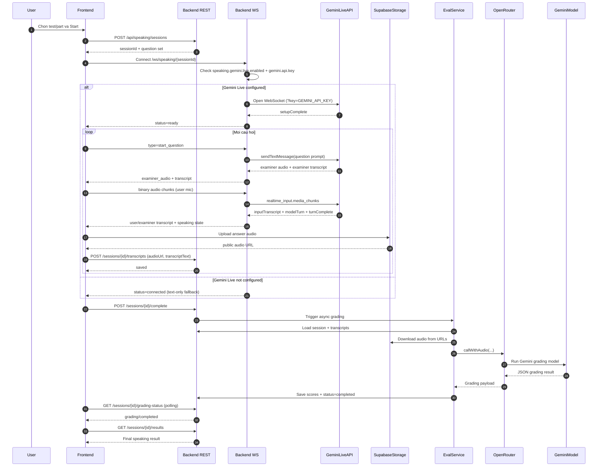

# Tính năng Speaking - Tài liệu Thiết kế

## Tổng quan kiến trúc

Tính năng Speaking mô phỏng một buổi thi IELTS Speaking có AI đóng vai examiner. Kiến trúc tổng thể gồm ba tầng phối hợp: Frontend chịu trách nhiệm giao diện và thu âm, Backend REST xử lý logic nghiệp vụ và lưu trữ, Backend WebSocket đảm nhiệm luồng audio real-time hai chiều thông qua Gemini Live API. [cloud.google](https://cloud.google.com/blog/topics/developers-practitioners/how-to-use-gemini-live-api-native-audio-in-vertex-ai)

Lý do dùng WebSocket thay vì REST cho phần thi: REST hoạt động theo mô hình request-response một chiều, không phù hợp cho việc stream audio liên tục với độ trễ thấp. WebSocket duy trì kết nối liên tục hai chiều, cho phép frontend gửi audio của người dùng và nhận lại audio của AI examiner gần như đồng thời trong suốt buổi thi. [ai.google](https://ai.google.dev/gemini-api/docs/live)

***

## Frontend Flow

Luồng giao diện người dùng được chia thành 5 màn hình chính, chuyển tiếp tuần tự:

**Bước 1 - Chọn bài thi**

Người dùng chọn "Test Speaking". Hệ thống hiển thị modal cho phép chọn Part muốn làm (Part 1, 2, 3 riêng lẻ) hoặc Full Test (toàn bộ 3 part liên tiếp).

**Bước 2 - Màn hình chuẩn bị (Permission + Config)**

Sau khi chọn xong và nhấn "Bắt đầu", người dùng được chuyển đến trang yêu cầu cấp quyền microphone. Trang này đồng thời hiển thị thông tin tổng quan của buổi thi:

- Topic và Test đang chọn
- Giọng đọc AI (voice) sẽ được dùng
- Tốc độ đọc (speed) hiện tại

Tại đây người dùng có thể điều chỉnh hai thông số:

- **Speed**: tốc độ đọc câu hỏi của AI examiner (ví dụ: chậm, bình thường, nhanh)
- **Accent**: giọng vùng miền của AI examiner (ví dụ: British, American, Australian)

Sau khi đồng ý cấp quyền và nhấn "Bắt đầu buổi thi", session chính thức được khởi tạo.

**Bước 3 - Màn hình thi**

Đây là màn hình trung tâm của tính năng. Các thành phần hiển thị gồm:

- Câu hỏi hiện tại ở dạng text
- Audio AI đọc câu hỏi (examiner audio) phát tự động
- Transcript real-time từ câu trả lời của người dùng (được Gemini Live nhận diện và trả về liên tục)
- **Nút microphone sáng/tắt**: khi người dùng đang nói, nút microphone sẽ sáng lên để phản hồi trực quan. Người dùng có thể tự nhấn để kết thúc câu trả lời sớm, hoặc chờ hết thời gian giới hạn thì hệ thống tự động ngắt và chuyển sang câu tiếp theo (hoặc Part tiếp theo nếu đã hết câu trong Part hiện tại)

**Bước 4 - Màn hình chờ chấm điểm**

Sau khi người dùng nhấn "Submit" ở cuối phần thi, hệ thống chuyển đến màn hình chờ. Màn hình này hiển thị trạng thái đang chấm bài trong khi Backend thực hiện grading bất đồng bộ.

**Bước 5 - Màn hình kết quả**

Khi AI chấm xong và trả kết quả, hệ thống tự động chuyển hướng đến trang kết quả chi tiết của buổi thi.

***

## Backend Flow

**Giai đoạn 1 - Khởi tạo session (REST)**

Frontend gọi `POST /api/speaking/sessions` với payload:

```json
{
  "mode": "full | part1 | part2 | part3",
  "topicId": "...",
  "testId": "...",
  "accent": "british | american | ...",
  "speed": "slow | normal | fast"
}
```

Backend thực hiện tuần tự:

1. Validate `mode` (kiểm tra giá trị hợp lệ)
2. Tạo session mới trong database
3. **Kiểm tra lúa**: kiểm tra số dư credits của người dùng có đủ để làm bài không (xem thêm ở phần Confirm bên dưới)
4. Random câu hỏi từ bộ đề tương ứng với topic/test đã chọn
5. Trả về `sessionId` và bộ câu hỏi (`question set`) cho Frontend

**Giai đoạn 2 - Kết nối WebSocket và khởi tạo Gemini Live**

Frontend mở kết nối WebSocket tới `/ws/speaking/{sessionId}`.

Backend kiểm tra hai điều kiện cấu hình:

- `speaking.gemini.live.enabled` có được bật không
- `gemini.api.key` có được cấu hình không

Nếu cả hai đều hợp lệ, Backend mở kết nối WebSocket ngược lên phía Gemini Live API với authentication key. Gemini Live API trả về sự kiện `setupComplete`, sau đó Backend forward trạng thái `status=ready` về Frontend. [docs.cloud.google](https://docs.cloud.google.com/vertex-ai/generative-ai/docs/live-api/get-started-websocket)

**Giai đoạn 3 - Vòng lặp từng câu hỏi (WebSocket)**

Mỗi câu hỏi diễn ra theo chu trình sau:

1. **Frontend gửi `start_question`**: đây là signal thông báo người dùng đã sẵn sàng nhận câu hỏi tiếp theo
2. **Backend forward prompt sang Gemini Live**: prompt bao gồm nội dung câu hỏi cùng các instruction về role examiner, tốc độ, giọng đọc
3. **Gemini Live phản hồi** với ba loại dữ liệu:
   - `examiner_audio`: binary audio của AI đọc câu hỏi, phát cho người dùng nghe
   - `transcript`: bản ghi lời nói của AI và/hoặc người dùng
   - `examiner_speaking` (true/false): cờ trạng thái cho biết AI đang nói hay đã dừng, Frontend dùng cờ này để biết khi nào mở mic cho người dùng

4. **Người dùng nói vào microphone**: Browser thu âm và gửi audio dưới dạng binary chunks liên tục qua WebSocket. Đây là dạng dữ liệu thô, nhỏ gọn, phù hợp cho streaming real-time [lablab](https://lablab.ai/ai-tutorials/building-voice-agents-gemini-live-fastapi)
5. **Backend forward audio chunks sang Gemini Live** qua `realtime_input.media_chunks`
6. **Gemini Live xử lý và trả về** `inputTranscript` (transcript lời người dùng), `modelTurn`, và `turnComplete` (signal kết thúc lượt)

**Giai đoạn 4 - Lưu transcript sau mỗi câu (REST)**

Sau khi người dùng trả lời xong một câu:

1. Frontend upload file audio lên Supabase Storage, nhận về public URL
2. Frontend gọi `POST /api/speaking/sessions/{id}/transcripts` với audio URL và nội dung transcript
3. Backend lưu transcript với trạng thái `finalized = false` (tức là draft, chưa chính thức), tương ứng với các câu hỏi trong session đang làm dở

**Giai đoạn 5 - Submit và chấm điểm**

1. Frontend gọi `POST /api/speaking/sessions/{id}/complete`
2. Backend set tất cả transcript của session này sang `finalized = true` (đánh dấu đã hoàn thành, chính thức)
3. Backend trigger EvalService chạy bất đồng bộ (async) để không chặn response trả về Frontend
4. EvalService tải session, tải audio từ Supabase, gọi OpenRouter để chạy Gemini grading model với audio và transcript, nhận kết quả JSON, lưu điểm và set `status = completed`
5. Frontend polling `GET /api/speaking/sessions/{id}/grading-status` để kiểm tra tiến trình, khi nhận `completed` thì gọi tiếp `GET /api/speaking/sessions/{id}/results` để lấy kết quả chi tiết

**Giai đoạn 6 - Tác vụ dọn dẹp định kỳ**

`SpeakingAudioCleanupJob` là một scheduled job (tác vụ tự động chạy nền theo lịch). Job này chạy mỗi 6 giờ một lần và xóa tất cả file audio trên Supabase Storage tương ứng với các transcript còn `finalized = false`, tức là những session bị bỏ dở, chưa submit. Mục đích là tránh tích lũy file rác tốn storage.

Job này chỉ được kích hoạt khi cấu hình `speaking.cleanup.enabled = true` trong file `application.properties` (hoặc `application.yml`). Đây là thiết kế an toàn: có thể tắt job dọn dẹp trong môi trường dev/test để debug mà không ảnh hưởng production.

***

## Cơ chế Fallback

Hệ thống có ba lớp fallback để đảm bảo buổi thi không bị gián đoạn dù gặp sự cố kỹ thuật:

| Tình huống lỗi | Hành vi fallback |
|---|---|
| Gemini Live không kết nối được | Backend WebSocket trả `status = fallback_text_mode`. Frontend vẫn hiển thị câu hỏi dạng text và cho người dùng làm bài bình thường. Session không bị kẹt hay mất |
| Gemini phản hồi chậm khi đọc câu hỏi | Frontend có timer đếm ngược khoảng 3 giây. Nếu sau 3 giây không nhận được audio từ examiner, Frontend tự động mở mic để người dùng có thể trả lời ngay dựa trên câu hỏi text đang hiển thị |
| Upload audio hoặc lưu transcript thất bại | Lỗi được bắt (try-catch) và bỏ qua ở cấp độ từng câu hỏi. Session vẫn tiếp tục bình thường, không chặn toàn bộ bài thi |

Đáng chú ý: hiện chưa có fallback cho trường hợp **ASR (Automatic Speech Recognition) lỗi**, tức là khi hệ thống nhận diện giọng nói thất bại hoàn toàn. Đây là một trong các mục TODO.

***

## Câu hỏi cần Confirm

> **Lúa bị trừ tại thời điểm nào?**
>
> Hiện tại backend kiểm tra lúa ngay khi tạo session (bước `POST /api/speaking/sessions`), nhưng chưa rõ thời điểm thực sự trừ là lúc vừa vào trang thi hay chờ đến khi người dùng nhấn Submit. Cần xác nhận để đảm bảo không trừ nhầm với các session bị bỏ dở hoặc lỗi mạng.

***

## TODO - Chưa hoàn thành

- **Lưu trạng thái bài làm (session resume)**: hiện tại nếu người dùng mất mạng hoặc reload trang, sẽ phải làm lại từ đầu. Cần confirm xem đây có phải yêu cầu bắt buộc không, vì việc lưu trạng thái WebSocket và audio buffer là khá phức tạp
- **Màn hình chờ và trang kết quả**: phần sau submit chưa được làm, bao gồm UI loading chờ chấm bài và trang hiển thị điểm chi tiết
- **Fallback cho ASR lỗi**: chưa xử lý trường hợp Gemini Live không nhận diện được giọng nói hoặc trả về transcript rỗng liên tiếp
- **Tạo Service Account trên Vertex AI và cấu hình API key**: bước này cần thiết để kết nối với Gemini Live API qua Vertex AI trong môi trường production thay vì dùng API key trực tiếp [docs.cloud.google](https://docs.cloud.google.com/vertex-ai/generative-ai/docs/live-api/get-started-websocket)

***

## Sequence Diagram



**Cách import vào draw.io:**

1. Vào [draw.io](https://draw.io)
2. Trên thanh header, nhấn vào mục **Sắp xếp** (Extras)
3. Chọn **Chèn** (Insert), sau đó chọn **Mermaid**
4. Dán toàn bộ đoạn code trên vào ô text
5. Nhấn **Chèn** (Insert) là xong
